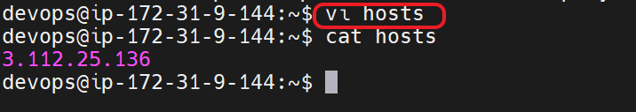
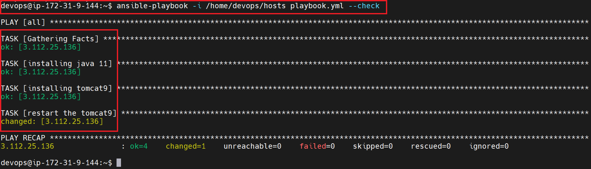
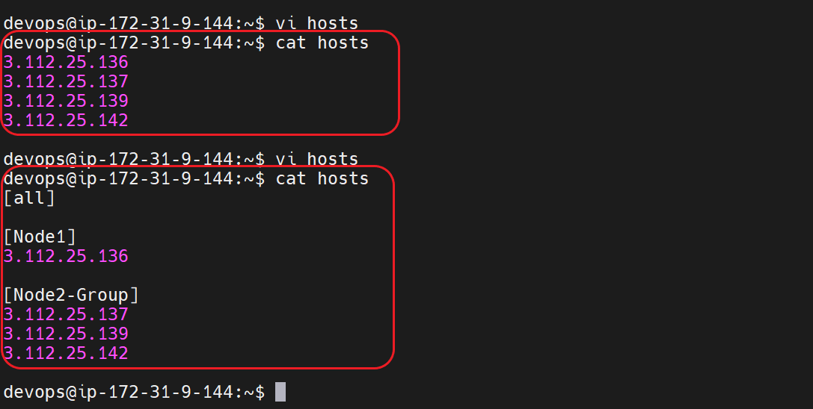
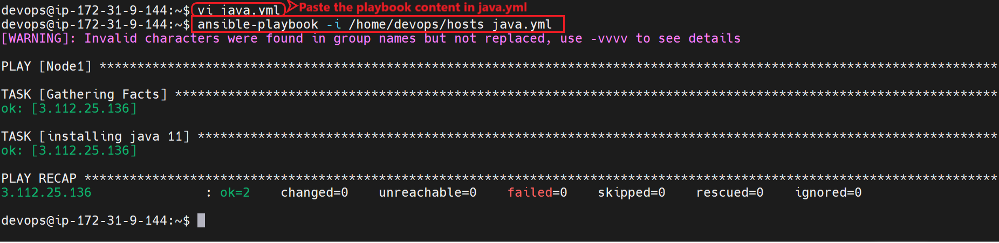
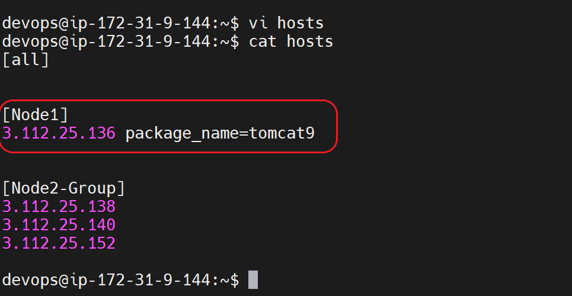
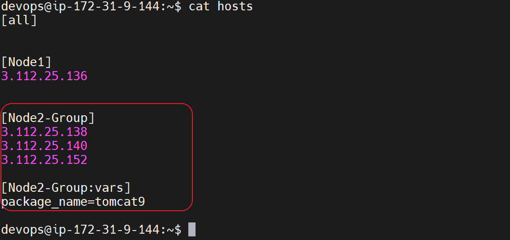
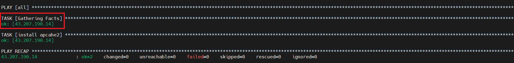
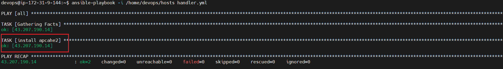
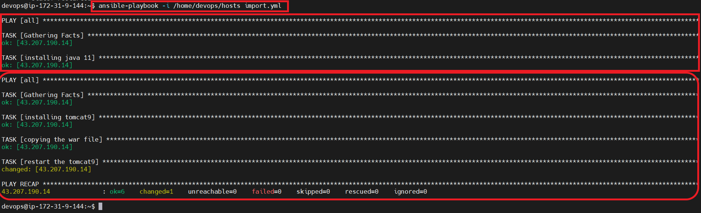
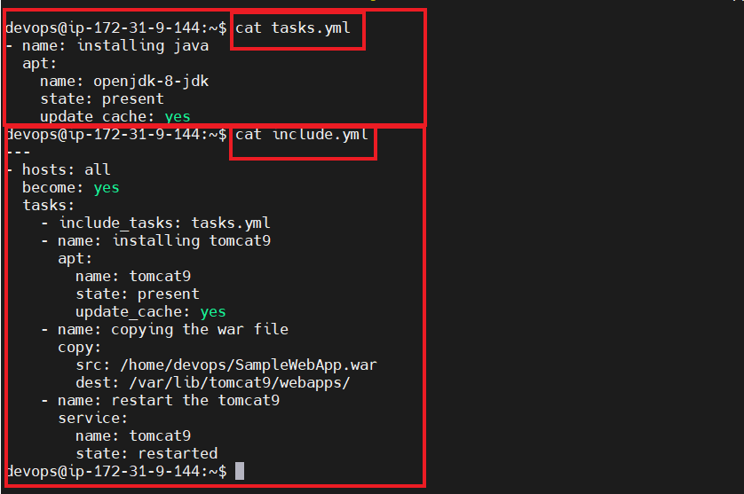

## BASIC PIPELINE OF DEVOPS :


## Ansible
* Ansible is one of the configuration management tool.
* Ansible is an open-source automation tool used for IT tasks such as application deployment, configuration management, and infrastructure orchestration. It uses a simple and easy-to-learn YAML-based language to define tasks and playbooks, making it accessible to a wide range of users.

<br/>

* * * 

<br/>

## Configuration management :
* For any application to be work,  we need some softwares to be installed. The process of configure & installing softwares is called Configuration Management.

<br/>

* * * 

<br/>

## Ways to install Softwares : 
### Manual :
* Administrator will install  all the softwares.

### Configuration Management:
* We write the desired state ..i,e(i want a file to be created)
* It uses declarative syntax.
* The main usecase of CM tool are idempotency .

<br/>

* * * 

<br/>

## Push / Pull type CM :

### Push type CM : 
* Ansible is the push type model of CM.


### Pull type CM:
* Chef is the  pull type model of CM 


<br/>

* * * 

<br/>

## Architecture  of ansible :


### Playbook:
* In playbook we will define the desired state .
* Playbooks are written in YAML format and consist of a set of tasks that define what actions Ansible should take on the managed hosts.

### Inventory : 
* In Ansible, an inventory file is a simple text file that contains a list of hosts or IP addresses that Ansible can connect to and manage. It is essentially a collection of the hosts or nodes that you want to configure or manage with Ansible.


<br/>

* * * 

<br/>


## SCENARIO-1 :-  LAB SETUP of ANSIBLE  :


* For ansible to be worked we need to install python on all the servers where you  want to install softwares.
* We also have to make sure that python is installed on the ACS , however it will be installed while installing ansible.

1. Enabling the password based authentication both  on ACS and NODE-1 :
```
sudo su - 
vi /etc/ssh/sshd_config
sudo service ssh restart 
sudo service ssh status
ctrl+c or Q -- to exit 
```


2. Create a user and give sudo acess on both ACS and NODE1 servers : 

```
sudo su - 
adduser devops
visudo  
*  To exit : ctrl+X , Y/N , Enter
su devops   
```


3. ssh-keygen on ACS Server to create keys for Key-based Authentication

```
sudo su - devops
ssh-keygen  
ssh-copy-id devops@<nodeipadress>
``` 


4. Ansible installation  on ACS SERVER: 
* Ansible installation [REFER HERE](https://docs.ansible.com/ansible/latest/installation_guide/intro_installation.html#installing-ansible-on-ubuntu)

```
sudo apt update
sudo apt install software-properties-common
sudo apt-add-repository --yes --update ppa:ansible/ansible
sudo apt install ansible
```

5. Installing  python on the NODE1: 

```
sudo apt update
sudo apt install software-properties-common
sudo apt-add-repository --yes --update ppa:ansible/ansible
sudo apt install python
```
<br/>

* * * 

<br/>


## Inventory :
* An inventory file is a simple text file that contains information about your hosts or devices, such as their IP addresses, hostnames, and connection details.
* The default path of inventory is 

```
/etc/ansible/hosts
```

<br/>

* * * 

<br/>


## Check the communication b/w ACS and NODE-1:

* Add your NODE-1 public ip to the /etc/ansible/hosts file

```
ansible -m ping all
```


<br/>

* * * 

<br/>


## Use customized file for inventory: 
* Add your NODE1 public ip to the /home/devops/hosts file



* Use below command to check communication between ACS & NODE1

```
ansible -i <path to the file> -m ping all
```
* EX : ansible -i /home/devops/hosts -m ping all


<br/>

* * * 

<br/>


## How to write ansible playbooks :
* list down all the manaul commands for the desired state.
* Make sure that the commands are working , when doing manaully .
* Each desired state / each step you are going to do in ansible is considered as task.
* In Ansible the tasks are executed by using MODULES.
* Modules are atomic units of ansible which performs execution

## Playbook syntax:
* Yaml Syntax [REFERHERE(]https://docs.ansible.com/ansible/latest/reference_appendices/YAMLSyntax.html)
* Ansible modules Offical Document [REFER HERE](https://docs.ansible.com/ansible/2.8/modules/list_of_all_modules.html)


```
---
- hosts: all
  become: yes
  tasks:
    - name: name of your task1
      module:
        par1: val1
        par2: val2
    - name: name of your task2
      module:
        par1: val1
        par2: val2
  ...
  ..
  ..

```

<br/>

* * * 

<br/>

## SCENARIO-2: Write a playbook to install Tomcat & Java to configure servers:

```
Java is a developement softwares and it is prequisite for Tomcat.
Tomcat is one of the appliaction server.
```


## List down the steps to install tomcat:

```
sudo apt-get update 
sudo apt-get install openjdk-11-jdk
java -version

sudo apt-get update
sudo apt-get install tomcat9

sudo service tomcat9 restart
sudo service tomcat9 status
```


## Playbook to install java11 and tomcat9

```
---
- hosts: all
  become: yes
  tasks:
    - name: installing java 11
      apt:
        name: openjdk-11-jdk
        state: present
        update_cache: yes
    - name: installing tomcat9
      apt: 
        name: tomcat9
        state: present
        update_cache: yes
    - name: restart the tomcat9
      service:
         name: tomcat9
         state: restarted
    
```
* ***NOTE***: Make sure you addd your NODE1 public ip to the /home/devops/hosts file


* To check the playbook syntax is correct : 

```
 ansible-playbook -i /home/devops/hosts playbook.yml --syntax-check
```


* To run the playbook use below command : 

```
 ansible-playbook -i /home/devops/hosts playbook.yml
```


* To run the playbook for the  dryrun 

```
 ansible-playbook -i inventory playbook.yml --check
```




<br/>

* * * 

<br/>

## Playbook vc Adhoc commands :
* Playbooks and Ad-hoc commands are different ways of using Ansible to achieve the same result: configure and manage systems.
* We can define all the tasks and modules in a file (playbook file).
* In adhoc commands , we can use  only one module at at time.

*  Adhoc commands syntax:

```
ansible -i <host file path> -m <module> "para1=value1 ....paran=valuen" [-b]  <all>
```

* For the adhoc commands [REFER HERE](https://docs.ansible.com/ansible/latest/user_guide/intro_adhoc.html)

<br/>

* * * 

<br/>


## SCENARIO -3 : Run the playbook on the specific server in the inventory file.


* The  /home/devops/hosts file changes as below :


* Create a java.yml with below playbook  content : 

```
sudo su - devops 
cd /home/devops
vi java.yml 

Paste the below Playbook content 

```

```
---
- hosts: Node1
  become: yes
  tasks:
    - name: installing java 11
      apt:
        name: openjdk-11-jdk
        state: present
        update_cache: yes
```


* To run the playbook use below command : 

```
 ansible-playbook -i /home/devops/hosts java.yml
```



<br/>

* * * 

<br/>


## Reuse ansible playbooks by using  variables :
* In ansible we had a below ways to define variable:
1. host level
2. group level 
3. playbook level 
4. commandline level

* Create variable name **package_name** as below in playbook :
```
---
- hosts: webserver
  become: yes
  tasks:
    - name: using variables in ansible
      apt:
        name: "{{package_name}}"
        state: present
        update_cache: yes

```

1. **Host level variable**  :



2. **Group level variable** : 




3. **Playbook level variable** :

```
- hosts: webserver
  become: yes
  vars:
    package_name:
      - tomcat9
  tasks:
    - name: using variables in ansible
      apt:
        name: "{{package_name}}"
        state: present
        update_cache: yes

```

4 **commandline level variable** :

```
 ansible-playbook -i <hostspath> -e " package_name=tomcat9" playbook.yml
```

<br/>

* * * 

<br/>

## SCENARIO-4 :  sample deployment of apache and php modules:
* Reference Sample Link : [Apache_PHP_Installation](https://www.digitalocean.com/community/tutorials/how-to-install-linux-apache-mysql-php-lamp-stack-on-ubuntu-20-04)

* **Apache** is a popular open-source web server software that is used to serve websites and web applications over the internet. It was developed by the Apache Software Foundation and is available for a variety of operating systems, including Windows, macOS, and Linux.

* Apache is highly customizable and supports a variety of programming languages, including PHP, Python, Perl, and Ruby. It also supports many different modules and plugins, allowing users to add functionality to their web servers as needed.

* Apache is known for its reliability, scalability, and security, and is widely used by businesses and individuals around the world. It is a key component of the LAMP (Linux, Apache, MySQL, PHP) and LEMP (Linux, Nginx, MySQL, PHP) stacks, which are commonly used for web development and hosting.

* **PHP (Hypertext Preprocessor)** is a popular server-side scripting language that is widely used for web development. It was originally created in 1994 by Rasmus Lerdorf, and has since evolved into a powerful language that is used by millions of developers worldwide.

* list down the manual steps :

```
sudo apt-get update 
sudo apt-get  install apache2 -y 
sudo systemctl enable apache2
sudo apt-get install php libapache2-mod-php php-mysql php-cli -y 
sudo vi /var/www/html/info.php
<?php
phpinfo();
?>
sudo systemctl restart apache2
```

* The playbook looks as below once after convert the manual steps in to tasks :

```
---
- hosts: all
  become: yes
  tasks:
    - name: installing apache2
      apt:
        name: apache2
        state: present
        update_cache: yes
    - name: enable apache2
      service:
        name: apache2
        enabled: yes
        state: restarted
    - name: installing php modules
      apt:
        name: "{{ item }}"
        state: present  
        update_cache: yes
      loop:
        - php
        - libapache2-mod-php
        - php-mysql
        - php-cli

    - name: creating the file info.php
      file:
        path: /var/www/html/info.php
        state: touch

    - name: add content to the info.php file
      blockinfile:
        path: /var/www/html/info.php
        block: |
          <?php
          phpinfo();
          ?>
    - name: restart the apache
      service:
         name: apache2
         state: restarted

```

* Create a file named  apache2php.yml  with above content .

```
sudo su - devops 

vi apache2php.yml 

Insert mode 
copy the above playbook content 

ESC:wq                  -- To save the file 

```


*  To check the syntactical errors in playbook:

```
ansible-playbook -i hosts apache2php.yml --syntax-check
```

*  Trial run  :

```
ansible-playbook -i hosts apache2php.yml --check
```


* Run the playbook :

```
ansible-playbook -i hosts apache2php.yml 
```


*  To see the apache & php modules installed on browser  :

```
# Apache

http://<publicipaddress> 

# PHP

http://<publicipaddress>/info.php

```


<br/>

* * * 

<br/>


## SCENARIO-5 :  sample deployment of apache and php modules on redhat/centos 

* Below are the maual steps : 

```
sudo yum update 
sudo yum  install httpd -y 
sudo systemctl enable httpd
sudo yum install php 
sudo vi /var/www/html/info.php
<?php
phpinfo();
?>
sudo systemctl restart httpd

```

* **Exercise-1** : Write a playbook for above manual steps and setup CentOs as a node to ACS.


<br/>

* * * 

<br/>


## Mostly used modules in the ansible for install & configure softwares:

* apt         -- [REFERHERE-For Ansible module Documentation](https://docs.ansible.com/archive/ansible/2.3/apt_module.html)
* yum         -- [REFERHERE-For Ansible module Documentation](https://docs.ansible.com/archive/ansible/2.4/yum_module.html)
* package     -- [REFERHERE-For Ansible module Documentation](https://docs.ansible.com/archive/ansible/2.3/service_module.html)
* file        -- [REFERHERE-For Ansible module Documentation](https://docs.ansible.com/ansible/2.8/modules/list_of_files_modules.html)
* copy        -- [REFERHERE-For Ansible module Documentation](https://docs.ansible.com/archive/ansible/2.4/copy_module.html)
* blockinfile -- [REFERHERE-For Ansible module Documentation](https://docs.ansible.com/ansible/2.8/modules/blockinfile_module.html#blockinfile-module)
* lineinfile  -- [REFERHERE-For Ansible module Documentation](https://docs.ansible.com/ansible/2.8/modules/lineinfile_module.html#lineinfile-module)
* loop       -- [REFERHERE-For Ansible module Documentation](https://docs.ansible.com/archive/ansible/2.3/playbooks_loops.html#standard-loops)

<br/>

* * * 

<br/>

## Ansible facts:
* In Ansible, facts are pieces of information about the remote systems that Ansible collects during a playbook run. Ansible facts are automatically collected by the setup module and stored in a set of variables that you can access in your playbook. These facts provide useful information about the remote system, such as the operating system, the hostname, the network interfaces, and much more.

* Ansible Document: --  [REFER HERE](https://docs.ansible.com/ansible/latest/user_guide/playbooks_vars_facts.html#id3)




## Ansible conditionals:

* In Ansible, conditionals are used to check if certain conditions are true or false before executing a task or a block of tasks. Ansible provides several conditional statements that can be used in playbooks

* Ansible  document here [REFER HERE](https://docs.ansible.com/ansible/latest/user_guide/playbooks_conditionals.html)

```
---
- hosts: all
  become: yes
  tasks:
    - name: installing apache2
      apt:
        name: apache2
        state: present
        update_cache: yes
      when: ansible_facts['os_family'] == "Debian"
```

<br/>

* * * 

<br/>


## Fail module:
* In Ansible, the fail module is used to terminate the playbook or task execution with a custom failure message. It can be useful when you need to enforce certain conditions in your playbook or task and stop execution if those conditions are not met.

* Fail Module [REFERHERE - Ansible module Documentation](https://docs.ansible.com/ansible/2.8/modules/fail_module.html)

```
---
- hosts: all
  become: yes
  tasks:
    - name: fail if the os is other than the debian
      fail:
        msg: the playbook run only for the debian os
      when: ansible_facts['os_family'] != "Debian"
    - name: installing apache2
      apt:
        name: apache2
        state: present
        update_cache: yes
      when: ansible_facts['os_family'] == "Debian"
```


<br/>

* * * 

<br/>

## Package module :

* The package module provides a generic interface for package management, which means that it can handle different package managers such as YUM, APT, and DNF on Linux systems, and Windows Package Manager (winget) on Windows systems.
* Package  Module    -- [REFERHERE - Ansible module Documentation](https://docs.ansible.com/archive/ansible/2.3/service_module.html)


```
---
- hosts: all
  become: yes
  tasks:
    - name: installing apache2
      package:
        name: apache2/httpd
        state: present
        update_cache: yes
```

<br/>

* * * 

<br/>


## If you  didnt find any module /  unable to get the exact modules.

* We have modules in ansible , where we can provide the linux command as it is and run the playbook.
* Examples : shell and command modules

1. SHELL : -  [Ansible Document](https://docs.ansible.com/archive/ansible/2.3/shell_module.html)

SYNTAX:

```
- name: shell module
  shell: sudo apt-get update 
```
2. COMMAND : [Ansible Document](https://docs.ansible.com/ansible/2.9/modules/command_module.html)

SYNTAX:

```
- name: Command module 
  command: sudo apt-get update
```
* ***NOTE*** : In Shell and command modules there wont be any idempotency.

<br/>

* * * 

<br/>


## Handler in ansible
* Handler is  also one of the module in ansible . One of the best use case is to optimise the playbook.
* In Ansible, a handler is a task that is triggered only when a change has been made on a managed node by a task in a playbook. Handlers are used to ensure that changes made to a system are applied only when necessary, rather than every time a task is executed.

* Look at below example for understanding.

```
---
- hosts: all
  become: yes
  tasks:
    - name: installing apache2
      apt:
        name: apache2
        state: present
        update_cache: yes
      notify:
      - restart apache2
    - name: installing php modules
      apt:
        name: "{{ item }}"
        state: present  
        update_cache: yes
      loop:
        - php
        - libapache2-mod-php
        - php-mysql
        - php-cli

    - name: creating the file info.php
      file:
        path: /var/www/html/info.php
        state: touch

    - name: add content to the info.php file
      blockinfile:
        path: /var/www/html/info.php
        block: |
          <?php
          phpinfo();
          ?>
      notify:
      - restart apache2 
    handlers:
      - name: restart apache2 
        service:
          name: apache2
          enabled: yes 
          state: restarted
```

* Create a file handler.yml with below playbook content: 

```
sudo su - devops 

vi handler.yml 

Insert mode 
copy the below playbook content 

ESC:wq                  -- To save the file 

```

```
---
- hosts: all
  become: yes
  tasks:
  - name: install apcahe2
    apt:
      name: apache2
      state: present
      update_cache: yes
    notify:
    - restartapache2
  handlers:
    - name : restartapache2
      service:
        name: apache2
        state: restarted

```


* Run ansible playbook where apache2 is not installed:

```
ansible-playbook -i /home/devops/hosts handler.yml 
```


* Run the playbook again and look at the output: 



<br/>

* * * 

<br/>


# Important and main stuff we do in pipeline using ansible:
## Scenario- 6:  Deployment using ansible playbook:
* Look at the below pipelins:


### Steps Involved :
1. Install Java 
2. Install Tomcat 
3. Need war file to copy 
4. Restart Tomcat

* For war [REFER HERE](https://github.com/AKSarav/SampleWebApp/raw/master/dist/SampleWebApp.war)


* Look at the below playbook : 

```
---
- hosts: all
  become: yes 
  tasks: 
    - name: installing java 
      apt:
        name: openjdk-11-jdk
        state: present
        update_cache: yes
    - name: installing tomcat9
      apt:
        name: tomcat9
        state: present 
        update_cache: yes
    - name: copying the war file
      copy:
        src: /home/devops/SampleWebApp.war
        dest: /var/lib/tomcat9/webapps/
    - name: restart the tomcat9
      service:
        name: tomcat9
        state: restarted

```


```
ansible-playbook -i hosts tomcat1.yml --syntax-check

ansible-playbook -i hosts tomcat1.yml
```


<br/>

* * * 

<br/>


## ANSIBLE:
1. Mostly used modules are copy, apt , yum , package , service , systemd , file , blockinfile , lineinfile .
2. Tomcat home path is /var/lib/tomcat9/webapps/ . It runs on the port 8080 . Tomcat logs will be on the folder /var/log/tomcat9/ .


## Reusability of ansible playbooks.
1. VARIABLES
2. IMPORT/INCLUDE
3. ANSIBLE ROLES


## 1. VARIABLES

```
---
- hosts: all
  become: yes
  tasks:
    - name: installing software 
      apt:
        name: {{ package_name }}
        state: present
        update_cache: yes
```


<br/>

* * * 

<br/>

## 2. Import/Include :
* In Ansible, you can use the import and include directives to reuse code across different parts of your playbook.
* Official Ansible Documentation [REFERHERE](https://docs.ansible.com/ansible/2.9/user_guide/playbooks_reuse_includes.html)

* All ***import**** statements are pre-processed at the time playbooks are parsed.
* All ***include**** statements are processed as they are encountered during the execution of the playbook.


## Import playbook :

### java playbook (java.yml) 
```
- hosts: all
  become: yes 
  tasks: 
    - name: installing java 
      apt:
        name: openjdk-8-jdk
        state: present
        update_cache: yes
```


* Using the java playbook in installing tomcat9

### Import playbook (import.yml)
```
- import_playbook: java.yml
- hosts: all
  become: yes 
  tasks: 
    - name: installing tomcat9
      apt:
        name: tomcat9
        state: present 
        update_cache: yes
    - name: copying the war file
      copy:
        src: /home/devops/SampleWebApp.war
        dest: /var/lib/tomcat9/webapps/
    - name: restart the tomcat9
      service:
        name: tomcat9
        state: restarted
```


* Run playbook import.yml 

```
ansible-playbook -i /home/devops/hosts import.yml
```



<br/>

* * * 

<br/>

## Include  
### tasks playbook (tasks.yml)


``` 
- name: installing java 
  apt:
    name: openjdk-11-jdk
    state: present
    update_cache: yes
```

### Include playbook (Include.yml)
```
---
- hosts: all
  become: yes 
  tasks: 
    - include_tasks: tasks.yml
    - name: installing tomcat9
      apt:
        name: tomcat9
        state: present 
        update_cache: yes
    - name: copying the war file
      copy:
        src: /home/devops/SampleWebApp.war
        dest: /var/lib/tomcat9/webapps/
    - name: restart the tomcat9
      service:
        name: tomcat9
        state: restarted  
```




* Run Playbook :

```
ansible-playbook -i /home/devops/hosts include.yml
```


<br/>

* * * 

<br/>


## Exercise-2:
* Run the playbbok with below tasks :
   * Install java 
   * Install tomcat9
   * Stop the tomcat9
   * Copy the sample war to the /var/lib/tomcat9/webapps/
   * Restart the tomcat9
* When you are running the above playbook for the second time change the playbook as per below tasks:
   * Stop the tomcat9
   * Take the backup of the exising code which is in /var/lib/tomcat9/webapps/
   * Copy the sample war to the /var/lib/tomcat9/webapps/
   * Restart the tomcat9


<br/>

* * * 

<br/>


## 3. ANSIBLE ROLES:
* Ansible roles are the best way of reusing the playbooks .
* Ansible Roles are a way of organizing and managing Ansible code that allows for better modularity, reusability, and scalability of your infrastructure automation. A role is essentially a collection of tasks, variables, templates, and files that are grouped together to accomplish a specific goal, such as configuring a web server or installing a database.


## Structure of Ansible Role :


* An Ansible role is a collection of tasks, templates, files, and variables that are grouped together in a structured way to configure a specific part of a system. Ansible Roles are organized into a specific folder structure. The main folders that make up an Ansible role are as follows:

    * defaults: This folder contains default variables that are used by the role. These variables can be overridden by variables set in the playbook.

    * files: This folder contains any files that need to be copied to the remote server as part of the role.

    * handlers: This folder contains any handlers that the role uses. Handlers are tasks that are triggered by another task, typically after a change has been made.

    * meta: This folder contains metadata about the role, such as its author, license, and dependencies on other roles.

    * tasks: This folder contains the main set of tasks that are performed by the role. These tasks are typically defined in a YAML file.

    * templates: This folder contains any templates that the role uses. Templates are files that are processed by the Jinja2 templating engine and copied to the remote server.

    * vars: This folder contains any variables that are specific to the role. These variables can be overridden by variables set in the playbook.

* In addition to these folders, an Ansible role can also contain other files and folders, such as README.md files, tests, and even additional subfolders. The folder structure of an Ansible role is designed to be easily reusable and shareable, making it easy for others to use and contribute to the role.
<br/>

* * * 

<br/>


## Ansible-Galaxy:
* Ansible Galaxy is a community repository of pre-built Ansible roles, playbooks, and collections. It is a central hub for sharing and discovering Ansible content created by the community, including individual users, organizations, and vendors.
 
* Ansible-Galaxy [REFER HERE](https://galaxy.ansible.com/)


## Using Ansible roles from Ansible-galaxy : 
* Ansible-Galaxy link [REFER HERE](https://galaxy.ansible.com/)

### How to use the role from ansible galaxy:
```
 ansible-galaxy install geerlingguy.java
```


### How to use the ansible role downloaded from the ansible-galaxy:

```
---
- hosts: all
  become: yes 
  roles: 
    - role: geerlingguy.java
```


<br/>

* * * 

<br/>

## Jinja template
* These are used to create the dynamic files. Dynamic files means the content in the file will not be the static
* Example:
* Create a file with extension .j2 
```
vi   Testjinja.txt.j2

This is for the os {{ ansible_os_family }}
This is of distribution {{ ansible_distribution }}
```

* playbook using jinja template

```
---
- hosts: all
  become: yes
  tasks:
    - name: copying jinja file to the node
      template:
        src: /home/devops/Readme.txt.j2
        dest: /home/devops/
        
```


* Run above playbook by using below command:

```
ansible-playbook -i hosts jinja.yml
```

* After running the above playbook the content in the file changes as below:

```
This is for the os "Debian"
This is of distribution "Ubuntu"

```

<br/>

* * * 

<br/>

## How to create a ansible role:

```
ansible-galaxy role init <name of role>
```


## Writing Ansible-role to install JAVA 

* Creating a role 
```
ansible-galaxy role init javarole
tree javarole
```


*  tasks/main.yml as below :
```
---
- name: installing java
  apt:
    name: openjdk-8-jdk
    state: present
    update_cache: yes

```


* Now use the javarole in your playbook :


```
---
- hosts: all
  become: yes
  roles:
    - javarole


```
* Run the above playbook using below command:

```
ansible-playbook -i hosts usingjavarole.yml
```


## Tags in Ansible:
* If you have a large playbook, it may become useful to be able to run only a specific part of it rather than running everything in the playbook. Ansible supports a “tags:” attribute for this reason.

* Tags --  [ReferHere](https://docs.ansible.com/ansible/2.9/user_guide/playbooks_tags.html) 

* Playbook with tags :

```
---
- hosts: all
  become: yes
  tasks:
    - name : Install Tree
      apt:
        name: tree
        state: present
      tags:
      - tree
    - name: install java
      apt: 
        name: openjdk-11-jdk
        state: present
      tags:
      - java
```
1. Run the taks in the playbook which has tag of ```tree```
 

```
ansible-playbook -i hosts tags.yml --tags "tree"
```


2. Now skip the tasks which has tag of ```tree```

```
ansible-playbook -i hosts tags.yml --skip-tags "tree"

```


## How to deal with ansible:
1. List down the commands/steps to installed the software
2. My goal is to install tree
```
sudo apt-get update 
sudo apt-get install tree
```

```
yum update
yum install tree
```

### Write a playbook for installing tree : 

```
---
- hosts: all
  become: yes
  tasks:
    - name: installing tree
      apt:
        name: tree
        state: present
        update_cache: yes
```

## Ansible::
* Ansible is a configuration management tool , we can do deployment as well as configuration management by using ansible .
* Ansible is a push type model of CM 
* Ansible uses yaml syntax to write the playbook . But internally ansible is written in python
* YAML - Yet Another Markup Language
* Playbooks -- We write playbooks in ansible to mention our desiredstate/tasks to be done.
* Inventory/hosts -- Where we will provide the nodes information (ipaddress/hostname)
* Writing host file in different sections 
* Modules -- parameters.
* Examples of modules : apt , yum , service , systemd , file , copy  , package , Lineinfile, blockinfile , tags , fail
* Looping in ansible 
* Conditionals in ansible 
* Different types of defining variables -- host, group , playbook,commandline
* Resuability of playbooks : 1. variables 2.import/include 3. Ansible roles 
* APache and php installation -- LAMP installation
* Installing java , tomcat 
* Created a devops pipeline by using the samplewarfilefrom opensource.
* Deployed the application by using ansible


1. List down manual commands.
2. Check it by running them manually 
3. try to automate it by using the playbook (exact module)
4. create a inventory/host file -- Run the playbook 