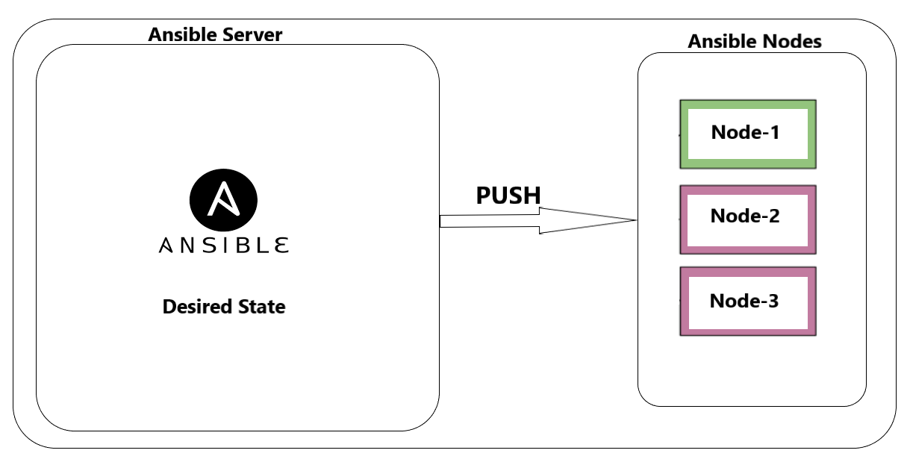
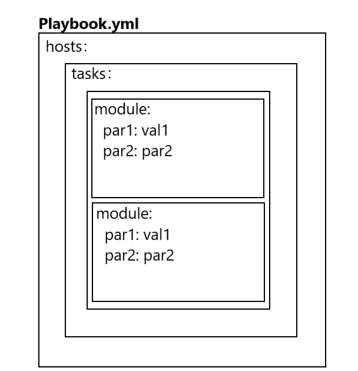
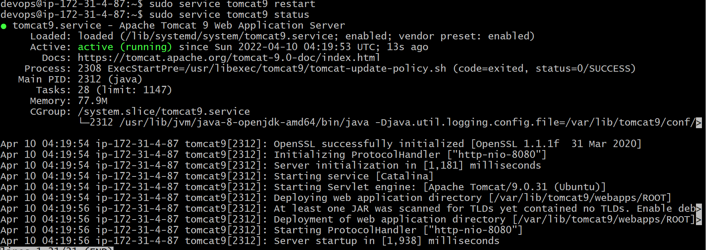
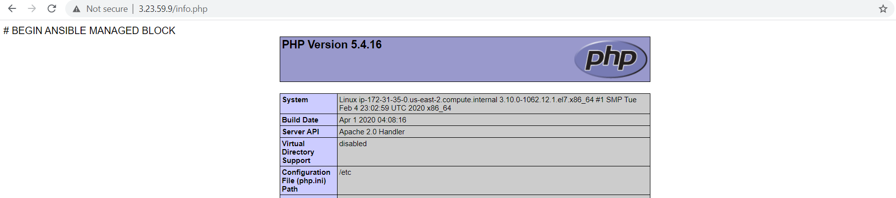
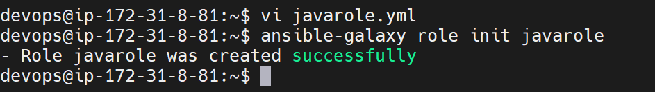
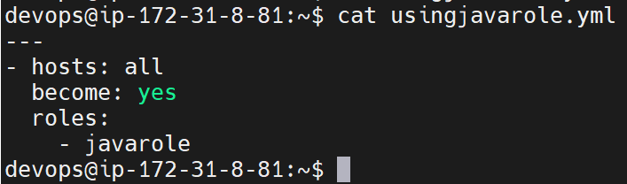

## BASIC PIPELINE OF DEVOPS :


## Ansible
* Ansible is one of the configuration management tool.
* Ansible is an open-source automation tool used for IT tasks such as application deployment, configuration management, and infrastructure orchestration. It uses a simple and easy-to-learn YAML-based language to define tasks and playbooks, making it accessible to a wide range of users.

<br/>

* * * 

<br/>

## Configuration management :
* For any application to be work,  we need some softwares to be installed. The process of configure & installing softwares is called Configuration Management.

<br/>

* * * 

<br/>

## Ways to install Softwares : 
### Manual :
* Administrator will install  all the softwares.

### Configuration Management:
* We write the desired state ..i,e(i want a file to be created)
* It uses declarative syntax.
* The main usecase of CM tool are idempotency .

<br/>

* * * 

<br/>

## Push / Pull type CM :

### Push type CM : 
* Ansible is the push type model of CM.



### Pull type CM:
* Chef is the  pull type model of CM 


<br/>

* * * 

<br/>

## Architecture  of ansible :


### Playbook:
* Write Playbooks in ansible to do the configuration management 
* YAML is all about mention all the desired states in the yaml file.

### Inventory : 
* list of the servers where you want to do CM.


<br/>

* * * 

<br/>


## Scenario-1 :-  LAB SETUP of ANSIBLE  :


* For ansible to be worked we need to install python on all the servers where you  want to install softwares.
* We also have to make sure that python is installed on the ACS , however it will be installed while installing ansible.

1. Enabling the password based authentication :
```
sudo su 
cd
vi /etc/ssh/sshd_config
sudo service ssh restart 
sudo service ssh status
```


2. Create a user  and give sudo acess on both ACS and NODE1 servers : 

```
sudo su 
cd
adduser devops
visudo
su devops   
```


3. ssh-keygen on ACS Server to create keys for Key-based Authentication

```
ssh-keygen  
ssh-copy-id devops@<nodeipadress>
``` 


4. Ansible installation  on ACS SERVER: 
* Ansible installation [REFER HERE](https://docs.ansible.com/ansible/latest/installation_guide/intro_installation.html#installing-ansible-on-ubuntu)

```
sudo apt update
sudo apt install software-properties-common
sudo apt-add-repository --yes --update ppa:ansible/ansible
sudo apt install ansible
```

5. Installing  python on the NODE1: 

```
sudo apt update
sudo apt install software-properties-common
sudo apt-add-repository --yes --update ppa:ansible/ansible
sudo apt install python
```
<br/>

* * * 

<br/>


## Inventory :
* An inventory file is a simple text file that contains information about your hosts or devices, such as their IP addresses, hostnames, and connection details.
* The default path of inventory is 

```
/etc/ansible/hosts
```

<br/>

* * * 

<br/>


## checking ansible ping between ACS and NODE1:

* Add your NODE1 public ip to the /etc/ansible/hosts file

```
ansible -m ping all
```


<br/>

* * * 

<br/>


## Using customized file for inventory: 
* Add your NODE1 public ip to the /home/devops/hosts file

```
ansible -i <path to the file> -m ping all
```
* EX : ansible -i /home/devops/hosts -m ping all


<br/>

* * * 

<br/>


## How to write ansible playbooks :
* list down all the manaul commands for the desired state.
* Make sure that the commands are working , when doing manaully .
* Each desired state / each step you are going to do in ansible is considered as task.
* In Ansible the tasks are executed by using MODULES.
* Modules are atomic units of ansible which performs execution

## playbook syntax:
* Ansible modules Offical Document [REFER HERE](https://docs.ansible.com/ansible/2.8/modules/list_of_all_modules.html)




```
---
- hosts: all
  become: yes
  tasks:
    - name: name of your task1
      module:
        par1: val1
        par2: val2
    - name: name of your task2
      module:
        par1: val1
        par2: val2
  ...
  ..
  ..

```

<br/>

* * * 

<br/>

# SCENARIO-1: Write a playbook to install tomcat & Java:

```
Java is a developement softwares and it is prequisite for Tomcat.
Tomcat is one of  the appliaction server.
```


## list down the steps to install tomcat:

```
sudo apt-get update 
sudo apt-get install openjdk-11-jdk
java -version

sudo apt-get update
sudo apt-get install tomcat9

sudo service tomcat9 restart
sudo service tomcat9 status
```



## Playbook to install java8 and tomcat9

```
---
- hosts: all
  become: yes
  tasks:
    - name: installing java 8 
      apt:
        name: openjdk-8-jdk
        state: present
        update_cache: yes
    - name: installing tomcat9
      apt: 
        name: tomcat9
        state: present
        update_cache: yes
    - name: restart the tomcat9
      service:
         name: tomcat9
         state: restarted
    
```

* To run the playbook use below command 

```
 ansible-playbook -i /home/devops/hosts playbook.yml
```

* To check the playbook syntax is correct 

```
 ansible-playbook -i inventory playbook.yml --syntax-check
```

* To run the playbook for he dryrun 

```
 ansible-playbook -i inventory playbook.yml --check
```

<br/>

* * * 

<br/>

## WAYS of working with ansible:
1. playbook
2. Adhoc-commands

## playbook vc Adhoc :
* We can define all the tasks and modules in a file (playbook file).
* In adhoc commands , we can use  only one module at at time.

## syntax:

```
ansible -i <host file path> -m <module> "para1=value1 ....paran=valuen" [-b]  <all>
```

* For the adhoc commands [REFER HERE](https://docs.ansible.com/ansible/latest/user_guide/intro_adhoc.html)


### SCENARIO
* I had 5 servers in the hosts . but i want the playbook to be run on only one server.


```
---
- hosts: node1
  become: yes
  tasks:
    - name: installing java 8 
      apt:
        name: openjdk-8-jdk
        state: present
        update_cache: yes
```

### Defining variables in the ansible:
* In ansible we had a below ways to define variable:
1. host level
2. group level 
3. playbook level 
4. commandline level

```
---
- hosts: webserver
  become: yes
  tasks:
    - name: using variables in ansible
      apt:
        name: "{{package_name}}"
        state: present
        update_cache: yes

```

## Host level and group level :


## For playbook level variable see below playbook:

```
- hosts: webserver
  become: yes
  vars:
    package_name:
      - tomcat9
  tasks:
    - name: using variables in ansible
      apt:
        name: "{{package_name}}"
        state: present
        update_cache: yes

```

## Defining variable at commandline level

```
 ansible-playbook -i <hostspath> -e " package_name=tomcat9" playbook.yml
```

### sample deployment of apache and php modules:
* Reference Sample Link : [Apache_PHP_Installation](https://www.digitalocean.com/community/tutorials/how-to-install-linux-apache-mysql-php-lamp-stack-on-ubuntu-20-04)
* list down the steps :
```
sudo apt-get update 
sudo apt-get  install apache2 -y 
sudo systemctl enable apache2
sudo apt-get install php libapache2-mod-php php-mysql php-cli -y 
sudo vi /var/www/html/info.php
<?php
phpinfo();
?>
sudo systemctl restart apache2
```


```
---
- hosts: all
  become: yes
  tasks:
    - name: installing apache2
      apt:
        name: apache2
        state: present
        update_cache: yes
    - name: enable apache2
      service:
        name: apache2
        enabled: yes
        state: restarted
    - name: installing php modules
      apt:
        name: "{{ item }}"
        state: present  
        update_cache: yes
      loop:
        - php
        - libapache2-mod-php
        - php-mysql
        - php-cli

    - name: creating the file info.php
      file:
        path: /var/www/html/info.php
        state: touch

    - name: add content to the info.php file
      blockinfile:
        path: /var/www/html/info.php
        block: |
          <?php
          phpinfo();
          ?>
    - name: restart the apache
      service:
         name: apache2
         state: restarted

```


* For redhat/centos machines

```
sudo yum update 
sudo yum  install httpd -y 
sudo systemctl enable httpd
sudo yum install php libapache2-mod-php php-mysql php-cli -y 
sudo vi /var/www/html/info.php
<?php
phpinfo();
?>
sudo systemctl restart httpd

```
### Mostly used modules in the ansible:

* apt 
* yum 
* package
* service
* file
* copy


## To check the apache and php  installed in browser do as below :

```
<publicipaddress>  --in the browser
```


## To check the playbook is having any syntactical errors:

```
ansible-playbook -i hosts apache2centos.yml --syntax-check
```

## Trial run in ansible :

```
ansible-playbook -i hosts apache2centos.yml --check
```



## Ansible conditionals:
* Full document here [REFER HERE](https://docs.ansible.com/ansible/latest/user_guide/playbooks_conditionals.html)

```
---
- hosts: ubuntu
  become: yes
  tasks:
    - name: installing apache2
      apt:
        name: apache2
        state: present
        update_cache: yes
      when: ansible_facts['os_family'] == "Debian"
```

## Fail module:

```
---
- hosts: ubuntu
  become: yes
  tasks:
    - name: fail if the os is other than the debian
      fail:
        msg: the playbook run only for the debian os
      when: ansible_facts['os_family'] != "Debian"
    - name: installing apache2
      apt:
        name: apache2
        state: present
        update_cache: yes
      when: ansible_facts['os_family'] == "Debian"
```

## Package module :
* This module is used to install the both centos and ubuntu packages

```
---
- hosts: ubuntu
  become: yes
  tasks:
    - name: installing apache2
      package:
        name: apache2/httpd
        state: present
        update_cache: yes
```

## If you  didnt find any module /  unable to get the exact modules.

* We have  modules in ansible  where we can provide the linux command as it is and run the playbook.
* Examples : shell and command modules

1. SHELL 

SYNTAX:

```
- name: shell module
  shell: sudo apt-get update 
```
2. COMMAND :

SYNTAX:

```
- name: Command module 
  command: sudo apt-get update
```
Shell and command modules there wont be any idempotency.

## BASIC PIPELINE WITH ANSIBLE:


```
---
- hosts: all
  become: yes 
  tasks: 
    - name: installing java 
      apt:
        name: openjdk-8-jdk
        state: present
        update_cache: yes
    - name: installing tomcat9
      apt:
        name: tomcat9
        state: present 
        update_cache: yes
    - name: copying the war file
      copy:
        src: /home/devops/SampleWebApp.war
        dest: /var/lib/tomcat9/webapps/
    - name: restart the tomcat9
      service:
        name: tomcat9
        state: restarted

```
* For war [REFER HERE](https://github.com/AKSarav/SampleWebApp/raw/master/dist/SampleWebApp.war)


```
ansible-playbook -i hosts tomcat1.yml --syntac-check

ansible-playbook -i hosts tomcat1.yml
```


### ANSIBLE:
1. Mostly used modules are copy, apt , yum , package , service , systemd , file , blockinfile , lineinfile .
2. Tomcat home path is /var/lib/tomcat9/webapps/ . It runs on the port 8080 . Tomcat logs will be on the folder /var/log/tomcat9/ .


## Exercise:
* Run the playbbok with below tasks :
   * Install java 
   * Install tomcat9
   * Stop the tomcat9
   * Copy the sample war to the /var/lib/tomcat9/webapps/
   * Restart the tomcat9
* When you are running the above playbook for the second time change the playbook as per below tasks:
   * Stop the tomcat9
   * Take the backup of the exising code which is in /var/lib/tomcat9/webapps/
   * Copy the sample war to the /var/lib/tomcat9/webapps/
   * Restart the tomcat9

## Handler in ansible
* Handler is  also one of the module in ansible . It is mostly used to optimise the playbook.
* For Example 

```
---
- hosts: all
  become: yes
  tasks:
    - name: installing apache2
      apt:
        name: apache2
        state: present
        update_cache: yes
      notify:
      - restart apache2
    - name: installing php modules
      apt:
        name: "{{ item }}"
        state: present  
        update_cache: yes
      loop:
        - php
        - libapache2-mod-php
        - php-mysql
        - php-cli

    - name: creating the file info.php
      file:
        path: /var/www/html/info.php
        state: touch

    - name: add content to the info.php file
      blockinfile:
        path: /var/www/html/info.php
        block: |
          <?php
          phpinfo();
          ?>
      notify:
      - restart apache2 
    handlers:
      - name: restart apache2 
        service:
          name: apache2
          enabled: yes 
          state: restarted
```


```
---
- hosts: all
  become: yes
  tasks:
  - name: install apcahe2
    apt:
      name: apache2
      state: present
      update_cache: yes
    notify:
    - restartapache2
  handlers:
    - name : restartapache2
      service:
        name: apache2
        state: restarted

```


## Ansible facts
* For the documents [REFER HERE](https://docs.ansible.com/ansible/latest/user_guide/playbooks_vars_facts.html#id3)

## Reusability of ansible playbooks.
1. VARIABLES
2. IMPORT/INCLUDE
3. ANSIBLE ROLES


## 1. VARIABLES

```
---
- hosts: all
  become: yes
  tasks:
    - name: installing software 
      apt:
        name: {{ package_name }}
        state: present
        update_cache: yes
```

```
ansible-plybook -i hosts -e package_name=git  playbook.yml
```
## 2. Import/Include
* java playbook (java.yml) 

```
- hosts: all
  become: yes 
  tasks: 
    - name: installing java 
      apt:
        name: openjdk-8-jdk
        state: present
        update_cache: yes
```


* Using the java playbook in installing tomcat9

```
- import_playbook: java.yml
- hosts: all
  become: yes 
  tasks: 
    - name: installing tomcat9
      apt:
        name: tomcat9
        state: present 
        update_cache: yes
    - name: copying the war file
      copy:
        src: /home/devops/SampleWebApp.war
        dest: /var/lib/tomcat9/webapps/
    - name: restart the tomcat9
      service:
        name: tomcat9
        state: restarted
```

## 3. ANSIBLE ROLES:
* Ansible roles are the best way of reusing the playbooks :
 We need to understand about the ansible-galaxy [REFER HERE](https://galaxy.ansible.com/)

## Jinja template
* These are used to create the dynamic files. Dynamic files means the content in the file will not be the static
* Example:
* Create a file with extension .j2 
```
vi   Testjinja.txt.j2

This is for the os {{ ansible_os_family }}
This is of distribution {{ ansible_distribution }}
```

* playbook  using jinja template

```
---
- hosts: all
  become: yes
  tasks:
    - name: copying jinja file to the node
      template:
        src: /home/devops/Readme.txt.j2
        dest: /home/devops/
        
```

* Run above playbook by using below command:

```
ansible-playbook -i hosts jinja.yml
```

* After running the above playbook the content in the file changes as below:

```
This is for the os "Debian"
This is of distribution "Ubuntu"

```

## Ansible roles 
* Ansible galaxy link [REFER HERE](https://galaxy.ansible.com/)

## How to use the role from ansible galaxy:
```
 ansible-galaxy install geerlingguy.java
```


## How to use the ansible role downloaded from the ansible-galaxy:

```
---
- hosts: all
  become: yes 
  roles: 
    - role: geerlingguy.java
```

## How to create a ansible role:

```
ansible-galaxy role init <name of role>
```


## Writing Ansible-role to install JAVA 

* Creating a role 
```
ansible-galaxy role init javarole
tree javarole
```



* Do  tasks/main.yml as below :
```
---
- name: installing java
  apt:
    name: openjdk-8-jdk
    state: present
    update_cache: yes

```


* Now use the javarole in your playbook :


```
---
- hosts: all
  become: yes
  roles:
    - javarole


```
* Run the above playbook using below command:

```
ansible-playbook -i hosts usingjavarole.yml
```


## Tags in Ansible:
* If you have a large playbook, it may become useful to be able to run only a specific part of it rather than running everything in the playbook. Ansible supports a “tags:” attribute for this reason.

* Tags --  [ReferHere](https://docs.ansible.com/ansible/2.9/user_guide/playbooks_tags.html) 

* Playbook with tags :

```
---
- hosts: all
  become: yes
  tasks:
    - name : Install Tree
      apt:
        name: tree
        state: present
      tags:
      - tree
    - name: install java
      apt: 
        name: openjdk-8-jdk
        state: present
      tags:
      - java
```
1. Run the taks in the playbook which has tag of ```tree```
 

```
ansible-playbook -i hosts tags.yml --tags "tree"
```


2. Now skip the tasks which has tag of ```tree```

```
ansible-playbook -i hosts tags.yml --skip-tags "tree"

```


## How to deal with ansible:
1. List down the commands/steps to installed the software
2. My goal is to install tree
```
sudo apt-get update 
sudo apt-get install tree
```

```
yum update
yum install tree
```

### Write a playbook for installing tree : 

```
---
- hosts: all
  become: yes
  tasks:
    - name: installing tree
      apt:
        name: tree
        state: present
        update_cache: yes
```

## Ansible::
* Ansible is a configuration management tool , we can do deployment as well as configuration management by using ansible .
* Ansible is a push type model of CM 
* Ansible uses yaml syntax to write the playbook . But internally ansible is written in python
* YAML - Yet Another Markup Language
* Playbooks -- We write playbooks in ansible to mention our desiredstate/tasks to be done.
* Inventory/hosts -- Where we will provide the nodes information (ipaddress/hostname)
* Writing host file in different sections 
* Modules -- parameters.
* Examples of modules : apt , yum , service , systemd , file , copy  , package , Lineinfile, blockinfile , tags , fail
* Looping in ansible 
* Conditionals in ansible 
* Different types of defining variables -- host, group , playbook,commandline
* Resuability of playbooks : 1. variables 2.import/include 3. Ansible roles 
* APache and php installation -- LAMP installation
* Installing java , tomcat 
* Created a devops pipeline by using the samplewarfilefrom opensource.
* Deployed the application by using ansible


1. List down manual commands.
2. Check it by running them manually 
3. try to automate it by using the playbook (exact module)
4. create a inventory/host file -- Run the playbook 