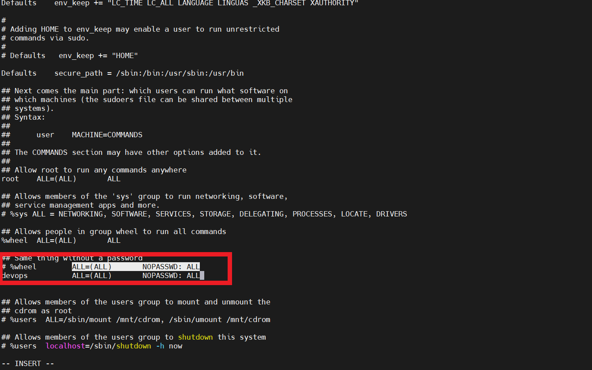
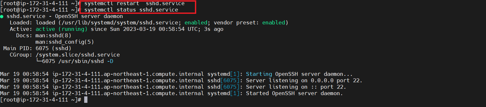
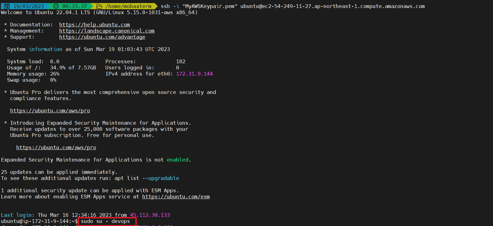
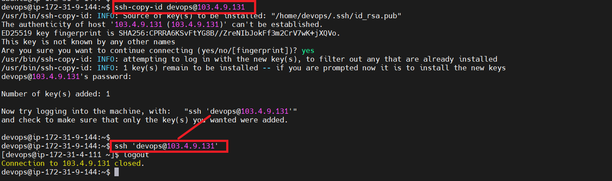

## Setup CentOs as node to ACS :
* Create a devops user , set password & provide sudo access .

```
sudo su - 
adduser devops
passwd devops
visudo 

## do changes as per below image 

Esc:wq 

```

 
 

* Install Python 

```
yum update -y
yum install -y python3
```

* PasswordAuthentication enable :
```
vi /etc/ssh/sshd_config 
# Do changes as shown in below image 
Esc:wq

systemctl restart sshd.service
systemctl status sshd.service

```
 
 
 


### On  ACS server :
* Copy the keys and check connection 
```
sudo su - devops 
ssh-copy-id dvops@<CentOsPublicIpaddress>
```


 


