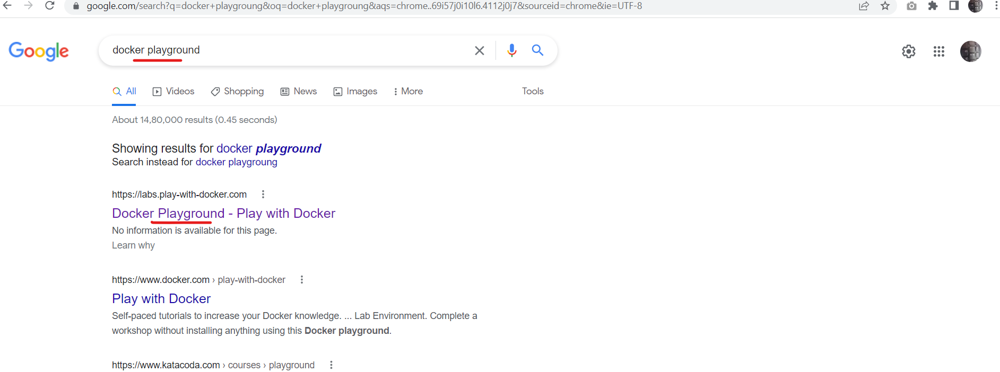
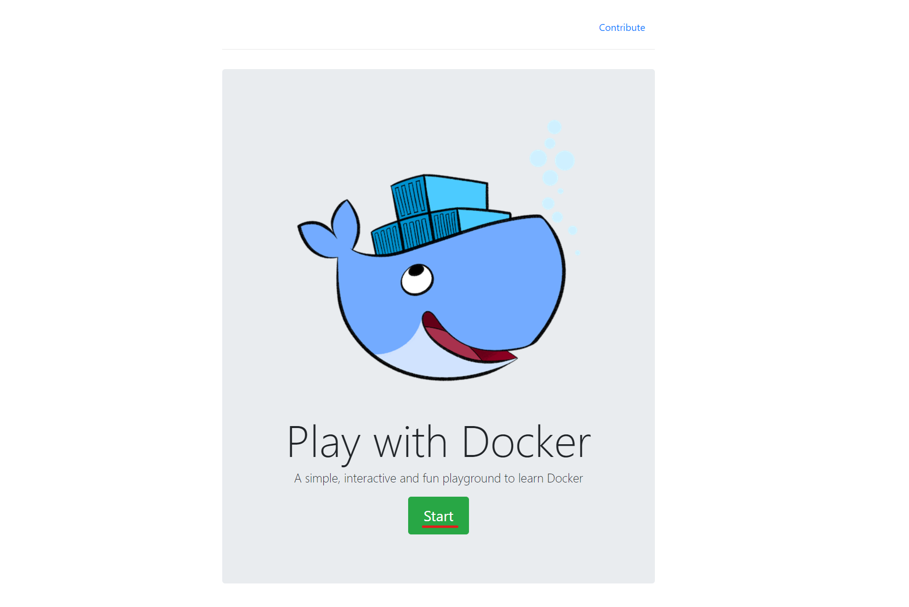
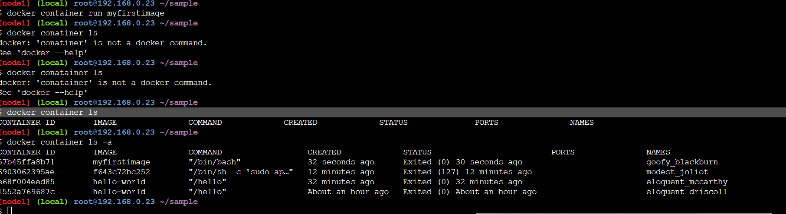
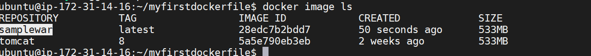

# Docker :

## Basic Devops Pipeline :


<br/>

* * * 

<br/>


## The evolution of applications ( VM vs Containers):
 

* Docker is an open source containerization tool. It enables developers to package applications into containers—standardized executable components combining application source code with the operating system (OS) libraries and dependencies required to run that code in any environment.
* __Containerazation__:  The process of making your application run on the docker containers.
* __Image__: Docker image is a process of packaging your application.
* Docker provides the ability to package and run the application in a loosely isolated environment called a  container. 
* For the docker documentation [REFER HERE](https://docs.docker.com/) 


## Understand Container :
* Every app running in container will be using the base os.
* Every container running in docker will be having process id.
* Application running inside the container will have storage, CPU, RAM , network.
* Each container running in the docker is going to have ip address.

<br/>

* * * 

<br/>

## Advantages of using docker over VM :
* Docker offers several advantages over virtual machines (VMs) for deploying and managing software applications. Some of these advantages include:

    * __Lightweight__: Docker containers are much more lightweight than virtual machines. While a virtual machine includes a complete operating system, including the kernel, Docker containers share the host operating system kernel and only include the application and its dependencies. This means that Docker containers are much smaller in size and faster to start up.

    * __Faster deployment__: Due to their smaller size and simpler architecture, Docker containers can be deployed much faster than virtual machines. In fact, Docker containers can be deployed in just a few seconds, whereas virtual machines typically take several minutes to start up.

    * __Portability__: Docker containers are highly portable and can run on any system that supports Docker. This makes it easy to move applications between development, test, and production environments, or to deploy applications across multiple cloud providers or data centers.

    * __Resource efficiency__: Because Docker containers share the host operating system kernel, they are much more resource-efficient than virtual machines. This means that you can run more Docker containers on a single host system than you could virtual machines, which can help to reduce infrastructure costs.

* Overall, Docker provides a lightweight, portable, and efficient way to deploy and manage software applications, making it an increasingly popular choice for modern application development and deployment.


<br/>

* * * 

<br/>

## Installing docker :
* Scripted way of installing docker [REFER HERE](https://get.docker.com/)
* Installing docker [REFER HERE](https://docs.docker.com/engine/install/ubuntu/)


<br/>

* * * 

<br/>

## Dockerhub & Playground:
* Signup in dockerhub [REFER HERE](https://hub.docker.com/signup)
* Docker playground     
 
 
 
 


<br/>

* * * 

<br/>


## Docker workflow :
  * While installing docker it installs two components :
   1. Docker Client
   2. Docker Daemon
  * When we use docker commands, docker client speaks with docker daemon to do the stuff
 

## DockerHub:
* DockerHub is the default remote registry to the docker, where you can store images and use the images when required
* There are many private registries:
  * ECR - (Elastic container registry provided by AWS)
  * ACR - (Azure container regitry provided by Azure)

```sh
* List images in local :
docker image ls

* To run a sample helloworld container :
docker container run hello-world

* List container in local:
docker container ls -a
```
 

* Docker cheat sheet [REFER HERE](https://www.docker.com/wp-content/uploads/2022/03/docker-cheat-sheet.pdf)


<br/>

* * * 

<br/>

## Container creation understanding :
* Write a Dockefile >> create image from Dockerfile >> create container from image
 


<br/>

* * * 

<br/>

## Basic Dockerfile syntax :
```
INSTRUCTIONS <ARGUMENTS>
```
* Some of the INSTRUCTIONS are FROM , RUN , CMD , ENTRYPOINT , ARG 


<br/>

* * * 

<br/>

## Dockerfile for the java :
* Make folder of sample and create a Dockerfile in that samplefolder
```
mkdir sample 
cd sample
vi Dockerfile
```
* Search for the ubuntu image in the dockerhub . For latest image follow below

* After adding Instructions and arguments , Dockerfile looks as below:
```
FROM ubuntu:16.04
ENV DEBIAN_FRONTEND noninteractive
RUN  apt-get update  -y \
  && apt-get install -y software-properties-common \
  && add-apt-repository ppa:openjdk-r/ppa \
  && apt-get install -y openjdk-8-jdk \
  && rm -rf /var/lib/apt/lists/*
```

* To create a image from dockerfile follow below steps:
```
docker image build -t <imagename> .
docker image build -t <imagename> <pathtothedockerfile>
docker image build -t myfirstimage .

```

* Dockerfile is convention , we can also change the filename


* To create a container from the  image we have created 
```
docker container run <imagename>
docker container run myfirstimage
docker container ls 
docker container ls -a
```



<br/>
<br/>
<br/>
<br/>

* * * 

<br/>
<br/>
<br/>
<br/>


## Install docker on EC2:
 * Install by script based :

```
sudo su 
curl -fsSL https://get.docker.com -o get-docker.sh
sh get-docker.sh

``` 

## RUN :
* This instructor executes your bash/linux commands in the Dockerfile
* Every RUN instructor stores as a single layer .
* syntax :
```
RUN <command>
RUN ["executable, "param1", "param2" ]
```
* shell way of providing RUN command:
```
RUN echo sample
```
* exec way of providing RUN command
```
RUN ["echo", "sample"]
```


## ENTRYPOINT:
* This is the instructor thats executed when the container creation.
* syntax:
```
ENTRYPOINT [ "executable, "param1", "param2"  ]
ENTRYPOINT executable param1 param2 
```

## CMD :
* This will be excuted when the container creation . If the ENTRYPOINT is not there , CMD is high priority.
* syntax:
```
CMD [ "executable, "param1", "param2"  ]
CMD executable param1 param2 
```

* If both the CMD and ENTRYPOINT exists, then the ENTRYPOINT will be excuted 

## EXPOSE :
* This intsructor is used to expose your port on the container 
* syntax:
```
EXPOSE <port>
EXPOSE 8080
```

## LABEL :
* This instructor adds metadata to your image :
* syntax:
```
LABEL <key>=<value>
LABEL author="myself"
LABEL project="myproject"
LABEL version="1.0"
```

## ADD and COPY :
* The two instructors are used to copy the files to the docker image.
* ADD instructor is uded to copying files from url and local machine.
* COPY instructor supports copying the files on the local machine.

* synatx:
```
ADD <src> <dest>
ADD <url> <dest>
COPY <src> <dest>
```

<br/>
<br/>
<br/>
<br/>

* * * 

<br/>
<br/>
<br/>
<br/>

## Run container in multiplemodes :

## Attached mode:
* The container runs on foreground
* Default mode of docker

```
docker conatiner run  <dockerimage>
docker container run tomcat
```

## Detached mode:

* Docker conainer runs in the background .

```
docker conatiner run -d <imagename>
docker container run -d tomcat 
```

## Interactive :
* In interactive mode we can interact with docker using terminal (/bin/bash, /bin/sh)
* We will be using -it in the docker command
```
docker conatainer exec -it  <containerid/container name> /bin/bash 
```
## To get into the container :

```
docker exec -it <conainername>/<containerid> /bin/bash
```


## Portforwarding:
* It is used to access our application running inside the container 

```
docker conatiner run -P <image>
```

## To publish our own specified port :
```
docker conatiner run  -p <hosport>:<conatinerport> <imagename>

docker conatiner run -p 8005:8080 <imagename>
```


<br/>
<br/>
<br/>
<br/>

* * * 

<br/>
<br/>
<br/>
<br/>

## Create a Dockefile for SAMPLEWAR deployment :
 * Install JAVA 
 * Install tomcat
 * Downloading the war file and copying it to tomcat webapps
 * start the tomcat
### First approach :
  1. Taking baseimage of ubuntu  ---- FROM 
  2. Installing java     ----  RUN 
  3. Installing tomcat   ----  RUN 
  4. know the exact path of webapps 
  5. downloading the war file  and copy to the webapps -----  ADD/COPY
  6. Open port of tomcat on container   --- EXPOSE 
  7. starting the tomcat  ----  ENTRYPOINT/CMD
### Second approch:
  1. Taking the baseimage of tomcat directly --- FROM
  2. Downloading the war file and copying it to tomcat webapps --- ADD/COPY
  3. Open port of tomcat on container   --- EXPOSE 
  4. starting the tomcat  ----  ENTRYPOINT/CMD
  

## Dockerfile for the second approach:
```
FROM tomcat:8
LABEL author="surya"
ADD https://tomcat.apache.org/tomcat-7.0-doc/appdev/sample/sample.war /usr/local/tomcat/webapps/
EXPOSE 8080
CMD [ "catalina.sh", "run" ]
```
* Run the above Dockerfile wiht below commads
```
docker image build -t samplewar .
```


* To create a container from the image of samplewar follow below steps:
```
docker container run samplewar
```

* To run the container on the detach mode follow below:
```
docker container  run -d samplewar
```
* To check the application ruuning on tomcat , we use -P to publish one of the port on the base OS to the container:
```
docker container -d  -P run samplewar
```


* To check the samplewar application accessible to the outside world:

```
ipaddress:<port>/sample
```


## Add name to the container :

```
docker container  run --name <nameofconainer>  -d -P <image>
```


## To inspect an image : 
* Docker inspect provides detailed information on constructs controlled by Docker. By default, docker inspect will render results in a JSON array.
```
docker image inspect <imagename>
```


## Delete an image :

```
docker image rm <imagename>
docker image rm -f <imagename>
```
* To delete all images :

```
docker rmi $(docker images -a -q)
```


## To delete the docker container :

```
docker container rm <conatinername>/<conatinerid>
docker container rm -f  <conatinername>/<conatinerid>
```
* For more info [REFERHERE](https://docs.docker.com/engine/reference/commandline/container_rm/)


<br/>
<br/>
<br/>
<br/>

* * * 

<br/>
<br/>
<br/>
<br/>


# Instructions:

## USER :
* This sets the username for any subsequent commands running by RUN , CMD , ENTRYPOINT
* syntax:
```
USER <username>
USER devops
```

## WORKDIR:
* This intruction sets the working directory for any subsequent commands running by RUN , CMD , ENTRYPOINT
* Syntax:
```
WORKDIR /home/devops/mypath
```

## ARG :
* This insruction allows variable to be passed while building image.
* syntax:
```
ARG <key>=<value>
```

## ENV:
* This insruction allows you to set the environmental variables for the docker image.
* syntax:
```
ENV <key>=<value>
```
* Environmental variable can also be replaced while container running.

## Example  Dockerfile with above Instructions

```
FROM tomcat:8
LABEL author="surya"
USER devops
ARG url=https://tomcat.apache.org/tomcat-7.0-doc/appdev/sample/sample.war
ADD $url /usr/local/tomcat/webapps/
EXPOSE 8080
WORKDIR /home/devops/
ENV tomcatversion=8
CMD [ "catalina.sh", "run" ]
```
<br/>
<br/>
<br/>
<br/>

* * * 

<br/>
<br/>
<br/>
<br/>

##  CMD &  ENTRYPOINT :
* These can be overwritten while creating a container:

```
docker container run -d samplewar echo hello
docker container run -d samplewar --entrypoint 
```

## stop/start pause/unpause

```
docker container stop <container-id>/<containername>
docker container start  <container-id>/<containername>
docker container pause  <container-id>/<containername>
docker container unpause  <container-id>/<containername>
```
## Commands:
```
docker container ls   ---- list of running container 
docker container ls -a    ---- list of all contaner running and exited
docker image ls         ----- list all the images

```


<br/>
<br/>
<br/>
<br/>

* * * 

<br/>
<br/>
<br/>
<br/>


## Volumes :

* As the containers are not reliable .That means the containers are going to stop/kill/died when there is no service running inside the container.
* When the containers are stopped the data inside the containers also lost.
* For the above isuue to be resolved , there is a concept of volumes, where we can attach the volumes. The volumes will be available even after the container is lost


* volumes 
* Bind mount
* tmpfs

* For docker volumes [REFERHERE](https://docs.docker.com/storage/volumes/)

# DELETING/INSPECT/PRUNE volumes
* For Document [REFERHERE](https://docs.docker.com/engine/reference/commandline/volume_rm/)

```
docker volume rm <volumename>
docker volume rm  -f <volumename>
```
# CNM(Conatiner Networking Model)
* For Document [REFERHERE](https://docs.docker.com/network/)