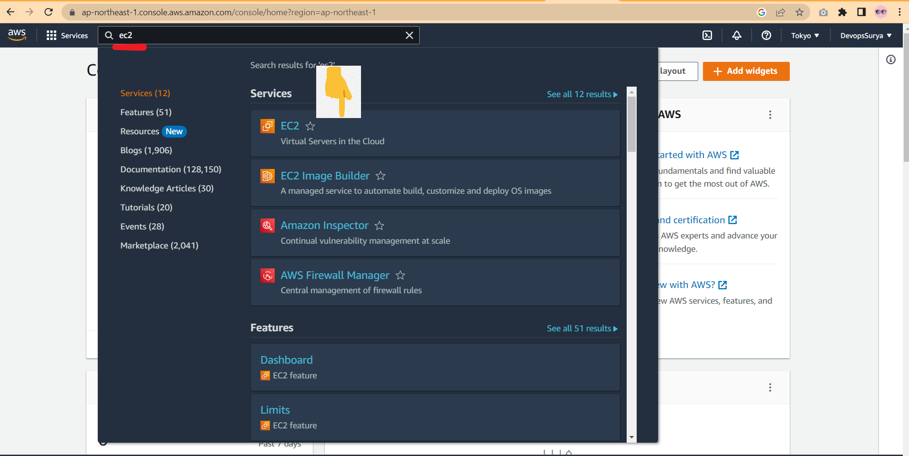
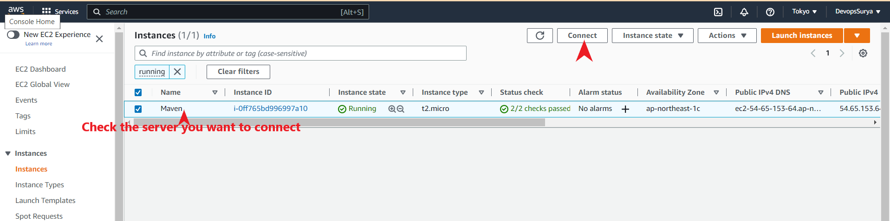
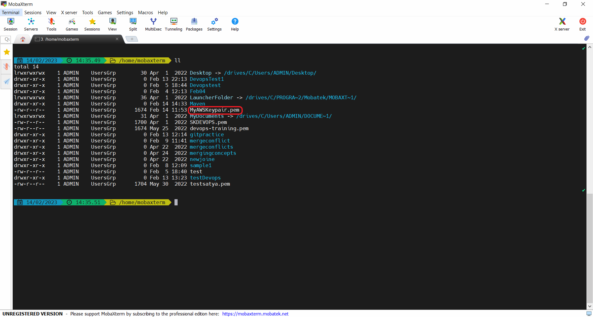

# EC2 (Elastic Compute Cloud) :
* An Amazon EC2 instance is a virtual server in Amazon's Elastic Compute Cloud (EC2) for running applications on the Amazon Web Services (AWS) infrastructure

## Create a EC2 in AWS :
* To create a EC2 in AWS , follow the below screenshots with instructions :
* Search of EC2 in AWS Dashboard 
* ***Note*** : When creating New keypair , a file will be downloaded(which requires when connecting to the server).
  
 
 
 
 

 

* * * 

 

## Connect to the EC2  / Disconnect from EC2 :  :
* To connect to the EC2 instance need a KeyPair file downloaded while creating the server.

1. Open the AWS dashboard get the command to connect to the EC2.
 
 

2. Open Mobaxterm and makesure the file downloaded is there in the present path and paste the command copied from AWS dashboard.
 
 

3. Disconnect from EC2 >> exit (or) Ctrl+ d :
 

 

* * * 

 

## Terminate EC2 in AWS : 
* To terminate/kill the EC2 in AWS , follow the screenshots with instructions:
   * **Terminate instance** : Permanent Delete/kill of instance 
   * **Stop instance**      : Temporary stopping , can start at anypoint in future
   * **Reboot instance**    : restart/reboot the instance 
   
 

 

* * * 

 
