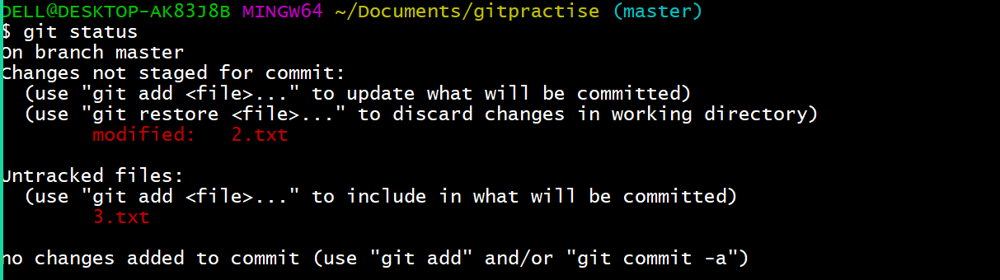
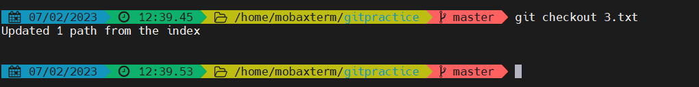
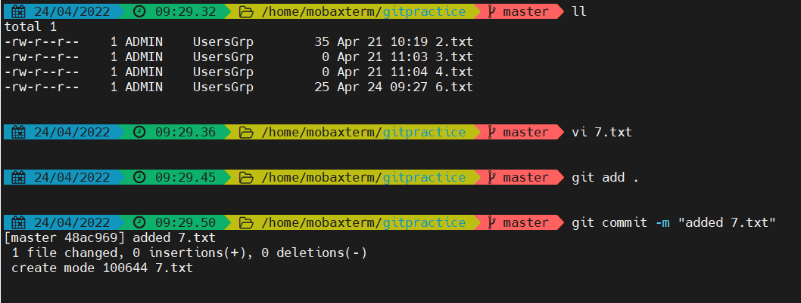
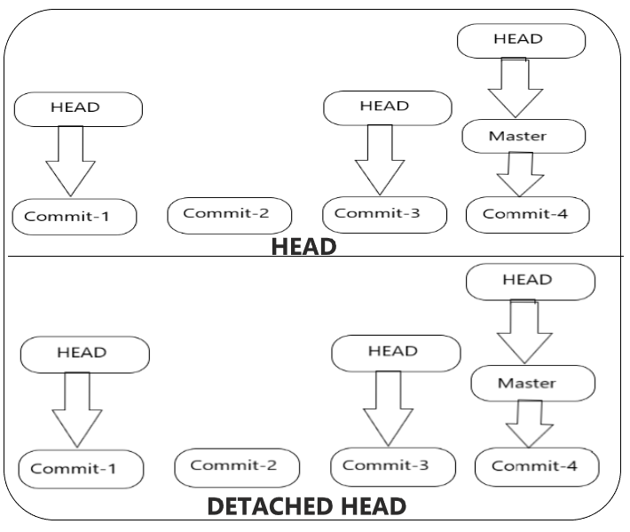
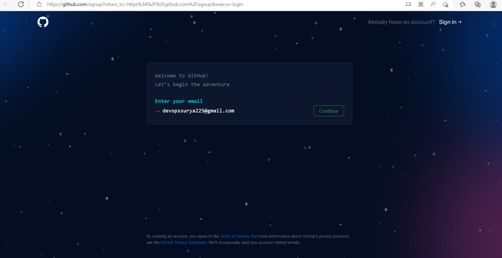
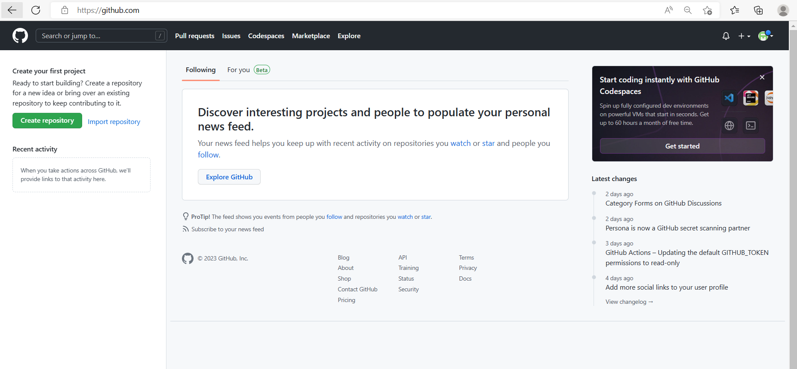
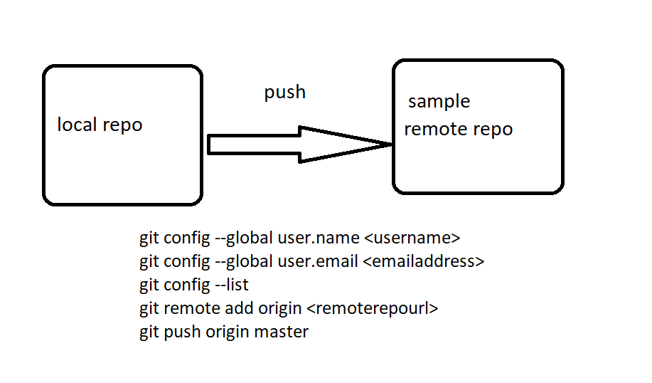
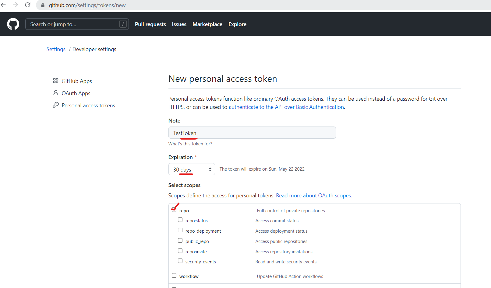
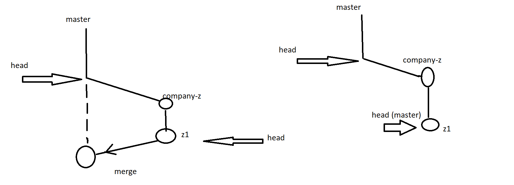

* BASIC PIPELINE OF DEVOPS:


# GIT

* Git is the version control system (VCS)
* Git is developed by **_LINUS TORVALDS_** .


## Organization Expectations :
* All the developers has to work on a same code parallely.
* It must have a feature of versions when the code is being developed.
* Need to have a feature of tracking the changes in the history.
* Must have a ability to serve the application to the mutiple clients.

## GIT HISTORY 
### Evolution of VCS :
  * Share the code via mail.
  * Sharedfolder .
  * Version Control System.
       * First generation :
           * SCCS (Source Code Control System)
           * RCS (Revision Control System)
       * Second Generation :
           * CVS (Concurrent Versions System)
           * SVN (Apache Subversion)
           * Perforce Helix Core
       * Third Generation :
           * Git
          
## Difference betwen Centralised VCS and Distibuted VCS :


## prerequisites:
* Install choco :
  [REFER HERE](https://chocolatey.org/docs/installation)

* GIt install
  [REFER HERE](https://chocolatey.org/packages/git.install)

* VSC install
  [REFER HERE](https://chocolatey.org/packages/vscode)

* MOBAXTERM Install 
  [REFER HERE](https://chocolatey.org/packages/MobaXTerm)
  

## THREE phases in git:
1. Working tree
2. Stagging area
3. Local repo
4. Remote repo .


* To see the changes made 
```
git status
```

* To add all the changes to the staging area 
```
git add .
```

* To commit all the changes to the local repo 

```
git commit -m "< added some changes>"
```


##  Initializing Git on local  : 

```
 mkdir gitpractice

 cd gitpractice

 git init  ---  To intilalize the git in the present folder.

```


       

## Scenario : Create a file 1.txt push it from workingarea to Localrepo :


```
touch 1.txt 

git status 

git add . 

git commit -m "adding 1.txt" 

```
  


## Untracked and Modified files :
* Untracked is the new file added and it is not there initially.
* Modified is  the file that already present and there are some changes in the content of the file



## Add only the modified changes to the stagging area:

```
git add -u      -- add only the modified changes to stagging area 
git add --all   --- it add all changes 
git add -A      --- it add all chnages
```


## Track the changes made in the history : 

```
git log --oneline   ---it will show u all the commit u have made till now
git checkout <commitid>   --- u can track the changes on the history 
git checkout master 
```


## Will git track folder ..?
* Git tracks only the files not the folders .


## SCENARIO : Get back the changes from staggingarea to Workingtree & remove the changes from Workingtree also 


### RESET 
* Reset will get back the changes from  the staggingarea to the workingtree


### checkout 
* Checkout  is used to remove the changes made on the workingtree , after we do reset

```
git checkout  <filename>
```



## Scenario:  Get back the changes from both staggingarea and workingtree at a sametime  :

```
git reset --hard 
```


## Removing  the file is also a change in the working of git.


## SCENARIO: Revert the commit .


### Revert :
* Git revert is to revert the commit .

```
touch 7.txt

git add .

git commit -m " added 7.txt"

git revert <commitid>
```




## Head VS Detached Head
* Head will be always at the latest commit .
* When we are going back to the history , the head will be detached and it will go back to the commit which you are using.




## Push the changes from local repo to remote repo
###  PUSH 
* git push will add changes from local repo to the remote repo


* For Remote repository we must have a ***github*** account to create it .
* Repositry is the place where the code will be stored.
* The number of repositries will be depending up on the basis of the project.


## High level view of github 


## GitHub Signup : [REFER HERE](https://github.com/signup?return_to=https%3A%2F%2Fgithub.com%2Fsignup&source=login) 
* Follow the below instructions to signup :
* **Note** - check the Free plan in the below steps






## Create a repositry in the github:
* Go to the repositries and then refer the image below:

* Provided the repositry name and make it public , so that it will be available to everyone.


## Configure RemoteRepo to the LocalRepo to push the code. 



* To configure the git in your local  :

```
git config --global user.name <username>
git config --global user.email <emailaddress>
git config --list
git remote add origin https://github.com/devops-surya/sample.git
git push origin master
```


## PersonalAccessTokens
* Git depricated the support of using password and  expecting us to use the PersonalAccessToekn as password.
* Go to >> Settings >> Developer Settings >> Personal access tokens >> Generate New Token >> 1.Note 2.Expiration 3.select scopes 4. Generate Token





## Scenario : A new developer added to a team and he/she want the  total code from the repositry:

```
git clone https://github.com/devops-surya/sample.git
```


## Scenario : A developer already exists and he/she has the code in his local desktop. But he/she dont have the latest code.

```
git pull https://github.com/devops-surya/sample.git
```


## Merge conflicts.  .

## Scenario : We have two developers newly assigned to a new project.


* To create the above scenario , follow the below steps :
  * Create a folder of mergeconflicts.
  * create a two folders with names developer1 , developer2 .
  * Get into folders of developer1, developer2 and clone the repo .
  
  * Developer1 has made some changes to the file 6.txt and then pushed to the repo .
   
  * Developer2 has made changes on the local and pushed the changes , here it is asking for the pull as shown below :
   
  * Developer2 has to pull the code and has to take call of merge conflicts and push the code again.
  

## Multiple branching :
* If a company want to serve the code to the mutliple companies , they will create multiple branches and go for the parallel development.


* To create a branch

```
git branch <branchname>
```
* To list the branches:
```
git branch
```

* To switch between the branches

```
git checkout <branchname>
```

* To create a branch and switch to it directly:

```
git checkout -b <branchname> 
```


* To push the code from the company-x branch to the remote repo:

```
git push origin company-x
```


* To see the remote branches:
```
git branch -r
```


## MERGE :

* create a file y1.txt and do add , commit .

* Switch to the company-x branch . Create  a file x1.txt and do add , commit .


## Fastforward merge:

* Create branch a company-z. create a file z1.txt and do add , commit.

* if u dont want to go with the fastforward merge 

```
git checkout master 
git merge --no-ff company-z
```

## Rebase :

* Create  a branch-a and create a a1.txt file in it. do git add , git commit.
* switch to master branch and create file rebase.txt, do git add and git commit.

* For rebase to be done

```
git checkout branch-a
git rebase master
```


## cherry-pick :

* Create a branch-c , add two commits  by creating c1.xtx and c2.txt.

* Create a branch-d , add d1.txt . do add and commit.


## git pull :
* git pull = git fetch + git merge 

## Branching strategy 

* Git Working 
* Multiple phases : Working Tree, Staging area , Local repo , Remote repo .
* Git history 
* Organization expectation 
* Git add , commit , push , clone , pull , reset , reset --hard , revert , merge rebase , ff merge , cherry-pick , 
* Branching startegies 
* git status
* Creating local branches , merge between branches
* Listing the local and remote branches .
* Pushing the multiple branches to the remote repos .