# Jenkins:
* Jenkins is an open source __continuous integration/continuous delivery and deployment__ (CI/CD) automation software DevOps tool written in the Java programming language. It is used to implement CI/CD workflows, called pipelines.
* Jenkins is a CI/CD tool
    * ***CI (Continous integration)*** : Continuous Integration is the practice of merging code changes into a shared repository frequently and automatically verifying that the resulting code builds, tests, and integrates successfully.
    * ***CD -- Continous Delivery / Continous Deployment*** :
        * **Continous Delivery** : Continuous Delivery is a software development practice that aims to make the release process more efficient and reliable by automating the entire software delivery pipeline. The idea is to ensure that code changes are always in a releasable state and can be deployed to production at any time. Continuous Delivery typically involves a continuous integration process that compiles and tests the code, followed by an automated deployment process that deploys the built artifacts to a staging environment. Once the code has been successfully tested in the staging environment, it can be promoted to the production environment.
        * **Continous Deployment** : Continuous Deployment, on the other hand, is a practice where every code change that passes the automated tests is automatically deployed to production. This means that any changes made to the code are automatically released to the users without any human intervention. Continuous Deployment is a more advanced version of Continuous Delivery and is generally suitable for organizations with high release frequency and the ability to handle fast feedback loops.
<br/>

* * * 

<br/>

## Pipeline flow of devops :


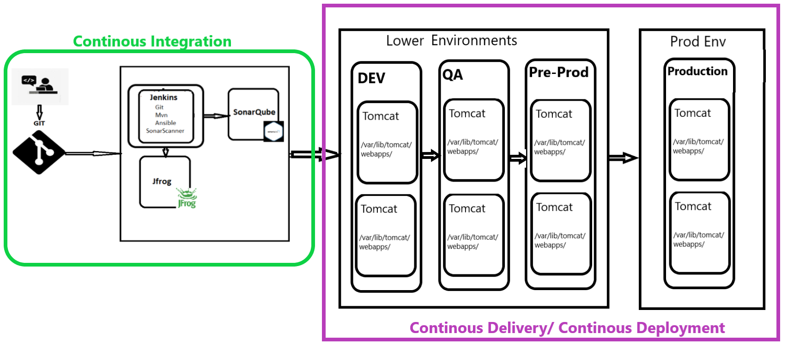


<br/>

* * * 

<br/>

## Installing Jenkins 
* prerequisites:
1. Ubuntu
2. Java 
3. Jenkins

## For installing Jenkins we have two ways.
1. Quick setup (it is not the enterprize setup)
2. Jenkins master 

### Quick setup [REFER HERE](https://www.jenkins.io/download/)
```
 java-jar <path to the download>
```

### Jenkins master setup :
* Jenkins installation official document [REFER HERE](https://www.jenkins.io/doc/book/installing/linux/#debianubuntu) 
* Create a EC2 in AWS and follow below steps to install Jenkins :
```
sudo apt-get update
sudo apt-get install openjdk-11-jdk

java -version

curl -fsSL https://pkg.jenkins.io/debian-stable/jenkins.io.key | sudo tee \
  /usr/share/keyrings/jenkins-keyring.asc > /dev/null
echo deb [signed-by=/usr/share/keyrings/jenkins-keyring.asc] \
  https://pkg.jenkins.io/debian-stable binary/ | sudo tee \
  /etc/apt/sources.list.d/jenkins.list > /dev/null

sudo apt-get update
sudo apt-get install jenkins
```

* To open jenkins on brower 
* ***NOTE*** : jenkins runs on port of 8080 . So port 8080 must be opened in EC2 server (or) set inbound rule to All Traffic .
```
http://publicipaddress:8080
```
* ***http://publicipaddress:8080*** will open below screen on browser:

* Copy the password from server and paste it on the browser:

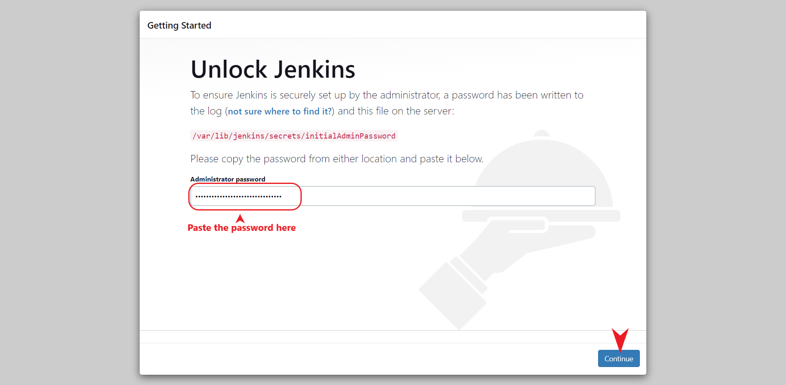
* Select ***Install suggested plugins*** and wait all plugins installed:

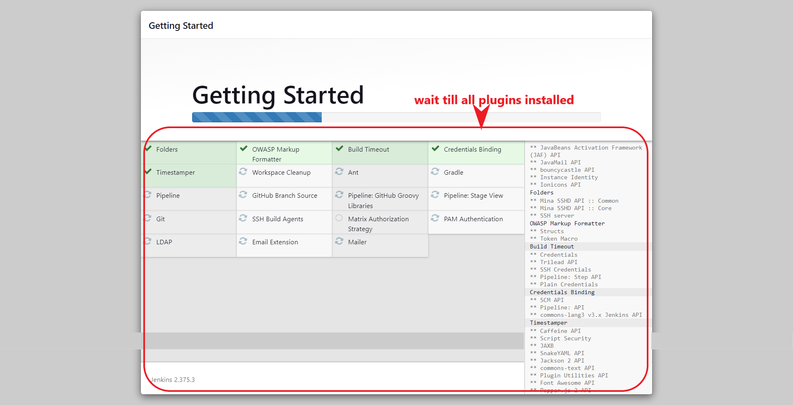
* ***Create First Admin User*** by provide the username, password , email then  Save and continue:

* ***Instance Configuration*** -- No changes
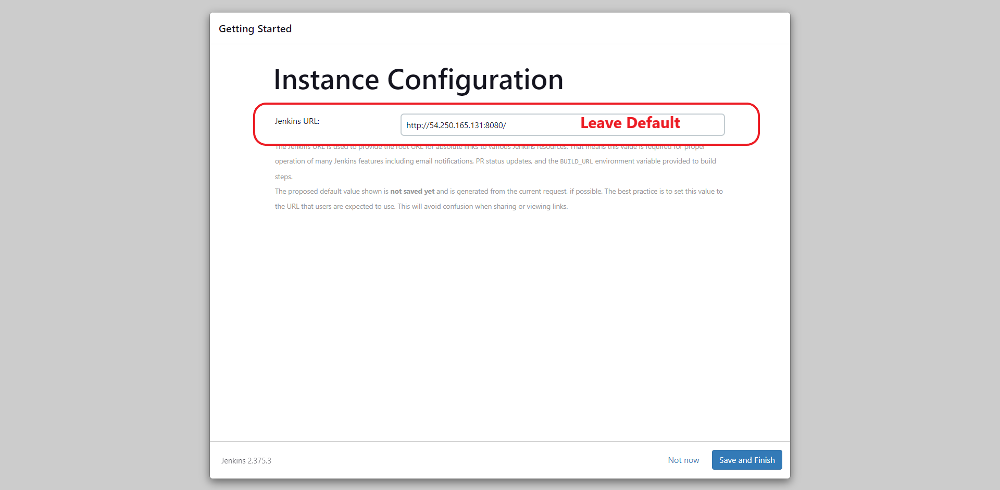
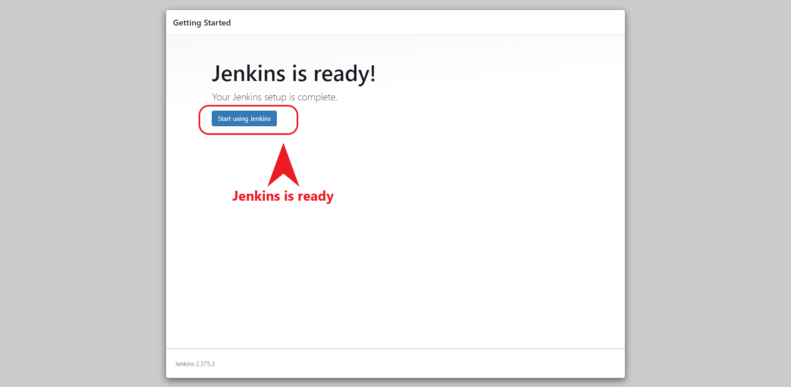
* Dashboard of jenkins
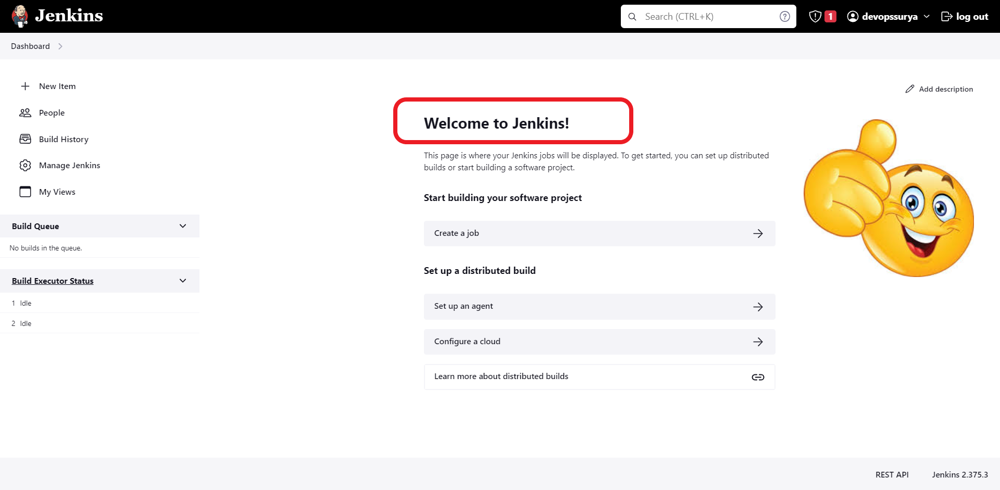


<br/>

* * * 

<br/>

## Create a *Job* :
* In Jenkins we do automation by creating jobs :


## Multiple ways to create a Job:


## Create a Job in Freestyle:
* Click on the  **New Item**  and follow the below instructions in the screenshots :


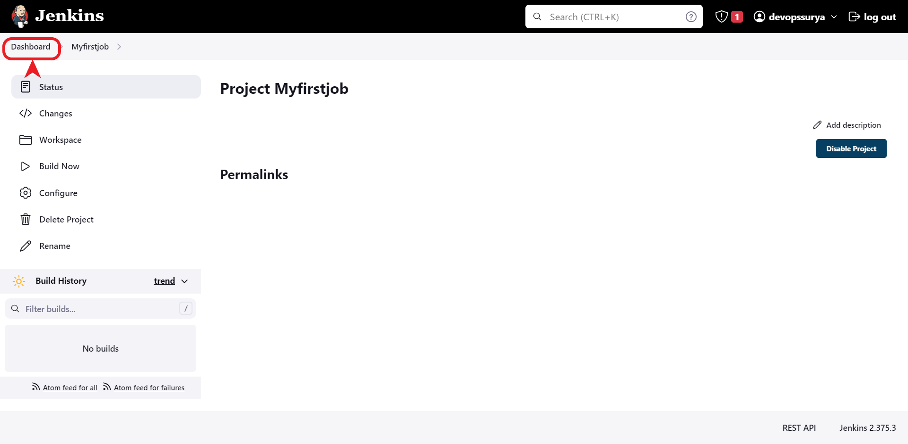
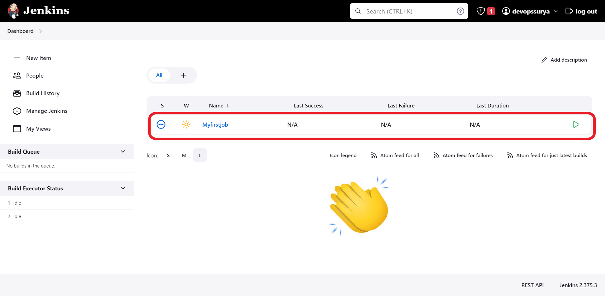


<br/>

* * * 

<br/>


## Multiple Sections in Jenkins Freestyle job:
1. General
2. Source Code Management
3. Build Triggers
4. Build Environment
5. Build Steps
6. Post-build Actions
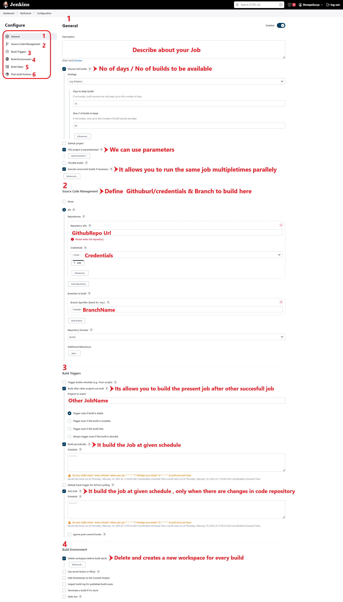


<br/>

<br/>

* * * 

<br/>

<br/>


# Explore ***Manage Jenkins*** Options : 

## ***Manage jenkins*** is used to configure the Jenkins (settings) :


<br/>

* * * 

<br/>


## Jenkins executor :
* ***Executor*** will define , how many jobs run parallely at a time.


<br/>

* * * 

<br/>


## Configure System 
* Go to Manage Jenkins >> Configure System 


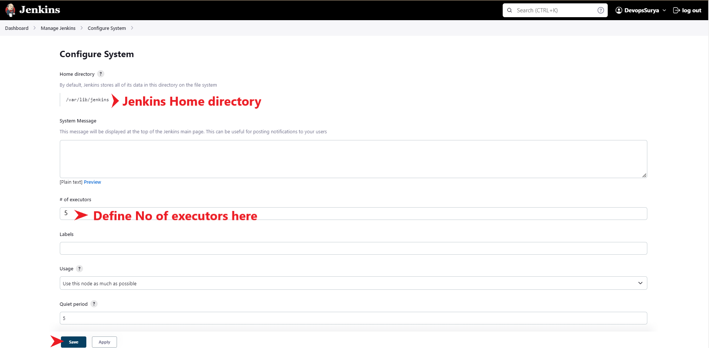


<br/>

* * * 

<br/>

## Configure Global Security 
* Go to Manage Jenkins >> Configure Global Security 


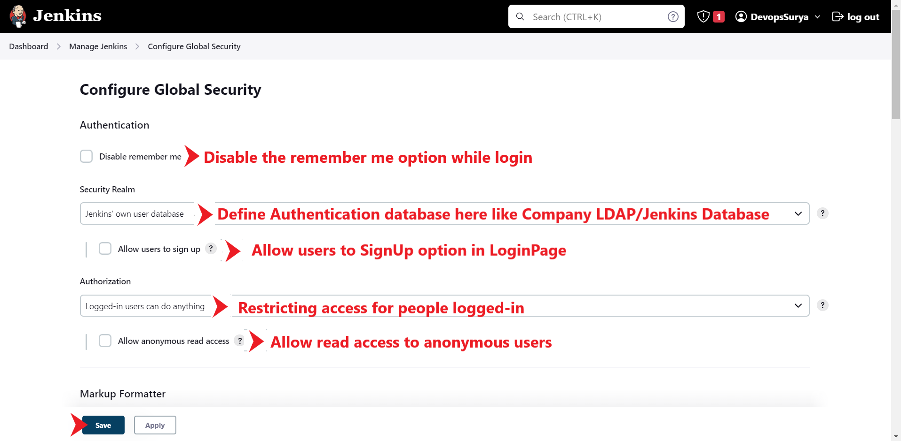

<br/>

* * * 

<br/>


## Manage Plugins :
* Plugins are a core feature of Jenkins, an open-source automation server used for continuous integration and continuous delivery (CI/CD) of software projects. Plugins allow users to extend the functionality of Jenkins by adding new features and integrations with other tools.

* Go to  Manage jenkins >> Manage Plugins


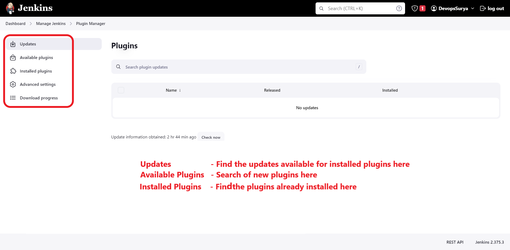

* In the "Available" tab, you can browse for new plugins to install. You can use the search bar to find plugins by name, or you can browse through the list of available plugins.
* In the "Installed" tab, you can view all of the plugins that are currently installed on your Jenkins instance. You can also disable or uninstall plugins from this page.
* In the "Updates" tab, you can see if there are any updates available for the plugins you have installed. To update a plugin, select the checkbox next to the plugin and click on the "Download now and install after restart" button.
* In the "Advanced" tab, you can upload a plugin from your local machine or specify a custom update center URL.
***Note*** :  Some plugins may require a Jenkins restart to be fully installed or updated. When you install or update a plugin, Jenkins will 

<br/>

* * * 

<br/>


## Restart the jenkins :
* Multiple ways to restart 
  1. From ***cli*** from jenkins server : 
    ``` 
    sudo service jenkins restart     -- Restart Jenkins
    sudo service jenkins status      -- check the status of jenkins
    ```
    

  2. From ***GUI*** i,e Jenkins dashboard in browser: 
    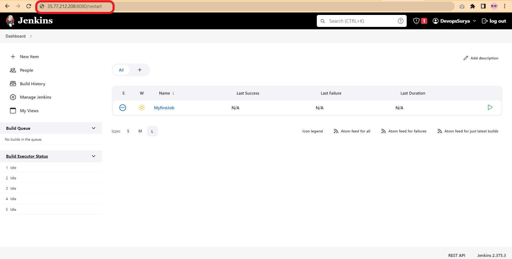

  3. From  ***Manage Jenkins*** in Jenkins Dashboard
     


<br/>
<br/>

* * * 

<br/>
<br/>


## Scenario-1: Create a CI Job.
### Find below requirements :
```
Need a Freestyle Job that should automatically detect the changes in github, get the code from SampleMavenProject, build it by using Maven &  Delete the Workspace for every build.
```


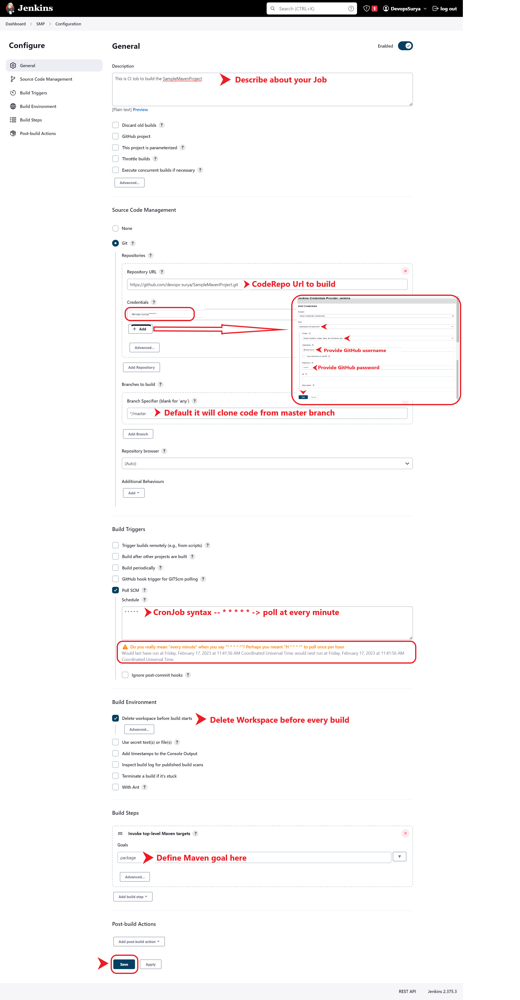


* Explore ***Console Output*** of **SMP** Job


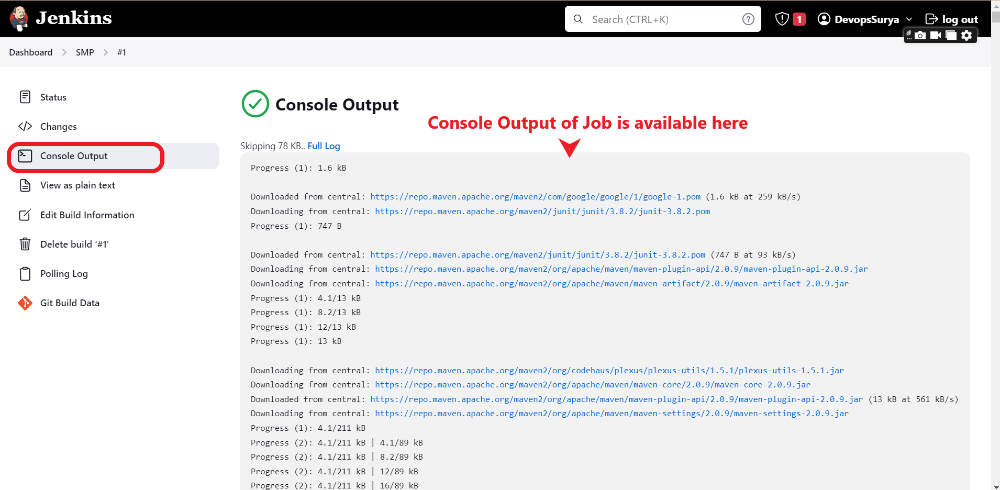
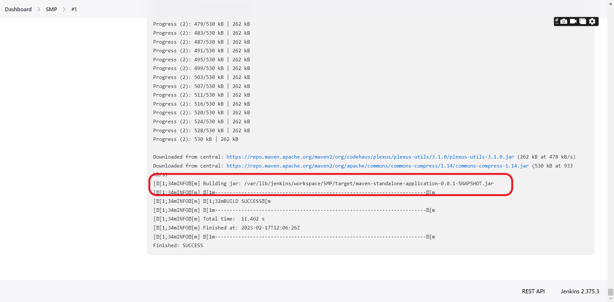

<br/>
<br/>

* * * 

<br/>
<br/>

## Scenario-2: Add Post-build action to the Scenario-1 
### Find below requirement for Post-build actions:
```
Configure Scenario-1 CI job with **Archive the artifacts** & **Publish JUnit test result report** Post-build actions 
```
* ***Archive the artifacts*** -- It will provide option to download the artifact from the Jenkins Dashboard
* ***Publish JUnit test result report*** -- It will publish the test result in the Jenkins Dashboard 


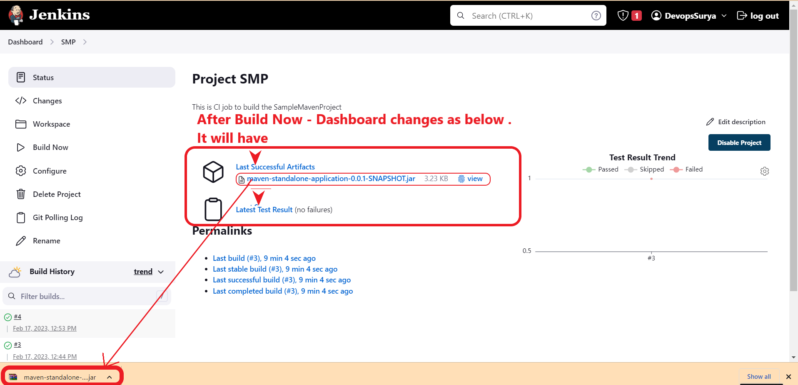


<br/>
<br/>

* * * 

<br/>
<br/>

##  Understand the build process in Jenkins :

  * A ***build*** in Jenkins refers to the process of running a job, which typically involves compiling the source code, running tests, and producing artifacts etc. Each build in Jenkins is assigned a build number, which is incremented with each new build of a job. You can view the build history for a job in Jenkins, including the build number, the date and time of the build, and the status of the build (success or failure). You can also view the console output for a build, which shows the output of the build process, including any errors or warnings that occurred during the build.

  * The ***Jenkins workspace*** directory is typically a subdirectory of the ***Jenkins home directory*** and is unique to each job. When a job is triggered, Jenkins will create a new workspace directory for the job and copy the source code from your source control system into the workspace.


## Jenkins Home Directory Structure  :

  * In Jenkins, the ***home directory*** is the top-level directory where Jenkins stores all its configuration, plugins, and other related files. The location of the Jenkins home directory varies depending on the operating system and the installation method used.

  * When you install Jenkins on a Unix-like system, such as Linux or macOS, the default Jenkins home directory is usually located at /var/jenkins_home. On Windows, the default location is usually C:\Program Files (x86)\Jenkins.


  * The Jenkins home directory contains several important directories and files, including:

      * config.xml: This file contains the main configuration settings for Jenkins, such as security settings, system properties, and global tool installations.

      * jobs/: This directory contains the configuration and workspace directories for each Jenkins job. Each job is stored in a separate directory within the jobs/ directory.
      
      * jobs/**Jobname**/builds/: This directory contains all the build related information like no of builds and build history 
      
      * plugins/: This directory contains all the installed plugins for Jenkins. Each plugin is stored in a separate directory within the plugins/ directory.

      * secrets/: This directory contains sensitive information, such as passwords and API keys, that Jenkins uses for authentication and authorization.

    * users/: This directory contains the user accounts and their associated settings, including passwords and permissions.

It's important to back up the Jenkins home directory regularly, as it contains all the important configuration and data for your Jenkins installation. This will allow you to easily restore your Jenkins instance in case of a system failure or other issue.


## CronTab syntax : 
* Cronatb Guru -- [REFER HERE](https://crontab.guru/#*_*_*_*_*)
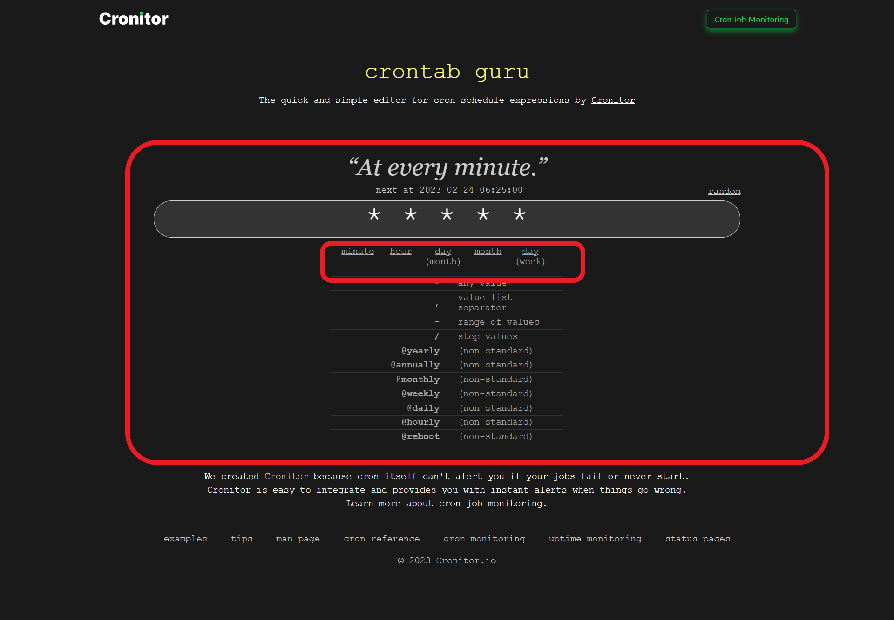


<br/>

* * * 

<br/>


## Build with parameters:
  * In Jenkins, you can create a build job that accepts parameters from the user. This allows you to customize the build process and pass in values that are specific to the build.

      * String Parameter: Allows the user to enter a text value.

      * Boolean Parameter: Allows the user to select a checkbox.

      * Choice Parameter: Allows the user to select a value from a dropdown list.

      * File Parameter: Allows the user to upload a file.


### Official Dcoument for Parameters :
* Git parameter [ReferHere](https://plugins.jenkins.io/git-parameter/)
* String parameter [ReferHere](https://wiki.jenkins.io/display/JENKINS/Parameterized+Build)
* Choice Parameter [ReferHere](https://plugins.jenkins.io/extensible-choice-parameter/)
* Active choice parameter [ReferHere](https://plugins.jenkins.io/uno-choice/#:~:text=The%20Active%20Choices%20plugin%20is,or%20rich%20HTML%20UI%20widgets.)

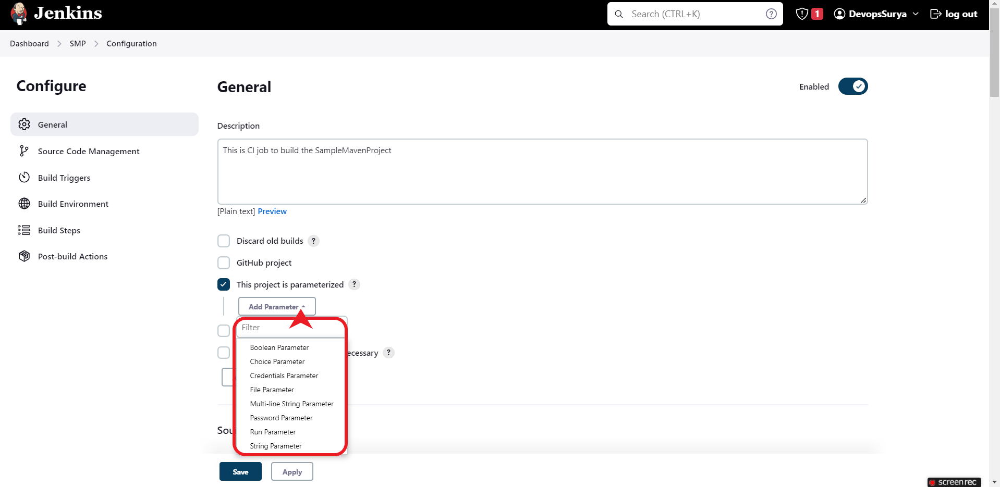


#### Scenario-3 : Install & Configure ***Git Parameter***  to pass the branch paramater while running the Job .
    
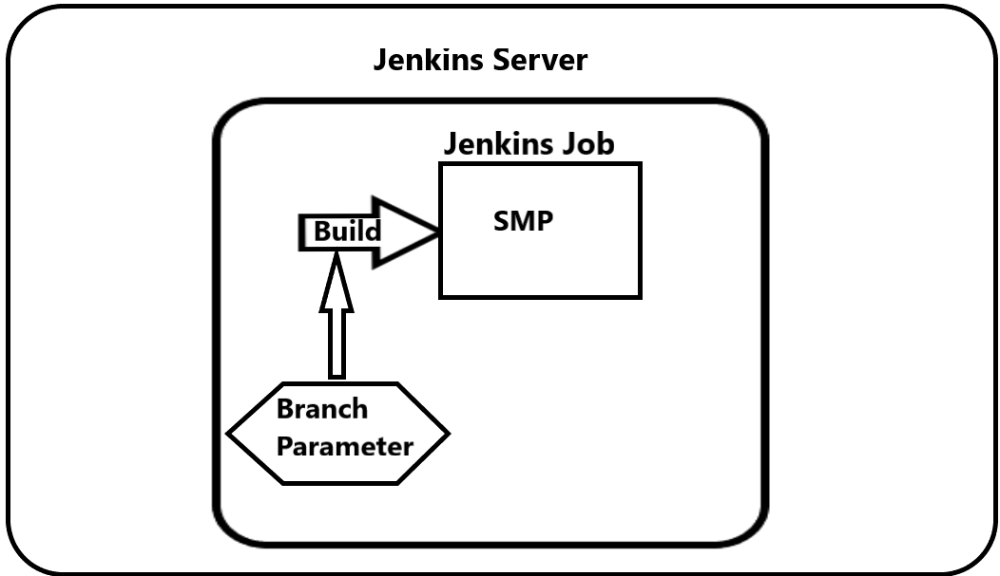


  1. Install ***Git Paramter plugin*** 


  2. Configure ***Git Paramter plugin*** in the __SMP__ Jenkins Job


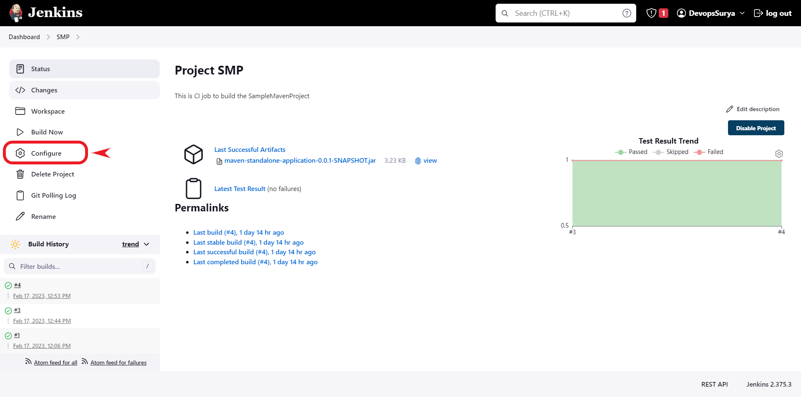


<br/>

* * * 

<br/>


### Scenario-4:  Create a NewJob SMP-2 , it should be copied from the existing SMP Job.


* Copy/Clone the existing Job , will help us in this scenario.
* when you copy a job, it will inherit the settings and configuration of the original job, including the build history.


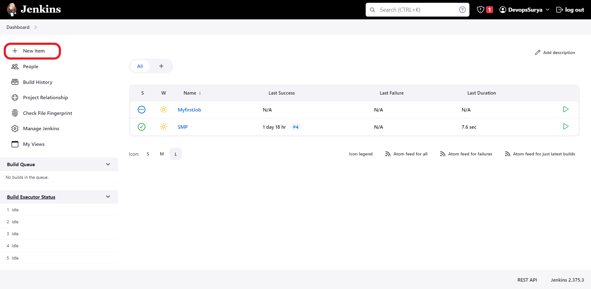

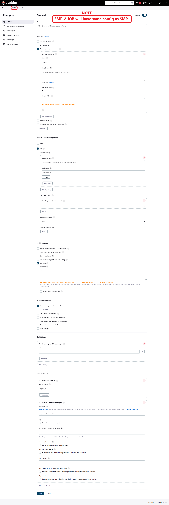

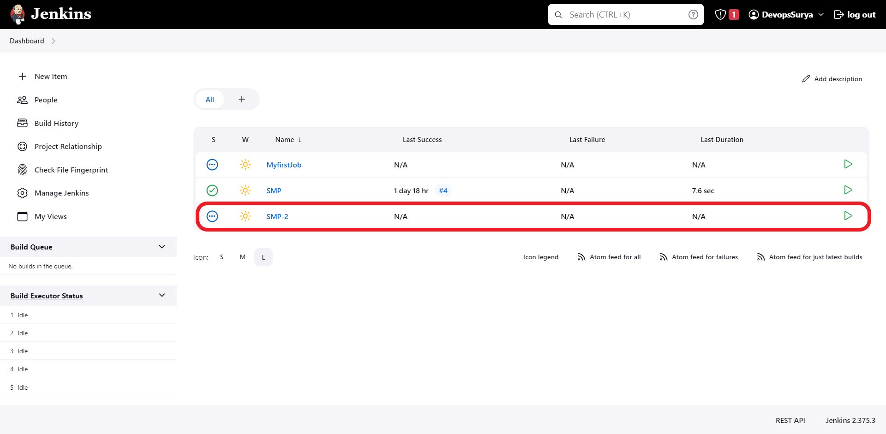


<br/>

* * * 

<br/>

## Upstream and Downstream projects:

* In Jenkins, "upstream" jobs are those that trigger or initiate the execution of other jobs, while "downstream" jobs are those that are triggered or executed by upstream jobs.


* For example, let's say you have two jobs, Job A and Job B, where Job A triggers Job B when it completes successfully. In this case, Job A is the upstream job and Job B is the downstream job.

  * Here are some examples of upstream and downstream jobs in Jenkins:

   * Upstream job: Build and package an application.
      * Downstream jobs: Deploy the application to a test environment, run automated tests on the application, deploy the application to a production environment.

   * Upstream job: Pull code changes from a source code repository.
      * Downstream job: Build and test the code changes, deploy the changes to a staging environment.

   * Upstream job: Run a performance test on an application.
      * Downstream job: Analyze the performance test results and provide recommendations for optimizing the application.

By defining upstream and downstream jobs in Jenkins, you can create complex workflows and ensure that all the necessary steps are executed in the correct order.

### Install ***Parameterized Trigger*** plugin :
* Parameterized Trigger is a plugin in Jenkins that allows you to trigger a downstream job with certain parameters from an upstream job. This plugin provides flexibility and customization by enabling you to pass variables and parameters from one job to another.
  
  * Go to **Manage Jenkins** >> **Manage Plugin**

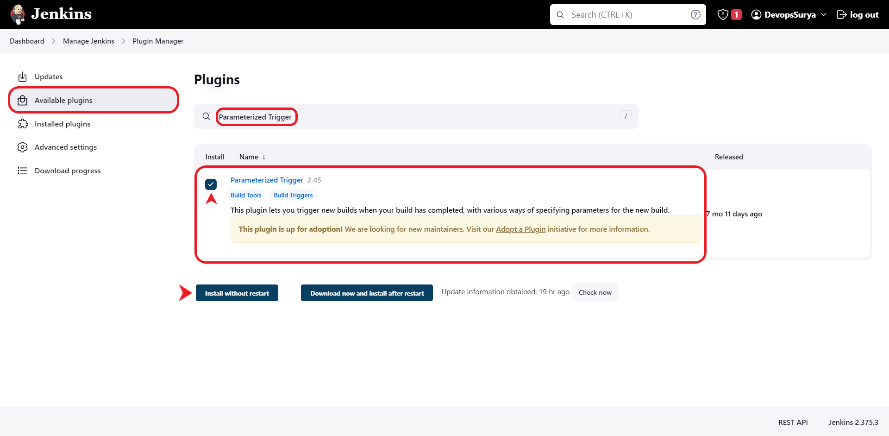


### Scenario-5: Configure the Upstream & Downstream as per below requirement :

```
1. Upstream Job : Build a ***SMP*** Job from Dev Branch
2. Downstream Job: Once the **SMP** Job is sucessfull , it has to build the Downstream Job(SMP-2) with Master Branch.
```
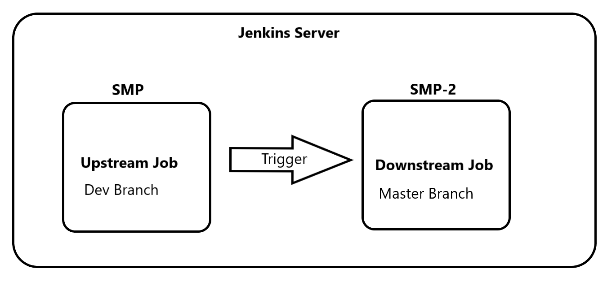


* 1. Configure Upstream Job :


* 2. Build UpstreamJob with Dev branch it should trigger Downstream with master branch : 


    * Go to dashboard and check for the SMP-2 to trigger automatically :
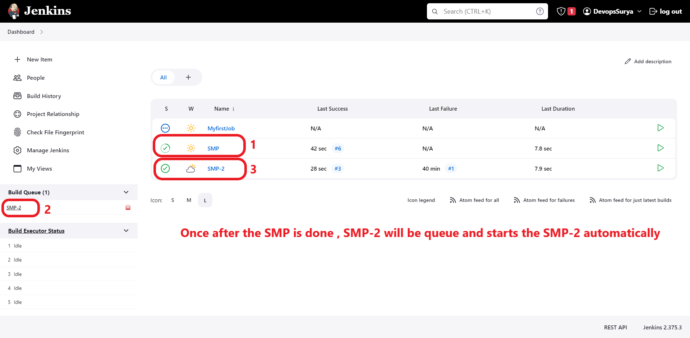

    * Go to Job __SMP-2__ >>  __Console Output__ and check for whether the Job triggered from Master branch :
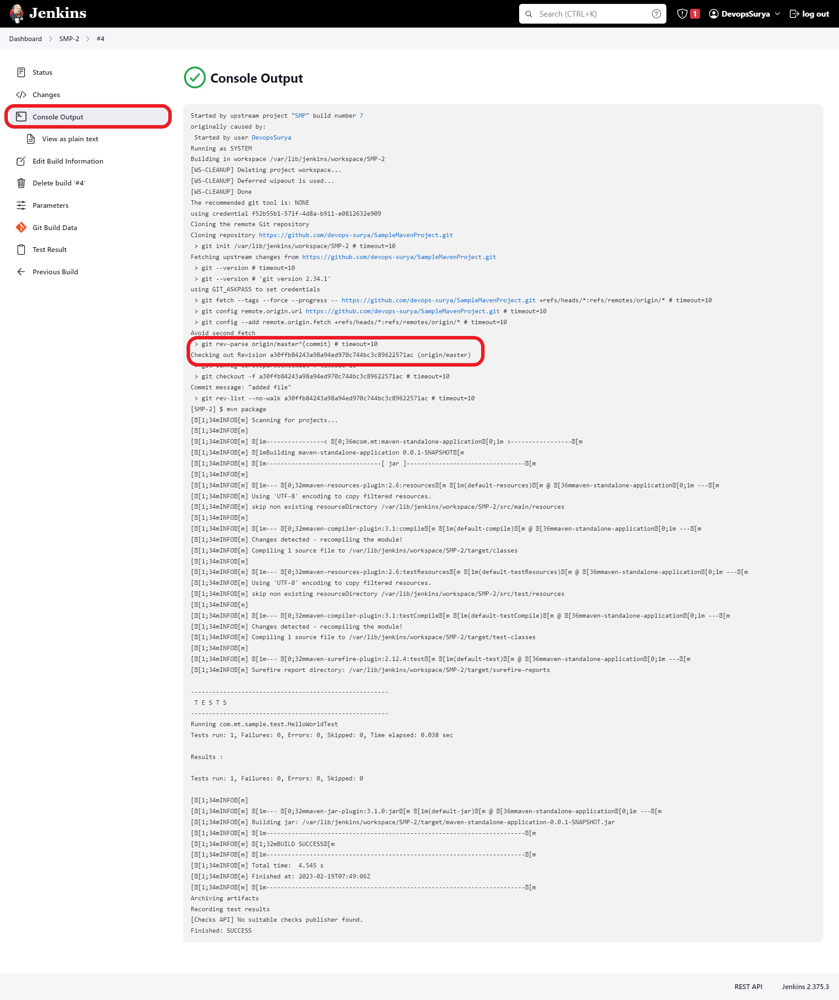


<br/>

* * * 

<br/>


## Jenkins Node/slave/Agent:


* In the context of the Jenkins, a "node" refers to a physical or virtual machine that is set up to perform build and testing tasks as part of a Jenkins job.

* A Jenkins node is also known as a "slave", as it operates as a worker machine that can be controlled by the Jenkins master server. A node can run on a variety of operating systems, including Linux, macOS, and Windows.

* In Jenkins, you can configure multiple nodes to distribute the build and testing workloads across a cluster of machines, which can help to improve performance and reduce the time required for building and testing your code. By setting up nodes, you can also run jobs in parallel, which can help to optimize resource utilization and speed up the overall build process.

* Nodes can be configured to have different sets of tools and plugins installed, which makes it possible to support multiple build environments. Once a node is set up and registered with the Jenkins master, you can assign Jenkins jobs to specific nodes, depending on the requirements of the job.

###  Here are some use cases of Jenkins nodes:

* Distributing build load: One of the primary use cases of Jenkins nodes is to distribute the build load across multiple machines. By running build jobs on separate nodes, Jenkins can perform builds in parallel and reduce build times.

* Supporting different operating systems and environments: Jenkins nodes can be used to support building applications for different operating systems and environments. For example, if you need to build an application that needs to run on both Windows and Linux, you can configure Jenkins nodes to run builds on Windows and Linux machines.

* Isolating builds: Jenkins nodes can be used to isolate builds from the Jenkins master. This can be useful if you want to ensure that builds don't interfere with each other or if you want to enforce security restrictions.

* Scaling Jenkins: Jenkins nodes can be used to scale Jenkins horizontally by adding more nodes as the build load increases. This can help to ensure that builds continue to run smoothly even as the number of build jobs increases.

* Enabling distributed testing: Jenkins nodes can be used to enable distributed testing of applications. By running tests on separate nodes, you can perform tests in parallel and reduce test times.


## Understanding Pipeline with Jenkins Node: 


## Configure a Jenkins Node and attach it to the Jenkins Master:

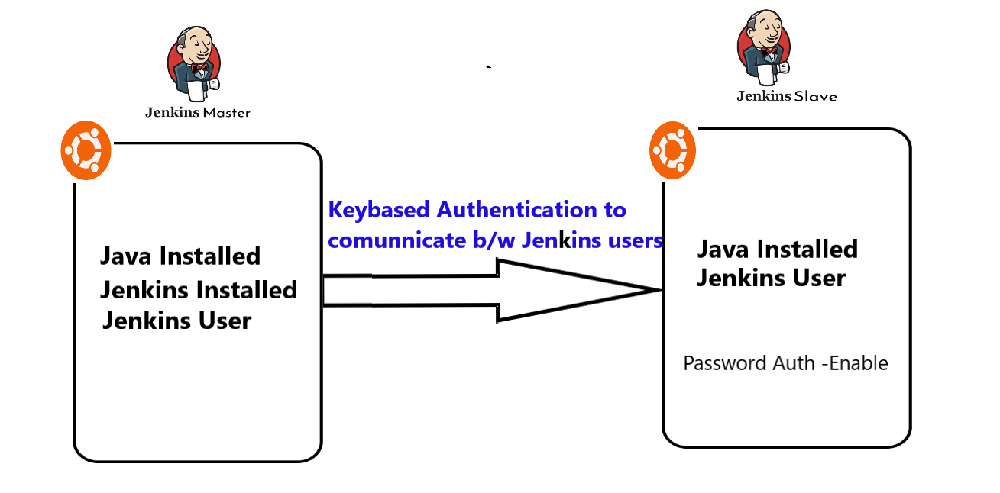

1. Configure the Jenkins Node :
    * Install ***Java*** on Jenkins Node :
    ```
    sudo apt-get update

    sudo apt-get install openjdk-11-jdk
    ```
    * Create a user in ***jenkins User*** in Jenkins Node & provide ***admin permissions***
    ```
    sudo su                  -- Change as root(Admin) user.
    adduser jenkins          -- create user 
    visudo                   -- Opens sudoers file

    ```
    * Enable ***PasswordAuthentication***
    ```
    vi /etc/ssh/sshd_config 
    
    ====
    PasswordAuthentication Yes
    ===

    sudo service sshd restart

    ```


* To add the node to the jenkins as per the above image. Do the ssh-keygen as shown below in jenkins-master:

```
ssh-keygen
ssh-copy-id username@ipaddress
```


* On node , do the below steps:

```

sudo su 

sudo apt-get update

sudo apt-get install openjdk-8-jdk

vi /etc/ssh/sshd_config 

PasswordAuthentication Yes

sudo service sshd restart

adduser jenkins

visudo -- add jenkins to the sudo group

```

2. Add node/slave to the jenkins.

* In manage jenkins => mange nodes 


## Use node/slave in the jenkins job:

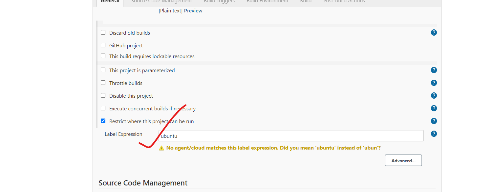


<br/>

* * * 

<br/>


## Backup of Jenkins:
1. Manual    - Take a copy of /var/lib/jenkins/
2. Automated - Using ThinBackup plugin

* ThinBackup plugin or the Backup plugin, which allow you to schedule automatic backups or perform on-demand backups.


* __Note__ : Makesure the backup folder has 777 permissions.


<br/>

<br/>

* * * 

<br/>

<br/>


# Pipeline :
* A pipeline job in Jenkins is a way to define a CI/CD  using a domain-specific language (DSL) called Groovy. 

## Jenkins pipeline :
* In Jenkins pipeline there are two ways:
  1. Pipeline  script     -- Scripted pipeline 
  2. Pipeline  script from SCM -- Declarative pipeline

* The approach we follow for the Jenkins pipeline and writing the groovy for is called as pipeline-as-code.


## Create a Jenkins job in pipeline format:


* Basic syntax of groovy for pipeline Job:

```
node('<LABEL>'){
    stage('git clone'){
      
    }
    stage('build the code){

    }
    stage('archive the artifacts'){

    }
    stage('publish the junit reports'){

    }
    stage('Running the ansible playbook'){
        
    }
}
```

<br/>

* * * 

<br/>


## SCENARIO-6:  Create a Pipeline Job for below requirement  :
```
Get the code from Git , build using Maven, archive the artifacts & publish the junit reports 
```


```
node('ubuntu'){
    stage('git clone'){
      git 'https://github.com/devops-surya/game-of-life.git' 
    }
    stage('build the code'){
      sh 'mvn package'
    }
    stage('archive the artifacts'){
      archiveArtifacts artifacts: 'gameoflife-web/target/*.war', followSymlinks: false
    }
    stage('publish the junit reports'){
      junit 'gameoflife-web/target/surefire-reports/*.xml'
    }
}
```

## Snippet generator:


## To generate the pipeline script for git:


## To generate the pipeline script for archive the artifacts:


## To generate pipeline script for the publish junit test results:


* The output of the jenkins pipeline job will be as below:


<br/>

* * * 

<br/>


## Tracking the changes in the Jenkins Job:
## Job Configuration History :
* Plugin usage [REFERHERE](https://plugins.jenkins.io/jobConfigHistory/)
* This plugin is used to track the changes made previously  .


## Jenkinsfile 
* Jenkinsfile reference [REFERHERE](https://www.jenkins.io/doc/book/pipeline/jenkinsfile/)
* Using jenkinsfile will be helpful in tracking the changes and it is called as __Declarative Pipeline__

## Jenkins declarative pipeline syntax:

* ***Declarative pipeline*** : It is a text file that is stored in the source code repository and defines the steps and logic of the pipeline. 
* Reference for the __Declarative Pipeline syntax__ [REFER HERE](https://www.jenkins.io/doc/book/pipeline/syntax/)


## Scripted pipeline vs declarative pipeline :

*  Scripted pipeline:
```
node('ubuntu'){
    stage('git clone'){
      git 'https://github.com/devops-surya/game-of-life.git' 
    }
    stage('build the code'){
      sh 'mvn package'
    }
    stage('archive the artifacts'){
      archiveArtifacts artifacts: 'gameoflife-web/target/*.war', followSymlinks: false
    }
    stage('publish the junit reports'){
      junit 'gameoflife-web/target/surefire-reports/*.xml'
    }
}
```

* Declarative pipeline:
```
pipeline {
   agent { label 'ubuntu' }
   stages{
       stage('git clone'){
           steps{
               git 'https://github.com/devops-surya/game-of-life.git'  
           }        
       }
       stage('build the code'){
           steps{
              sh 'mvn package'
           }
       }
       stage('archive the artifacts'){
           steps{
              archiveArtifacts artifacts: 'gameoflife-web/target/*.war', followSymlinks: false
           }          
       }
       stage('publish the junit reports'){
           steps{
              junit 'gameoflife-web/target/surefire-reports/*.xml'
           }
           
       }

   }
}
```


<br/>

* * * 

<br/>

## Create a new Jenkins job with Jenkinsfile (Declarative pipeline):


## Blue ocean plugin :
* In manage jenkins => manage plugins => available => Blue ocean
* After installing you will see below changes:


## SNAPSHOT vs RELEASE 
* If you find an artifact with the Snapshot , that means it is still in development.
* If you find an artifact with the release , that means it is ready for the deploymnet and sent it to production.
```
EX: Game-of-life.war-sanapshot-1.0 
EX: Game-of-life.war-Release-1.0
```


<br/>

* * * 

<br/>

## Triggers for build peridically and pollSCM in the pipeline job [REFER HERE](https://www.jenkins.io/doc/book/pipeline/syntax/#triggers)

```
pipeline {
   agent any
   triggers{
      cron('* * * * *')
   }
   triggers{
      pollSCM('* 8 * * *')
   }
   stages{
       stage('git clone'){
           steps{
               git branch: 'master', url: 'https://github.com/devops-surya/game-of-life.git'
           }        
       }
       stage('build the code'){
           steps{
              sh 'mvn package'
           }
       }
       stage('archive the artifacts'){
           steps{
              archiveArtifacts artifacts: 'gameoflife-web/target/*.war', followSymlinks: false
           }          
       }
       stage('publish the junit reports'){
           steps{
              junit 'gameoflife-web/target/surefire-reports/*.xml'
           }
           
       }

   }
}
```

<br/>

* * * 

<br/>

## __Upstream__ job triggering: [REFERHERE](https://www.jenkins.io/doc/book/pipeline/syntax/#:~:text=4%20*%20*%201%2D5%27)

```
pipeline {
   agent any
   triggers{
     upstream(upstreamProjects: 'pipeline-1', threshold: hudson.model.Result.SUCCESS)
   }
   stages{
       stage('git clone'){
           steps{
               git branch: 'master', url: 'https://github.com/devops-surya/game-of-life.git'
           }        
       }
       stage('build the code'){
           steps{
              sh 'mvn package'
           }
       }
       stage('archive the artifacts'){
           steps{
              archiveArtifacts artifacts: 'gameoflife-web/target/*.war', followSymlinks: false
           }          
       }
       stage('publish the junit reports'){
           steps{
              junit 'gameoflife-web/target/surefire-reports/*.xml'
           }
           
       }

   }
}
```

<br/>

* * * 

<br/>

## Parameters using in jenkins pipeline [REFER HERE](https://www.jenkins.io/doc/book/pipeline/syntax/#parameters)
```sh
pipeline {
    agent any
    parameters {
        string(name: 'PERSON', defaultValue: 'Mr Jenkins', description: 'Who should I say hello to?')

        text(name: 'BIOGRAPHY', defaultValue: '', description: 'Enter some information about the person')

        booleanParam(name: 'TOGGLE', defaultValue: true, description: 'Toggle this value')

        choice(name: 'CHOICE', choices: ['One', 'Two', 'Three'], description: 'Pick something')

        password(name: 'PASSWORD', defaultValue: 'SECRET', description: 'Enter a password')
    }
    stages {
        stage('Example') {
            steps {
                echo "Hello ${params.PERSON}"

                echo "Biography: ${params.BIOGRAPHY}"

                echo "Toggle: ${params.TOGGLE}"

                echo "Choice: ${params.CHOICE}"

                echo "Password: ${params.PASSWORD}"
            }
        }
    }
}

```

<br/>

* * * 

<br/>

## Triggering remote job [REFER HERE](https://www.jenkins.io/doc/pipeline/steps/pipeline-build-step/)
```sh
pipeline {
   agent any
   triggers{
     upstream(upstreamProjects: 'pipeline-1', threshold: hudson.model.Result.SUCCESS)
   }
   parameters{
     string(name: 'BUILD_BRANCH', defaultValue: 'master', description: 'parameterized the branch' )
   }
   stages{
       stage('git clone'){
           steps{
               git branch: "$BUILD_BRANCH", url: 'https://github.com/devops-surya/game-of-life.git'
           }        
       }
       stage('build the code'){
           steps{
              sh 'mvn package'
           }
       }
       stage('archive the artifacts'){
           steps{
              archiveArtifacts artifacts: 'gameoflife-web/target/*.war', followSymlinks: false
           }          
       }
       stage('publish the junit reports'){
           steps{
              junit 'gameoflife-web/target/surefire-reports/*.xml'
           }
	   stage('triggering the another job named gol'){
	       steps{
		      build job: 'gol'
		   }
	   }
           
       }

   }
}
```

<br/>

* * * 

<br/>


## Multibranch pipeline:


<br/>

* * * 

<br/>

## JENKINS Built-in environment variables
* Jenkins provides a set of environment variables. You can also define your own. Here is a list of built in environment variables:

```sh
BUILD_NUMBER - The current build number. For example "153"
BUILD_ID - The current build id. For example "2018-08-22_23-59-59"
BUILD_DISPLAY_NAME - The name of the current build. For example "#153".
JOB_NAME - Name of the project of this build. For example "foo"
BUILD_TAG - String of "jenkins-${JOB_NAME}-${BUILD_NUMBER}".
EXECUTOR_NUMBER - The unique number that identifies the current executor.
NODE_NAME - Name of the "slave" or "master". For example "linux".
NODE_LABELS - Whitespace-separated list of labels that the node is assigned.
WORKSPACE - Absolute path of the build as a workspace.
JENKINS_HOME - Absolute path on the master node for Jenkins to store data.
JENKINS_URL - URL of Jenkins. For example http://server:port/jenkins/
BUILD_URL - Full URL of this build. For example http://server:port/jenkins/job/foo/15/
JOB_URL - Full URL of this job. For example http://server:port/jenkins/job/foo/
```

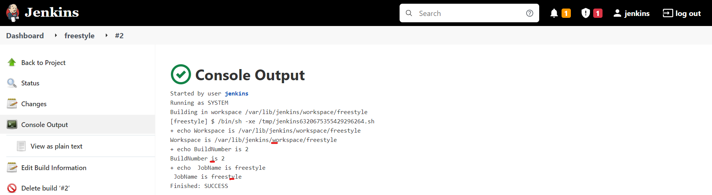
