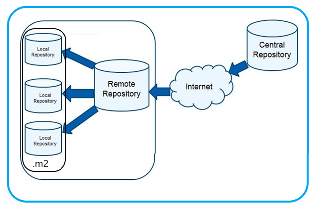
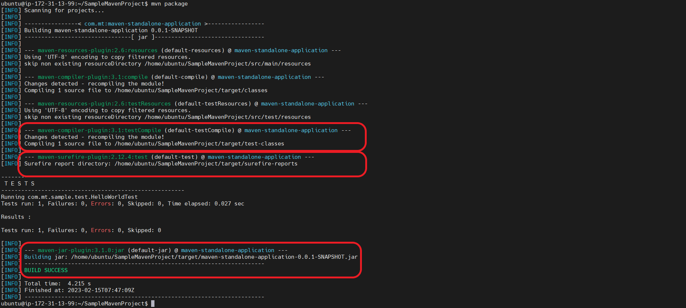
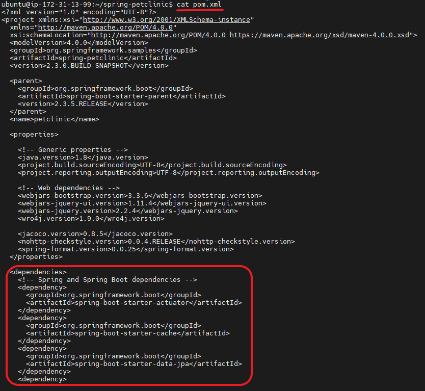

# MAVEN & JENKINS


# Maven:
* Maven is a build automation tool used primarily for Java projects.

## Build tools
   * c => Make, GCC
   * Java => Ant, Maven, Gradle
   * .net => MSBuild, dotnet build

## Install maven 

```
sudo apt update
sudo apt install maven
mvn -version
```
<br/>

* * * 
<br/>

## MAVEN GOALS:

* ***compile***: This goal compiles the source code of the project and creates the class files.

* ***test***: This goal runs the unit tests of the project.

* ***package***: This goal packages the compiled code and resources into a distributable format, such as a JAR, WAR, or ZIP file.

* ***install***: This goal installs the packaged artifact into the local repository, making it available for other projects to use.

* ***clean***: This goal removes all the generated files and directories created by the previous build.

* ***deploy***: This goal deploys the packaged artifact to a remote repository or a remote server.

```
mvn test = mvn compile + mvn test
mvn package = mvn compile + mvn test + mvn package
mvn clean package = mvn clean + mvn compile + mvn test + mvn package
```
<br/>

* * * 
<br/>


## Types of Maven repositories :  Local, Central & Remote

  


* Maven supports three types of repositories:

    * **Local repository** : This is the local cache where Maven stores the downloaded artifacts on the developer's machine. By default, it's located in the .m2 directory in the user's home directory.

    * **Remote repository** : This is a network location, usually an HTTP or HTTPS URL, where Maven can download the required artifacts. Remote repositories can be public or private, and they can be hosted on a local network or on the internet.

    * **Central repository** : Maven comes with a default set of remote repositories, such as the Maven Central Repository and the JBoss Community Repository. However, you can also configure custom repositories in your POM file, either by specifying their URLs or by setting up a repository manager that can host and manage your custom repositories.

* ***NOTE***: When you add a dependency to your project's POM file, Maven first checks the local repository for the dependency. If it's not found, it then checks the remote repositories configured in the POM file. If the dependency is not found in any of the configured repositories, the build process fails with an error.


<br/>

* * * 
<br/>

## Build the code manually using maven:

* Clone the code from github.

```
git clone https://github.com/devops-surya/SampleMavenProject.git
cd SampleMavenProject
```
  

* ***mvn package***

  
  
* ***mvn install***

  

* ***mvn clean install*** 
  


<br/>

* * * 
<br/>


## pom.xml : 

* In Maven, the Project Object Model (POM) is an XML file called pom.xml that describes the project and its configuration. The POM file is located at the root of the project's directory and contains information about the project's name, version, dependencies, build process, and more.

 


<br/>
<br/>
<br/>
<br/>

* * * 

<br/>
<br/>
<br/>
<br/>


# Jenkins:
* Jenkins is an open source __continuous integration/continuous delivery and deployment__ (CI/CD) automation software DevOps tool written in the Java programming language. It is used to implement CI/CD workflows, called pipelines.
* Jenkins is a CI/CD tool
    * ***CI (Continous integration)*** : Continuous Integration is the practice of merging code changes into a shared repository frequently and automatically verifying that the resulting code builds, tests, and integrates successfully.
    * ***CD -- Continous Delivery / Continous Deployment*** :
        * **Continous Delivery** : Continuous Delivery is a software development practice that aims to make the release process more efficient and reliable by automating the entire software delivery pipeline. The idea is to ensure that code changes are always in a releasable state and can be deployed to production at any time. Continuous Delivery typically involves a continuous integration process that compiles and tests the code, followed by an automated deployment process that deploys the built artifacts to a staging environment. Once the code has been successfully tested in the staging environment, it can be promoted to the production environment.
        * **Continous Deployment** : Continuous Deployment, on the other hand, is a practice where every code change that passes the automated tests is automatically deployed to production. This means that any changes made to the code are automatically released to the users without any human intervention. Continuous Deployment is a more advanced version of Continuous Delivery and is generally suitable for organizations with high release frequency and the ability to handle fast feedback loops.
<br/>

* * * 

<br/>

## Pipeline flow of devops :


<br/>

* * * 

<br/>

## Installing jenkins 
* prerequisites:
1. Ubuntu
2. Java 
3. Jenkins

## For installing jenkins we have two ways.
1. Quick setup (it is not the enterprize setup)
2. Jenkins master 

### Quick setup [REFER HERE](https://www.jenkins.io/download/)
```
 java-jar <path to the download>
```

### Jenkins master setup :
* Jenkins installation official document [REFER HERE](https://www.jenkins.io/doc/book/installing/linux/#debianubuntu) 
* Create a EC2 in AWS and follow below steps to install Jenkins :
```
sudo apt-get update
sudo apt-get install openjdk-11-jdk

java -version

curl -fsSL https://pkg.jenkins.io/debian-stable/jenkins.io.key | sudo tee \
  /usr/share/keyrings/jenkins-keyring.asc > /dev/null
echo deb [signed-by=/usr/share/keyrings/jenkins-keyring.asc] \
  https://pkg.jenkins.io/debian-stable binary/ | sudo tee \
  /etc/apt/sources.list.d/jenkins.list > /dev/null

sudo apt-get update
sudo apt-get install jenkins
```

* To open jenkins on brower 
* ***NOTE*** : jenkins runs on port of 8080 . So port 8080 must be opened in EC2 server (or) set inbound rule to All Traffic .
```
http://publicipaddress:8080
```
* ***http://publicipaddress:8080*** will open below screen on browser:

* Copy the password from server and paste it on the browser:


* Select ***Install suggested plugins*** and wait all plugins installed:


* ***Create First Admin User*** by provide the username, password , email then  Save and continue:

* ***Instance Configuration*** -- No changes


* Dashboard of jenkins


<br/>

* * * 

<br/>

## Create a *job* :
* In Jenkins we do automation by creating jobs :


## Multiple ways to create a job:


## Create a job in Freestyle:
* Click on the  **New Item**  and follow the below instructions in the screenshots :


<br/>

* * * 

<br/>

## ***Manage jenkins*** is used to configure the Jenkins (settings) :


## Jenkins executor :
* ***Executor*** will define , how many jobs run parallely at a time.


<br/>

* * * 

<br/>


## Multiple sections in Jenkins freestyle job:
1. General
2. Source Code Management
3. Build Triggers
4. Build Environment
5. Build Steps
6. Post-build Actions


<br/>

* * * 

<br/>

# Explore ***Manage Jenkins*** Options : 

## Configure System 
* Go to Manage Jenkins >> Configure System 


## Configure Global Security 
* Go to Manage Jenkins >> Configure Global Security 


## Manage Plugins
* Go to  Manage jenkins >> Manage Plugins


## Restart the jenkins :
* Multiple ways to restart 
  1. From ***cli*** from jenkins server : 
    ``` 
    sudo service jenkins restart 
    ```
  2. From ***GUI*** i,e Jenkins dashboard in browser: 
    

  3. From  ***Manage Jenkins*** in Jenkins Dashboard
     


<br/>
<br/>

* * * 

<br/>
<br/>