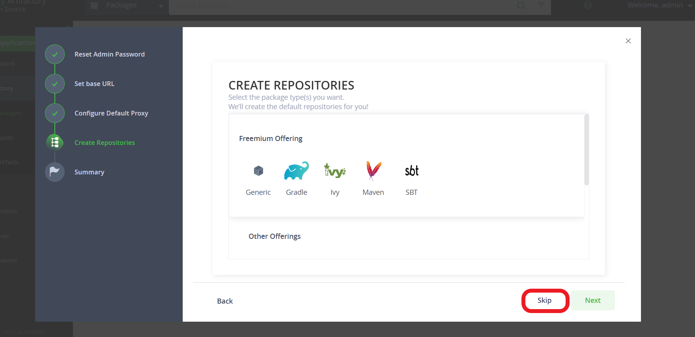
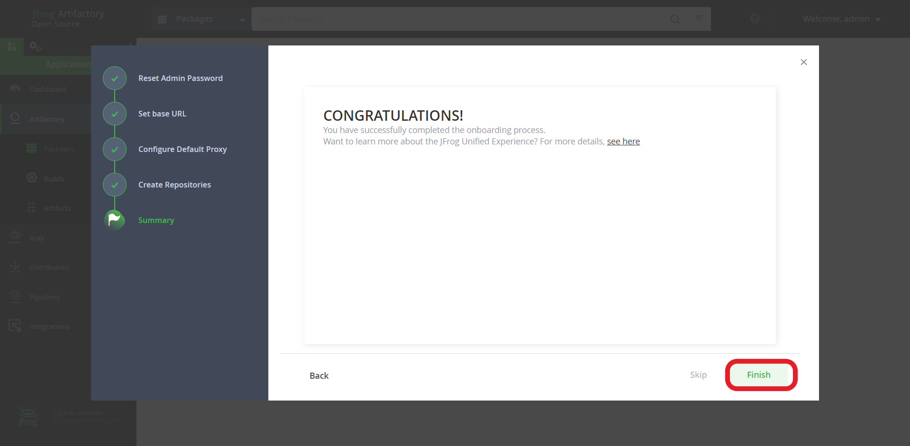
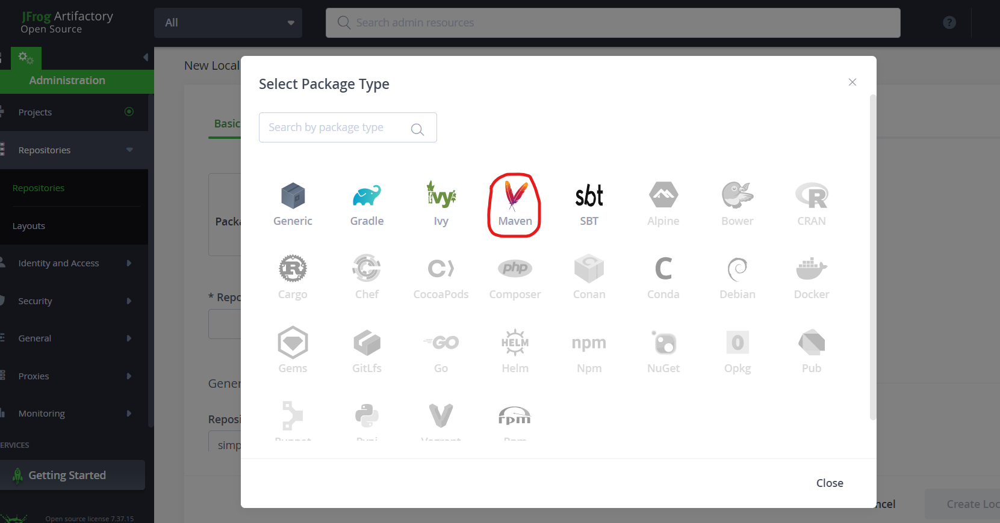
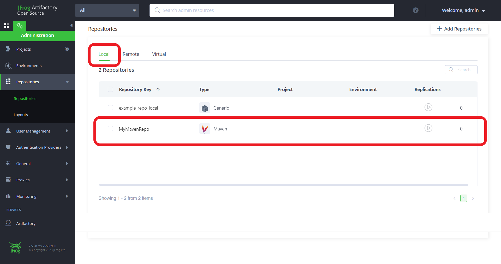
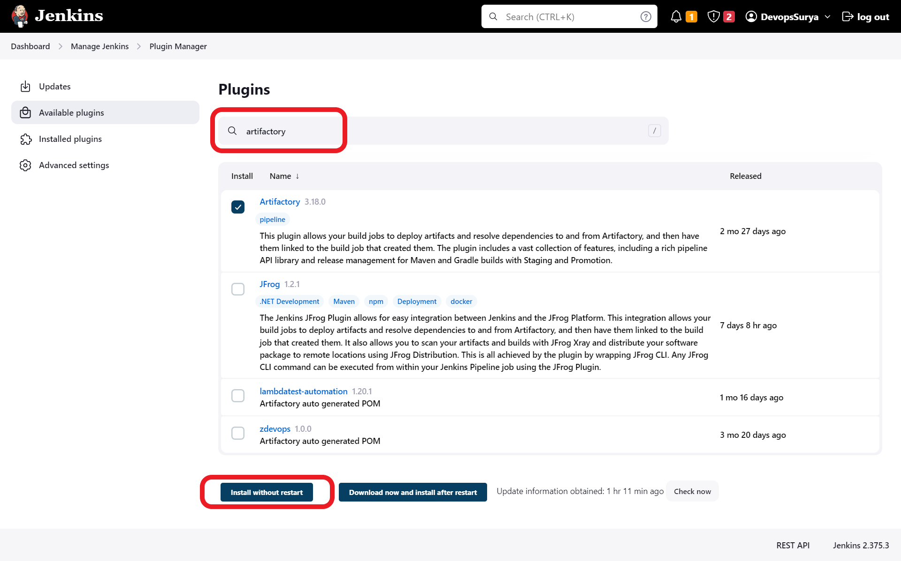
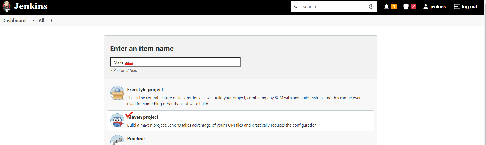
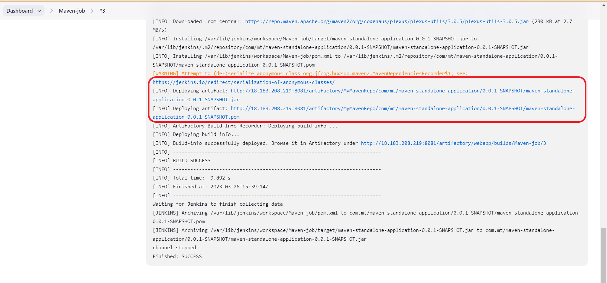
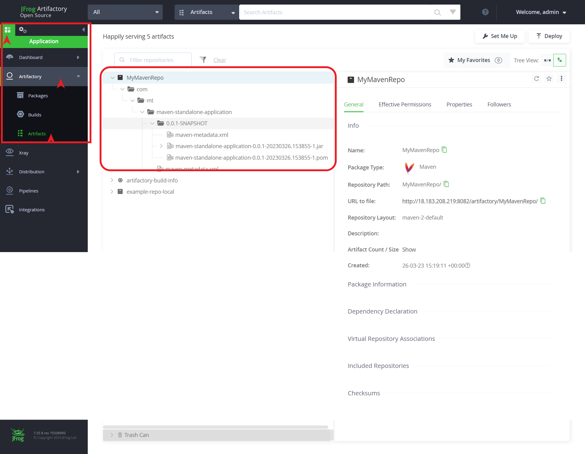
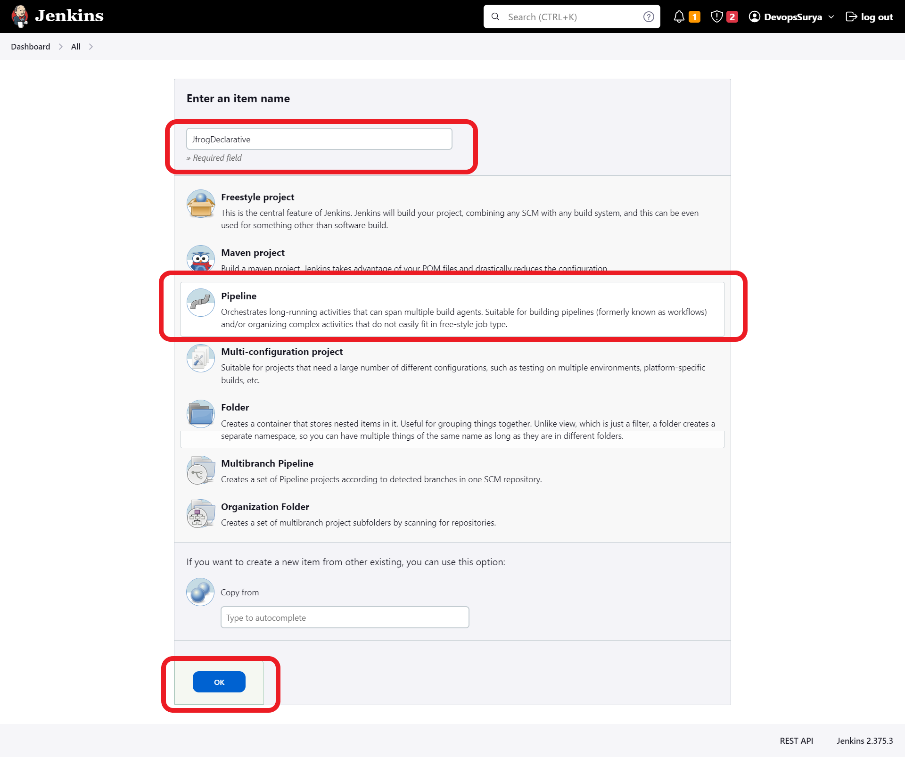
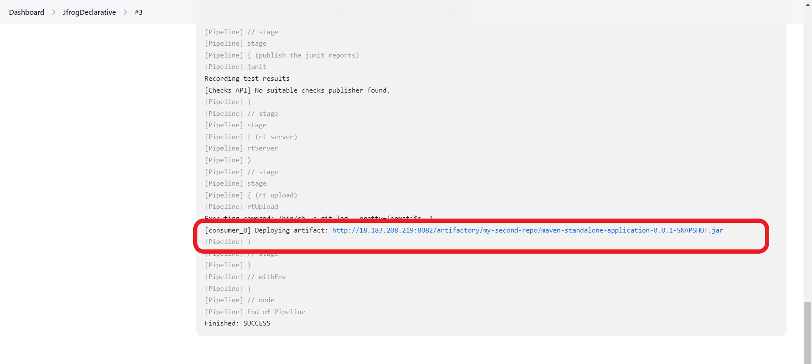

# JFrog Artifactoy:
* JFrog Artifactory is the Universal Repository Manager supporting all major packaging formats, build tools and CI servers.
* Artifactory supports a wide range of software package formats, including Maven, Gradle, npm, Docker, and many others. It also provides powerful features for managing artifacts, such as version control, access control, metadata management, and integration with popular build tools and CI/CD pipelines.

<br/>

* * * 

<br/>

## Pipeline integrated with Jfrog  :


<br/>

* * * 

<br/>


## Install JFrog Artifactory oss :
* Installation steps [REFERHERE](https://www.devopsschool.com/blog/artifactory-install-and-configurations-guide/#:~:text=Artifactory%20Pro%20Install%20in%20Linux%20using,jfrog/artifactory/var/etc/system.yaml)

### Server-Specs:
* t2 small and t2 medium is atleast needed.

```
 sudo apt update

 wget -qO - https://api.bintray.com/orgs/jfrog/keys/gpg/public.key | sudo apt-key add -

 echo "deb https://jfrog.bintray.com/artifactory-debs bionic main" | sudo tee /etc/apt/sources.list.d/jfrog.list

 sudo apt update

 sudo apt install jfrog-artifactory-oss

 sudo systemctl start artifactory.service

 sudo systemctl enable artifactory.service

 systemctl status artifactory.service

```

* Access artifactory by using : __http://publicip:8081__ and follow the below steps:
* Default username and password :
```
Username: admin
Pasword : password
```






<br/>

* * * 

<br/>


##  Create a repository :







<br/>

* * * 

<br/>

## Integrate Jfrog with the jenkins :

* Install Jfrog plugin from __manage plugin__



* Configure Jfrog to Jenkins, Go to Manage jenkins >> Configure System , do the changes as below and save them


<br/>

* * * 

<br/>


## Create a Maven-job to store our artifacts to the jfog artifactory:
1. Create a new maven job 
2. SCM - provide code repository
3. Build -- Provide maven goal 
4. Post-build-Step -- Deploy Artifacts to Artifactory




5. Build the maven-job to check the artifactory working as per expected.



<br/>

* * * 

<br/>

## Upload the artifacts to jfrog in Declarative-pipeline :
* Reference Document for __Jfrog Ppeline syntax__ [REFERHERE](https://www.jfrog.com/confluence/display/JFROG/Declarative+Pipeline+Syntax)

1. Create a localrepo named  ***my-second-repo*** in Jfrog Dashboard 
2. Copy the below declarative pipeline script to jenkinsfile


```
pipeline {
   agent any
   stages{
       stage('git clone'){
           steps{
               git credentialsId: '627d81ae-5ed6-471b-afc8-90c69fadd554', url: 'https://github.com/devops-surya/SampleMavenProject.git'
           }        
       }
       stage('build the code'){
           steps{
              sh 'mvn package'
           }
       }
       stage('archive the artifacts'){
           steps{
              archive 'target/*.jar'
           }          
       }
       stage('publish the junit reports'){
           steps{
              junit 'target/surefire-reports/*.xml'
           }
           
       }
       stage('rt server'){
           steps{
               rtServer (
                   id: 'JFROG-OSS',
                   url: 'http://18.183.208.219:8082/artifactory',
                   username: 'admin',
                   password: 'Mvst@225',
                   bypassProxy: true,
                   timeout: 300
               )

           }
       }
       stage('rt upload'){
           steps{
               rtUpload (
                   serverId: 'JFROG-OSS',
                   spec: '''{
                         "files": [
                             {
                                 "pattern": "target/*.jar",
                                 "target": "my-second-repo/"

                             }
                                  ]
                   }''',
                        
               )

           }

       }

      }


    }


```

3. Create a Jenkins job as below :



4. Build the Jenkins Job and look at the output and Jfrog Dashboard :



<br/>
<br/>
<br/>
<br/>

* * * 

<br/>
<br/>
<br/>
<br/>

