# Sonarqube 
* SonarQube is an open-source static testing analysis software, it is used by developers to manage source code quality and consistency.
* __sonarscanner-for-maven__ Official docs [REFERHERE](https://docs.sonarqube.org/latest/analysis/scan/sonarscanner-for-maven/)

## SonarQube Architecture:
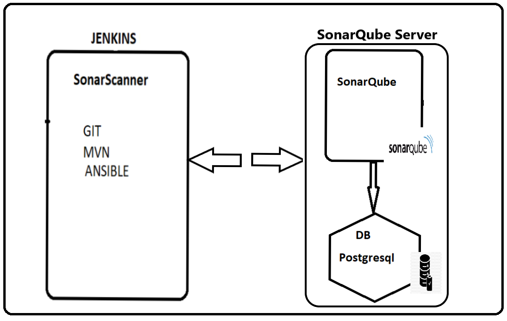


### Pipeline integrated with Jfrog & SonarQube :


# Install & Configure Sonarqube :
### Prerequisites
1. Need an EC2 instance (min t2.small)
2. Install Java-11
  ```sh 
   sudo su 
   cd
   apt-get update   
   apt  list | grep openjdk-11  
   apt-get install openjdk-11-jdk -y   
   ```

### Install & Setup Postgres Database for SonarQube
`Source: https://www.postgresql.org/download/linux/ubuntu/`  
1. Install Postgres database   
  ```sh 
  sudo sh -c 'echo "deb http://apt.postgresql.org/pub/repos/apt $(lsb_release -cs)-pgdg main" > /etc/apt/sources.list.d/pgdg.list'  
  wget --quiet -O - https://www.postgresql.org/media/keys/ACCC4CF8.asc | sudo apt-key add -
  sudo apt-get update
  sudo apt-get -y install postgresql
  ```

2. Set a password for postgres user (setting password as "admin" password)
  
  ```sh
  sudo passwd postgres
  su - postgres
  ```


3. Create a database user and database for sonarque 
  ```sh 
  createuser sonar
  psql
  ALTER USER sonar WITH ENCRYPTED PASSWORD 'admin';
  CREATE DATABASE sonarqube OWNER sonar;
  GRANT ALL PRIVILEGES ON DATABASE sonarqube to sonar;
  \q
  exit
  ``` 
  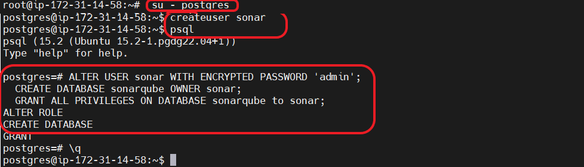


4. Restart postgres database to take latest changes effect from root user 
  ```sh 
  systemctl restart postgresql 
  systemctl status postgresql
  ```
  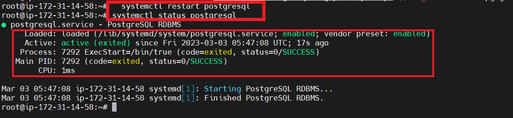


`check point`: You should see postgres is running on 5432
```sh
apt install net-tools
netstat -plnt
```
  


`Source: https://docs.sonarqube.org/latest/requirements/requirements/`

5. Added below entries in `/etc/sysctl.conf`
  ```sh 
  vm.max_map_count=524288
  fs.file-max=131072
  ulimit -n 131072
  ulimit -u 8192
  ```
6. Add below entries in `/etc/security/limits.conf`
  ```sh 
  sonarqube   -   nofile   131072
  sonarqube   -   nproc    8192
  ```

7. reboot the server 
  ```sh 
  sudo reboot 
  init 6 
  ```
  ==========================================

 ### SonarQube Setup

1. Download [soarnqube](https://www.sonarqube.org/downloads/) and extract it.   
  ```sh 
  sudo su 
  cd /opt/
  wget https://binaries.sonarsource.com/Distribution/sonarqube/sonarqube-8.9.2.46101.zip
  apt-get install unzip
  unzip sonarqube-8.9.2.46101.zip
  mv sonarqube-8.9.2.46101 sonarqube
  ```

2. Update sonar.properties with below information 
* /opt/sonarqube/conf/sonar.properties
  ```sh
  sonar.jdbc.username=<sonar_database_username>
  sonar.jdbc.password=<sonar_database_password>

  sonar.jdbc.username=sonar
  sonar.jdbc.password=admin
  sonar.jdbc.url=jdbc:postgresql://localhost/sonarqube
  sonar.search.javaOpts=-Xmx512m -Xms512m -XX:MaxDirectMemorySize=256m -XX:+HeapDumpOnOutOfMemoryError
  ```


3. Add below data to `/etc/systemd/system/sonarqube.service` file start sonarqube service at the boot time 
  ```sh   
  [Unit]
  Description=SonarQube service
  After=syslog.target network.target

  [Service]
  Type=forking
  User=sonar
  Group=sonar
  PermissionsStartOnly=true
  ExecStart=/opt/sonarqube/bin/linux-x86-64/sonar.sh start 
  ExecStop=/opt/sonarqube/bin/linux-x86-64/sonar.sh stop
  StandardOutput=syslog
  LimitNOFILE=65536
  LimitNPROC=4096
  TimeoutStartSec=5
  Restart=always

  [Install]
  WantedBy=multi-user.target
  ```

4. Add sonar user and grant ownership to /opt/sonarqube directory 
  ```sh 
  useradd -d /opt/sonarqube sonar
  chown -R sonar:sonar /opt/sonarqube
  ```

5. Reload the demon and start sonarqube service 
  ```sh 
  systemctl daemon-reload 
  systemctl enable sonarqube.service
  systemctl start sonarqube.service 
  ```


* Open Sonarqube on browser:

```sh

http://<publicip>:9000

Default:
=======
username: admin
password: admin
```
  
  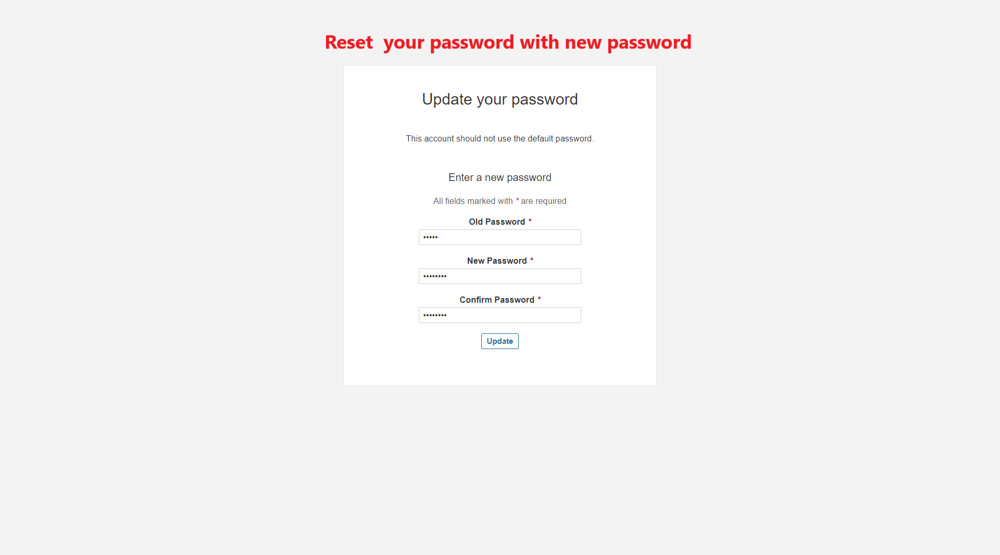


 ### Unable to access Sonarqube from browser? 

 1. Make sure port 9000 is opened at security group level
 2. start sonar service as a sonar user 
 3. user correct database credentials in the sonar.properties
 4. use instance which has atleast 2 GB of RAM


<br/>

* * * 

<br/>

## Understanding of SonarQube & Dashboard components :


* SonarQube is an open-source platform for continuous code quality inspection. It provides a variety of features and tools to analyze and manage code quality, including rules, quality profiles, and quality gates.

    * Rules: In SonarQube, rules are predefined sets of guidelines that define the quality of the code. These rules are used to analyze the source code and identify potential issues and defects. SonarQube comes with a large number of pre-configured rules for different programming languages and frameworks, and users can also create their own custom rules.

    * Quality profile: A quality profile is a collection of rules that are applied to a project or a subset of the project. Quality profiles are used to define the quality standards for a project and to ensure that the code meets those standards. SonarQube provides default quality profiles for different programming languages and frameworks, and users can also create their own custom profiles by selecting specific rules.

    * Quality gate: A quality gate is a set of predefined conditions that are used to measure the quality of the code. Quality gates are used to ensure that the code meets specific quality criteria before it is released or deployed. A quality gate can be set up to check different aspects of code quality, such as code coverage, code duplication, and coding standards. If the code does not meet the quality gate conditions, the build will fail, and the code will not be deployed.

* In summary, rules, quality profiles, and quality gates are essential components of SonarQube's code quality analysis process. By defining and enforcing these standards, developers can ensure that their code is high quality, reliable, and maintainable.


<br/>

* * * 

<br/>

## Default Quality Profile VS customized quality profile :
* Quality profile default 


* Customized Quality Profile


<br/>

* * * 

<br/>

## Integrate Sonarqube with Jenkins
1. Create a Sonarqube token  on SonarQubr Dashboard
* Generate a sonarqube token to authenticate from Jenkins as followed below:
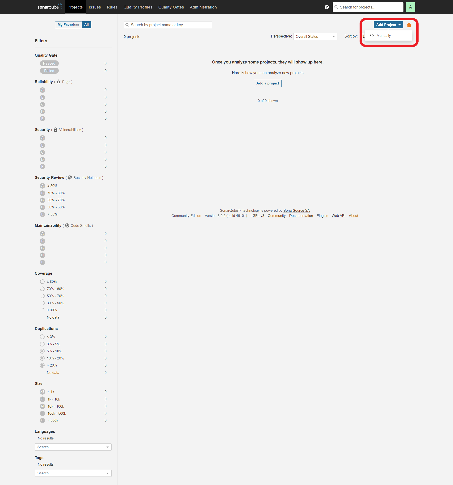


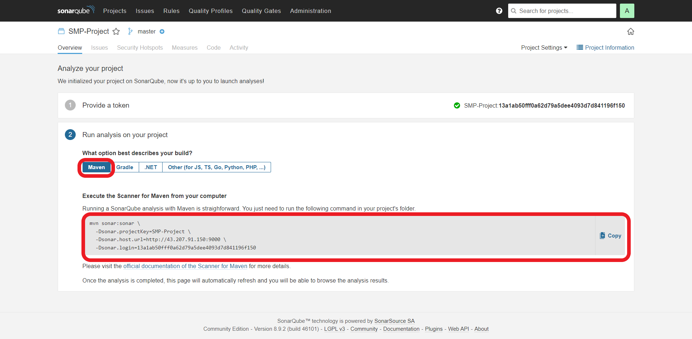


2. Install SonarQube Scanner 
* Install Sonarqube plugin --  Manage Jenkins >> Manage Plugins >> SonarQube Scanner  

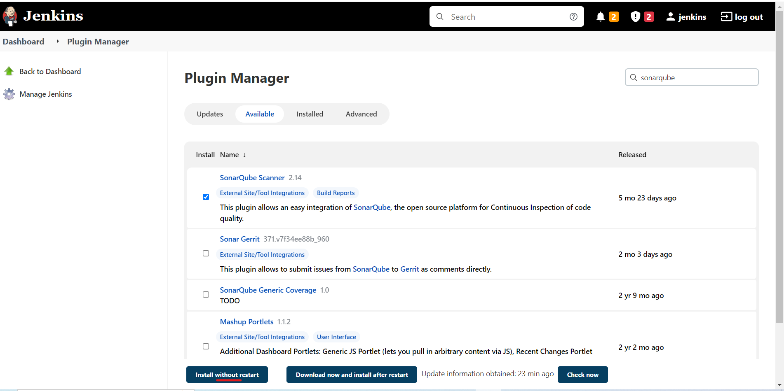


3. Configure Sonarqube credentials in Jenkins -- Manage Jenkins >> Manage Credentials 


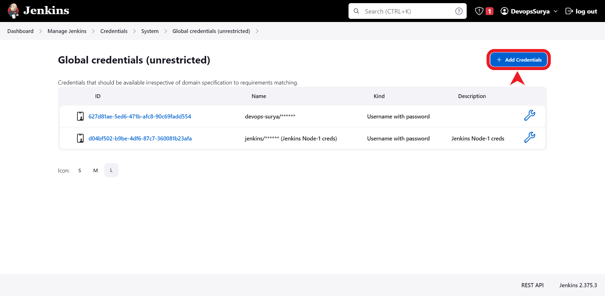
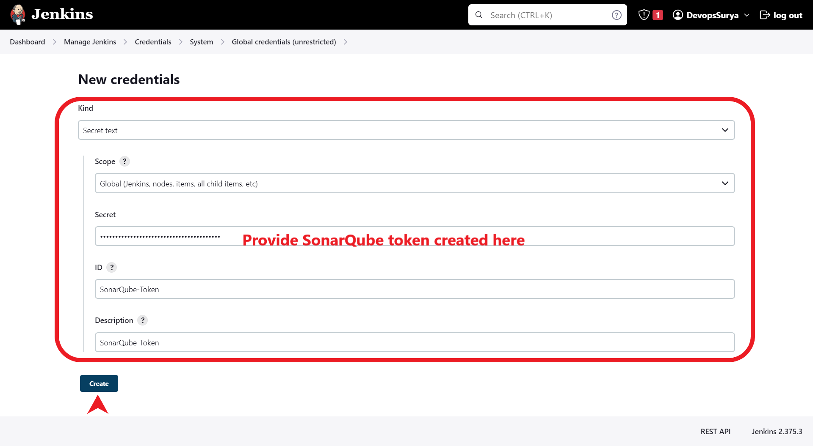
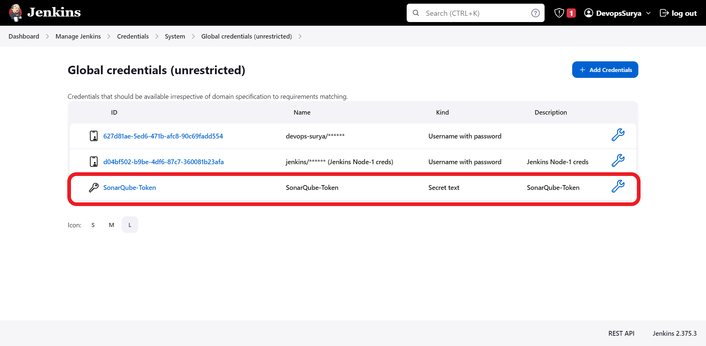


3. Add Sonarqube to jenkins "configure system"  -- Manage jenkins >> configure system
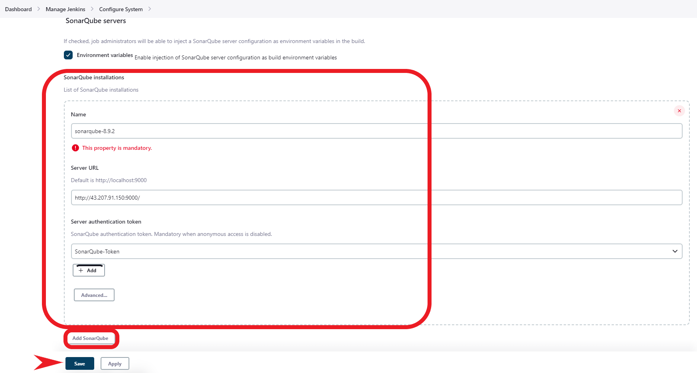


4. Install SonarScanner 
* Go to Manage Jenkins >> Global Tool Configuration
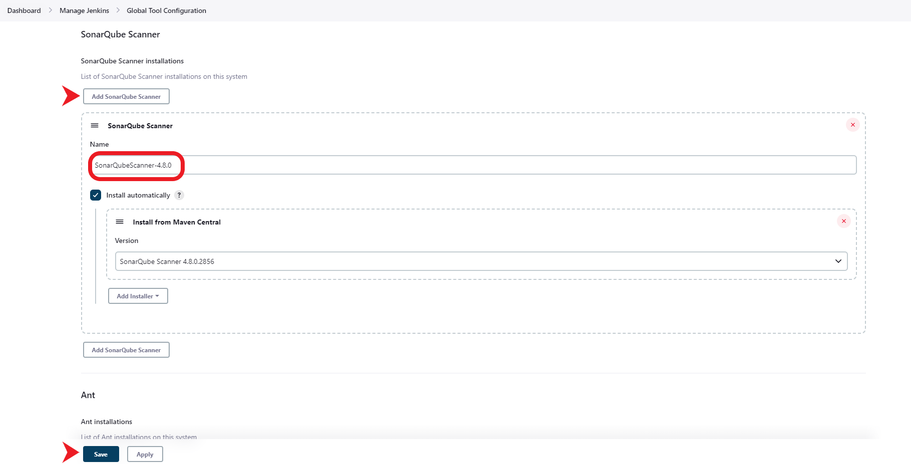


##  Create a  Pipeline job with SonarQubr analysis :

```
pipeline{
    agent any
    stages{
       stage('GetCode'){
            steps{
                git credentialsId: '627d81ae-5ed6-471b-afc8-90c69fadd554', url: 'https://github.com/devops-surya/SampleMavenProject.git'
            }
         }        
       stage('Build'){
            steps{
                sh 'mvn clean package'
            }
         }
        stage('SonarQube analysis') {
//    def scannerHome = tool 'SonarScanner 4.0';
        steps{
        withSonarQubeEnv('sonarqube-8.9.2') { 
        // If you have configured more than one global server connection, you can specify its name
//      sh "${scannerHome}/bin/sonar-scanner"
        sh "mvn sonar:sonar"
    }
        }
        }
       
    }
}
```
1. Copy the above script to the jenkinsfile 
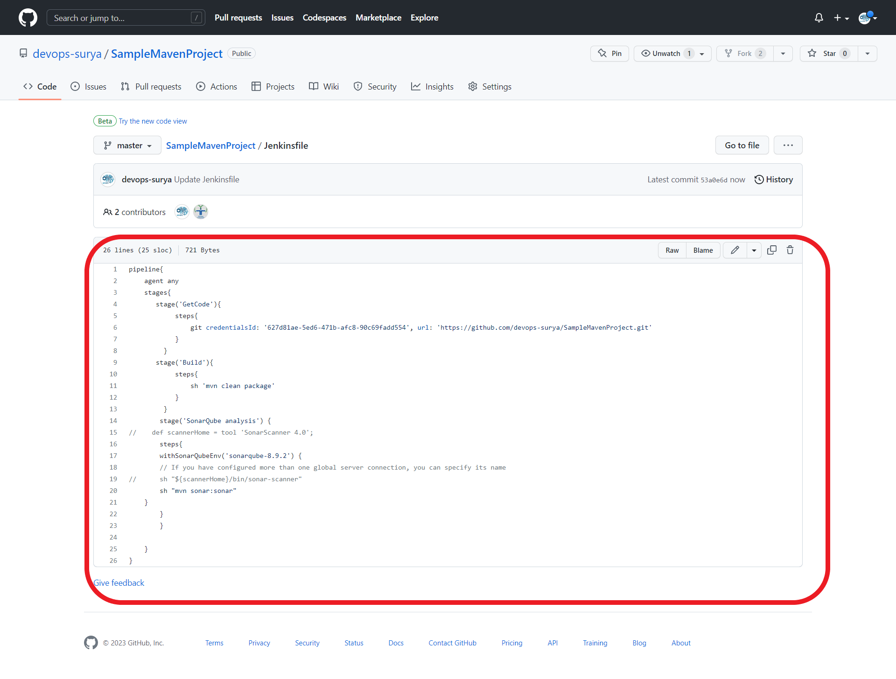


<br/>

* * * 

<br/>


## Create a Jenkinsjob to use the customized quality profile :

* Verify jenkins job is using new customized quality profile :


<br/>
<br/>
<br/>
<br/>

* * * 

<br/>
<br/>
<br/>
<br/>