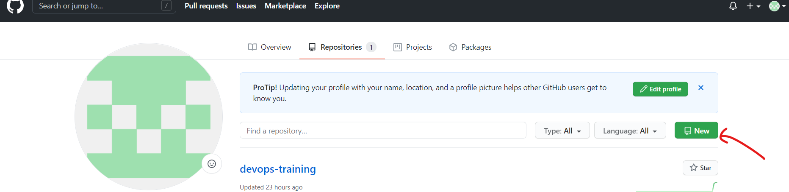
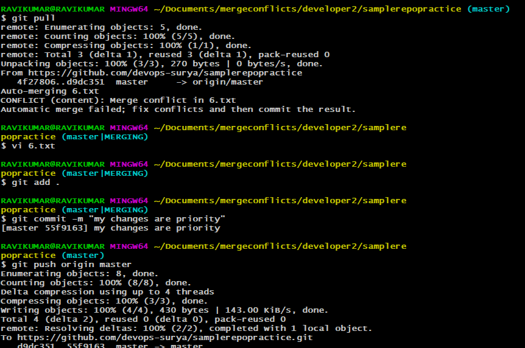
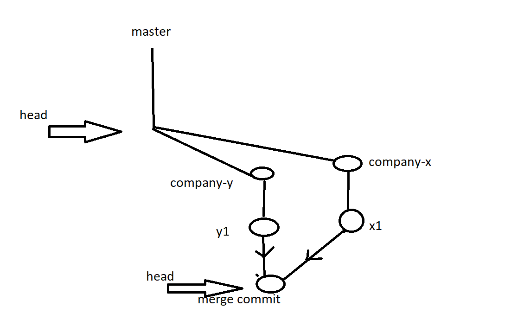

# GIT

* Git is the version control system (VCS)


* BASIC PIPELINE OF DEVOPS:


## Scenario with VCS is not exists:
* If there are 10 developers working in a company.
1. DATA loss of code  developed by the developers.
2. AS 10 developers working on the same code and developing for long period of time , there will be more conflicts when 10 developers merge the code at the same time.
3. It is very difficult to track the changes(version wise).

* To resolve those above issues we are going see the git functionality.

## THREE phases in git:
1. working tree
2. stagging area
3. local repo
4. remote repo .


#### prerequisites:
* Install choco :
  [REFER HERE](https://chocolatey.org/docs/installation)

* GIt install
  [REFER HERE](https://chocolatey.org/packages/git.install)

* VSC install
  [REFER HERE](https://chocolatey.org/packages/vscode)

* MOBAXTERM Install 
  [REFER HERE](https://chocolatey.org/packages/MobaXTerm)
  


# GIT HISTORY 

## Below are the functionality requirements an organization is expecting :

* All the developers has to work on a same code parallely.
* It must have a feature of versions when the code is being developed.
* Need to have a feature of tracking the changes in the history.
* Must have a ability to serve the application to the mutiple clients.

### Evolution of VCS :
  * Share the code via mail.
  * Sharedfolder .
  * Version Control System.
       * First generation :
           * SCCS (Source Code Control System)
           * RCS (Revision Control System)
       * Second Generation :pipa
           * CVS (Concurrent Versions System)
           * SVN (Apache Subversion)
           * Perforce Helix Core
       * Third Generation :
           * Git
* Git is developed by **_LINUS TORVALDS_** .
## Difference betwen Centralised VCS and Distibuted VCS :


# Working on git 
```
 mkdir gitpractise

 cd gitpractise

 git init  ---  To intilalize the git in the present folder.

```


* To see the changes made 
```
git status
```

* To add all the changes to the staging area 
```
git add .
```

* To commit all the changes to the local repo 

```
git commit -m "< added some changes>"
```


* To configure the git in your local  :

```
git config --global user.name <username>
git config --global user.email <emailaddress>
git config --list
```
## Untracked and modified changes:
* Untracked is the new file added and it is not there initially.
* Modified is  the file that already present and there are some changes in the content of the file


* To add only the modified changes to the stagging area:

```
git add -U 
```

```
git add --all   --- it add all changes 
git add -A      --- it add all chnages
git log --oneline   ---it will show u all the commit u have made till now
git checkout <commitid>   --- u can track the changes on the history 
git checkout master 
```


* Git tracks only the files not the folders .


# Working on the git 


## RESET 
* Reset will revert the changes from  the stagging area to the working tree


```
git checkout  --<filename>
```
* git checkout --<filename>  -- it is used to remove the changes u made on the working tree , after we do reset..


### * Scenario.. If you came across a scenario , where you  want to  remove the changes from stagging area and the working tree at a single shot:

```
git reset --hard 
```


* removin the file is also a chnage in the working of git.


## Head 
* Head will be always at the latest commit .
## Detached head
* When we are going back to the history , the head will be detached and it will go back to the commit which you are using.


## Reporting the issues 
* Refer to the link [REFER HERE](https://github.com/devops-surya/devops-training/issues
)

# GIT PUSH 
* git push will add changes  from local repo to the remote repo


* For Remote repository we must have a github account to create it .
* Repositry is the place where the code will be stored.
* The number of repositries will be depending up on the basis of the project.

## High level view of github 


## Create a repositry in the github:
* Got to the repositries and then refer the image below:

* Provided the repositry name and make it public , so that it will be available to everyone.


## Add remote repo to the local repo for push 


```
git remote add origin https://github.com/devops-surya/sample.git

git push origin master

```


## * scenario : A new developer added to a team and he/she want the  total code from the repositry:

```
git clone https://github.com/devops-surya/sample.git
```


## * Scenario : A developer already exists and he/she has  the code in his local desktop.But he/she dont have the latest code.

```
git pull https://github.com/devops-surya/sample.git
```

# Merge conflicts.

* understanding of the git flow :


## * Scenario : We have two developers newly assigned to a new project.


* To create the above scenario , follow the below steps :
  * Create a folder of mergeconflicts.
  * create a two folders with names developer1 , developer2 .
  * Get into folders of developer1, developer2 and clone the repo .
  
  * Developer1 has made some changes to the file 6.txt and then pushed to the repo .
   
  * Developer2 has made changes on the local and pushed the changes , here it is asking for the pull as shown below :
   
  * Developer2 has to pull the code and has to take call of merge conflicta and push the code again.
  

  # Multiple branching :
* If a company want to serve the code to the mutliple companies , they will create multiple branches and go for the parallel development.


* To create a branch

```
git branch <branchname>
```
* To list the branches:
```
git branch
```

* To switch between the branches

```
git checkout <branchname>
```

* To create a branch and switch to it directly:

```
git checkout -b <branchname>
```


* To push the code from the company-x branch to the remote repo:

```
git push origin company-x
```


* To see the remote branches:
```
git branch -r
```


## MERGE :

* creating a file y1.txt and do add , commit .

* Switch to the company-x branch .creating a file x1.txt and do add , commit .


## Fastforward merge:

* Create branch a company-z. create afile z1.txt and do add , commit.

* if u dont want to go with the fastforward merge 

```
git checkout master 
git merge --no-ff company-z
```

## Rebase :

* Create  a branch-a and create a a1.txt file in it. do git add , git commit.
* switch to master branch and create file rebase.txt, do git add and git commit.

* For rebase to be done

```
git checkout branch-a
git rebase master
```


## cherry-pick :

* Created a branch-c , added to commits  by creatinf c1.xtx and c2.txt.

* Create a branch-d , add d1.txt . do add and commit.


## git pull :
* git pull = git fetch + git merge 