# JENKINS and MAVEN

# Maven:
* Maven is a build automation tool and it helps DevOps in providing automation around the Build phase of the DevOps Life Cycle Management.

## Build tools
   * c => Make, GCC
   * Java => Ant, Maven, Gradle
   * .net => MSBuild, dotnet build

## Install maven 

```
sudo apt update
sudo apt install maven
mvn -version
```

## MAVEN GOALS:
  * compile
  * Test
  * package
  * Install
  * clean
## compile: __mvn compile__
* Compile : - compile the source code
* when you  do  ```__mvn compile__```. It creates the  classfile.

## Test:  __mvn test__
* test :- run unit tests

## package :  __mvn package__
* This will create the package (.war/.jar/.ear)

## clean :  __mvn clean__
* when you do clean , it will delete the old war and create the war.
* Basically the output will be stored in the target folder.

```
mvn test = mvn compile + mvn test
mvn package = mvn compile + mvn test + mvn package

```

## POM.XML : -  Developer defines the dependencies to build the project and also he will define the output of the build:
* POM stands for Project Object Model. It is the fundamental unit of work in the Maven. It is an XML file. It consists of all the information about the projects and the build configuration details used to build the project. It resides in the base directory of the Maven as the pom.xml
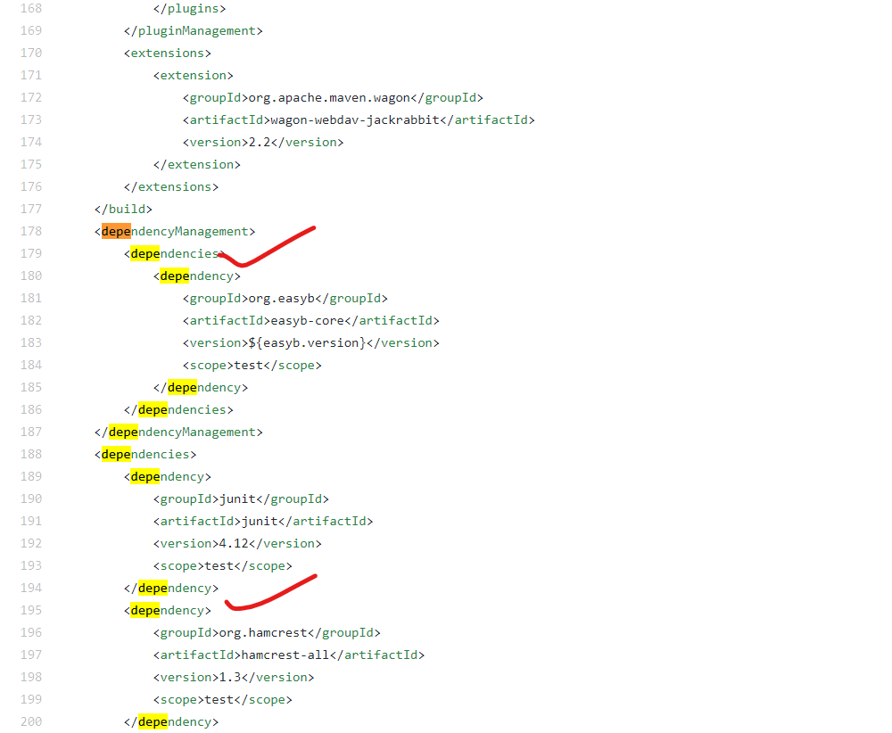 


## Types of Maven repositories : - central, local, and remote

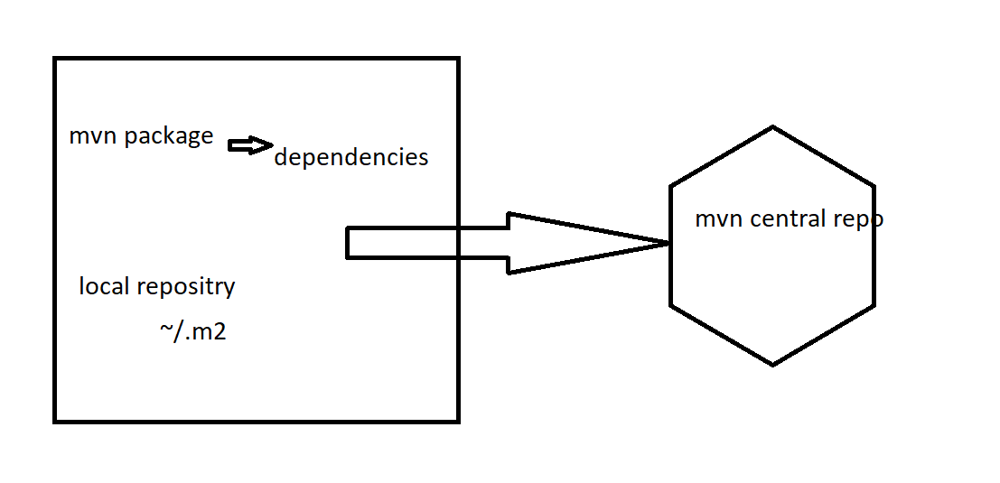  

## Build the code manually using maven:
* Clone the code from github.
```
git clone https://github.com/devops-surya/game-of-life.git
cd game-of-life.git
```
  
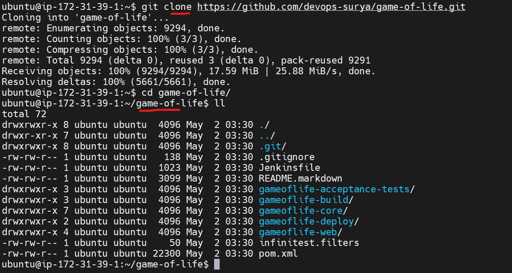  
* __mvn package__
  
  


<br/>
<br/>
<br/>
<br/>

* * * 

<br/>
<br/>
<br/>
<br/>

# Jenkins:
* Jenkins is an open source continuous integration/continuous delivery and deployment (CI/CD) automation software DevOps tool written in the Java programming language. It is used to implement CI/CD workflows, called pipelines.
* Jenkins is a ci/cd tool
* ci -- continous integration 
* cd -- continous delivery / continous deployment

## Basic flow of devops :


## Installing jenkins 
* prerequisites:
1. Ubuntu
2. Java 
3. Jenkins

## For installing jenkins we have two ways.
1. Jenkins master 
2. Quick setup (it is not the enterprize setup)
* For quick setup [REFER HERE](https://www.jenkins.io/download/)
```
 java-jar <path to the download>
```
## For installing jenkins master :
* For the jenkins installation [REFER HERE](https://www.jenkins.io/doc/book/installing/linux/#debianubuntu) 


```
sudo apt-get update
sudo apt-get install openjdk-8-jdk

java -version

wget -q -O - https://pkg.jenkins.io/debian-stable/jenkins.io.key | sudo apt-key add -
sudo sh -c 'echo deb https://pkg.jenkins.io/debian-stable binary/ > \
    /etc/apt/sources.list.d/jenkins.list'
sudo apt-get update
sudo apt-get install jenkins
```

* To open jenkins on brower 

```
http://ipaddress:8080
```
* After using above command we will get below screen on browser:
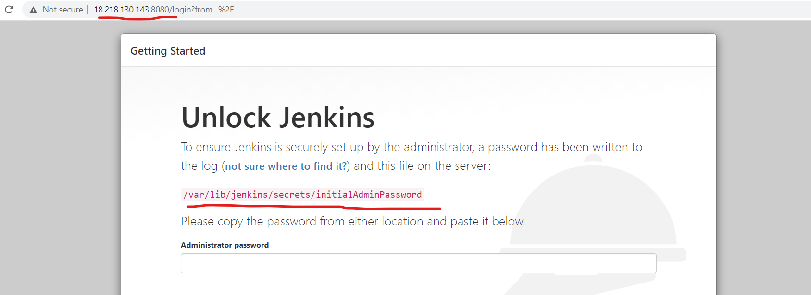
 * Copy the password and paste it on the browser:

* Click on the install suggested plugins , then u will see below page:

* provide the username, password , email:

* After providing usename and password click on the save and continue:

* Dashboard of jenkins


<br/>
<br/>
<br/>
<br/>

* * * 

<br/>
<br/>
<br/>
<br/>


# Freestyle Project: 
## Create a new job:


## Multiple ways to create a job:


## Create a job in Freestyle:
* click on the newitem and follow the below screenshots :


## Manage jenkins is used to configure the jenkins (settings) :


## Jenkins executor :
* Executor will define , how many jobs run parallely at a time.


<br/>
<br/>
<br/>
<br/>

* * * 

<br/>
<br/>
<br/>
<br/>

## Multiple sections in jenkins freestyle job:
1. General
2. Source Code Management
3. Build Triggers
4. Build Environment
5. Build 
6. Post-build Actions


## 1. General :
* Description : - Describe about your job
* Discard old builds : - No of days / No of build to be exists 

* This project is parameterized : - When can use parameters 

* Disable this project  : -  It will disable the project like can't Run/build the job

* Execute concurrent builds if necessary : - It allows you to run the same job multipletimes parallely


## 2. Source Code Management:
* Git : - Provide Githuburl/credentials , Branch to build 


## 3. Build Triggers:
* Trigger builds remotely : - Triggers the remote other jobs 
* Build after other projects are built : - Its allows you to build the present job after any succesfull job

* Build periodically : - It build the job at given schedule

* Poll SCM : - It build the job at given schedule , only when there are changes in code repository
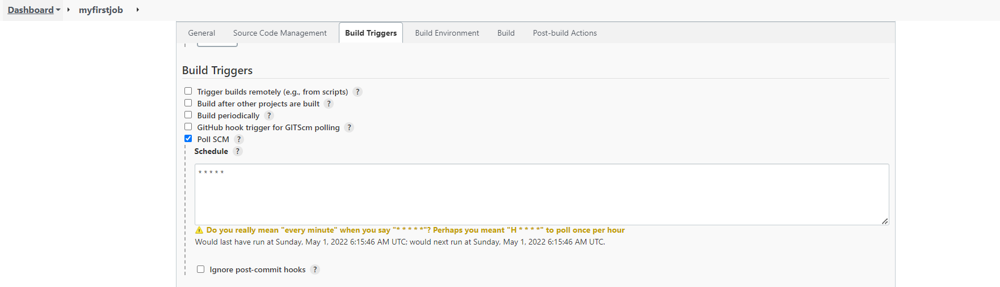

## 4. Build Environment:
* Delete workspace before build starts : - Delete and creates a new workspace for every build


## 5. Build:
* Define all your build steps here :

* Invoke top-level Maven targets : - Invoke the maven steps here
 
  

## 6. Post-build Actions:
* Define all you Post-build action steps here 


## Configurations in the __ Manage jenkins__
* In manage jenkins => configure system 


* In manage jenkins => configure global security 


## Manage Plugins
* In manage jenkins => manage plugins


## Restart the jenkins :
* Multiple ways to restart 
  1. In cli 
    ``` 
    sudo service jenkins restart 
    ```
  2. From GUI 
    
  3. In manage jenkins
     


<br/>
<br/>
<br/>
<br/>

* * * 

<br/>
<br/>
<br/>
<br/>

## Scenario: Create a CI job/pipeline .
### Create a job for GOL build.
1. Create a freestyle job with name __gol__
2. SCM -- provide the github url 
3. POLLSCM --- * * * * *
4. Delete the workspace for every build
5. BUILD -- Provide the goal in the invoke top-level maen plugin.


5. Build the job.


6. Go to configure and add post build actions as below:


7. Build the job and ouput will be as below:


* Artifacts are nothing but the war/jar/ear files.

8. Go to configure and add the publish junit test results as below:


9. Build the job and output will be as shown below:


## Jenkins workspace, Jobs, Builds, Jenkins HOME_PATH/HOME_DIRECTORY :
* All the jenkins stuff will be stored in the jenkins HOME_PATH = /var/lib/jenkins/
* /var/lib/jenkins/workspace : - Jenkins workspace for everyjob is stored
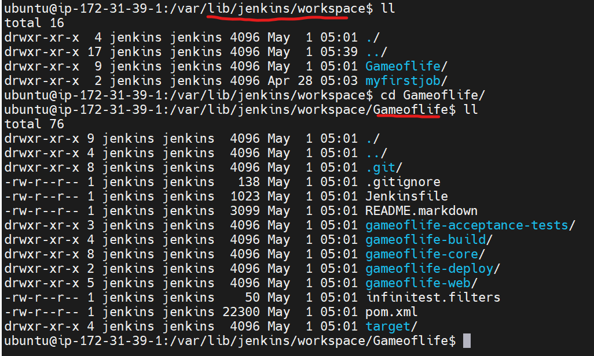
* /var/lib/jenkins/jobs : - Configurations of everyjob is stored


<br/>
<br/>
<br/>
<br/>

* * * 

<br/>
<br/>
<br/>
<br/>

## Build with parameters:


* Git parameter [ReferHere](https://plugins.jenkins.io/git-parameter/)
* String parameter [ReferHere](https://wiki.jenkins.io/display/JENKINS/Parameterized+Build)
* Choice Parameter [ReferHere](https://plugins.jenkins.io/extensible-choice-parameter/)
* Active choice parameter [ReferHere](https://plugins.jenkins.io/uno-choice/#:~:text=The%20Active%20Choices%20plugin%20is,or%20rich%20HTML%20UI%20widgets.)


* Install the git-plugin as shown in below image:


* After install we can see the option in parameters:


## Upstream and Downstream projects:

    
### Trigger the jenkins jobs from one-job-to-another-job:
* Install the plugin __Parameterized Trigger__ as shown in the below image:


* Use the __Trigger parameterized build on other projects__ to trigger other job:
    
    


<br/>
<br/>
<br/>
<br/>

* * * 

<br/>
<br/>
<br/>
<br/>


## Jenkins Node/slave in jenkins:
* For understanding the node concept. refer below architecture :


## Basic architecture of jenkins master and node:

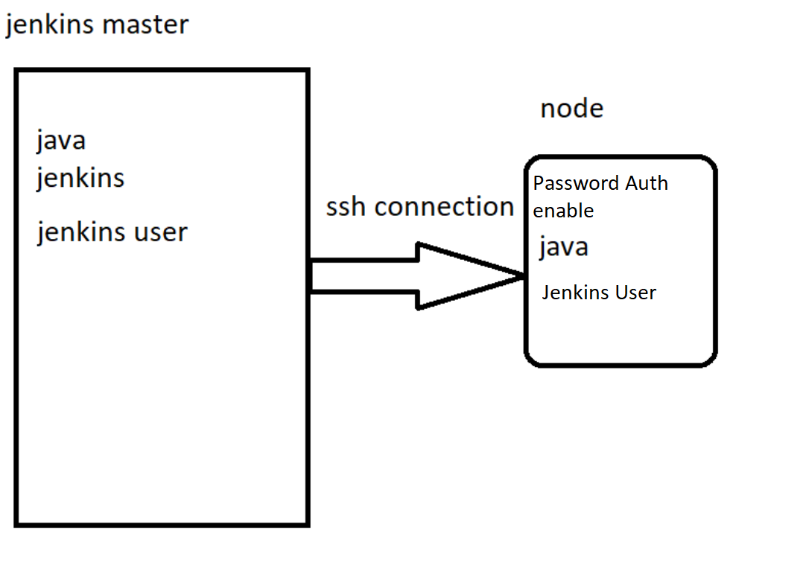

* To add the node to the jenkins as per the above image. Do the ssh-keygen as shown below in jenkins-master:

```
ssh-keygen
ssh-copy-id username@ipaddress
```


* On node , do the below steps:

```

sudo su 

sudo apt-get update

sudo apt-get install openjdk-8-jdk

vi /etc/ssh/sshd_config 

PasswordAuthentication Yes

sudo service sshd restart

adduser jenkins

visudo -- add jenkins to the sudo group

```

## Add node/slave to the jenkins.

* In manage jenkins => mange nodes 


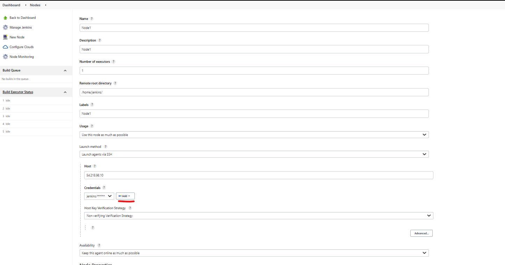

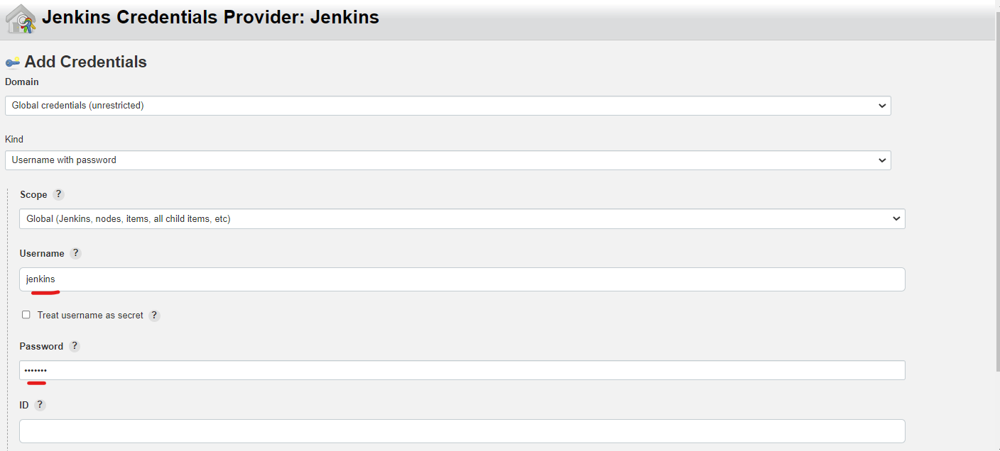


## Use node/slave in the jenkins job:


## Backup of jenkins:


* __Note__ : Makesure the backup folder has 777 permissions.

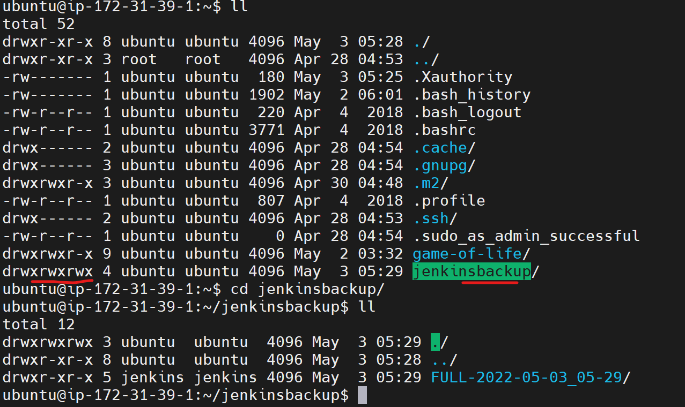


<br/>
<br/>
<br/>
<br/>

* * * 

<br/>
<br/>
<br/>
<br/>


# Pipeline :
## Create a jenkins job in pipeline format:


* Basic syntax of groovy:

```
node('<LABEL>'){
    stage('git clone'){
      
    }
    stage('build the code){

    }
    stage('archive the artifacts'){

    }
    stage('publish the junit reports'){

    }
    stage('Running the ansible playbook'){
        
    }
}
  
```

## Jenkins pipeline :
* In jenkins pipeline there are two ways:
  1. Pipeline  script     -- Scripted pipeline 
  2. Pipeline  script from SCM -- Declarative pipeline

* The approach we follow for the jenkins pipeline and writing the groovy for is called as pipeline-as-code.

## Basic scripted pipeline :
```
node('ubuntu'){
    stage('git clone'){
      git 'https://github.com/devops-surya/game-of-life.git' 
    }
    stage('build the code'){
      sh 'mvn package'
    }
    stage('archive the artifacts'){
      archiveArtifacts artifacts: 'gameoflife-web/target/*.war', followSymlinks: false
    }
    stage('publish the junit reports'){
      junit 'gameoflife-web/target/surefire-reports/*.xml'
    }
}
```
## Snippet generator:


## To generate the pipeline script for git:


## To generate the pipeline script for archive the artifacts:


## To generate pipeline script for the publish junit test results:


* The output of the jenkins pipeline job will be as below:


<br/>
<br/>

## Tracking the changes in the Jenkins Job:
## Job Configuration History :
* Plugin usage [REFERHERE](https://plugins.jenkins.io/jobConfigHistory/)
* This plugin is used to track the changes made previously  .


## Jenkinsfile 
* Jenkinsfile reference [REFERHERE](https://www.jenkins.io/doc/book/pipeline/jenkinsfile/)
* Using jenkinsfile will be helpful in tracking the changes and it is called as __Declarative Pipeline__

## Jenkins declarative pipeline syntax:

* Reference for the __Declarative Pipeline syntax__ [REFER HERE](https://www.jenkins.io/doc/book/pipeline/syntax/)


## Scripted pipeline vs declarative pipeline :
*  Scripted pipeline:
```
node('ubuntu'){
    stage('git clone'){
      git 'https://github.com/devops-surya/game-of-life.git' 
    }
    stage('build the code'){
      sh 'mvn package'
    }
    stage('archive the artifacts'){
      archiveArtifacts artifacts: 'gameoflife-web/target/*.war', followSymlinks: false
    }
    stage('publish the junit reports'){
      junit 'gameoflife-web/target/surefire-reports/*.xml'
    }
}
```

* Declarative pipeline:
```
pipeline {
   agent { label 'ubuntu' }
   stages{
       stage('git clone'){
           steps{
               git 'https://github.com/devops-surya/game-of-life.git'  
           }        
       }
       stage('build the code'){
           steps{
              sh 'mvn package'
           }
       }
       stage('archive the artifacts'){
           steps{
              archiveArtifacts artifacts: 'gameoflife-web/target/*.war', followSymlinks: false
           }          
       }
       stage('publish the junit reports'){
           steps{
              junit 'gameoflife-web/target/surefire-reports/*.xml'
           }
           
       }

   }
}
```


## Create a new pipeline job with pipeline script from scm as below:


## Blue ocean plugin :
* In manage jenkins => manage plugins => available => Blue ocean
* After installing you will see below changes:


## Fork:


* Go to the repo  which you want to fork:

 


## SNAPSHOT vs RELEASE 
* If you find the a artifacts with the Snapshot , that means it is still in development.
* If you find your artifact with the release , that means it is ready for the deploymnet and sent it to production.
```
EX: Game-of-life.war-sanapshot-1.0 
EX: Game-of-life.war-Release-1.0
```


## Triggers for build peridically and pollSCM in the pipeline job [REFER HERE](https://www.jenkins.io/doc/book/pipeline/syntax/#triggers)

```
pipeline {
   agent any
   triggers{
      cron('* * * * *')
   }
   triggers{
      pollSCM('* 8 * * *')
   }
   stages{
       stage('git clone'){
           steps{
               git branch: 'master', url: 'https://github.com/devops-surya/game-of-life.git'
           }        
       }
       stage('build the code'){
           steps{
              sh 'mvn package'
           }
       }
       stage('archive the artifacts'){
           steps{
              archiveArtifacts artifacts: 'gameoflife-web/target/*.war', followSymlinks: false
           }          
       }
       stage('publish the junit reports'){
           steps{
              junit 'gameoflife-web/target/surefire-reports/*.xml'
           }
           
       }

   }
}
```

## __Upstream__ job triggering: [REFERHERE](https://www.jenkins.io/doc/book/pipeline/syntax/#:~:text=4%20*%20*%201%2D5%27)%20%7D-,upstream,triggers%20%7B%20upstream(upstreamProjects%3A%20%27job1%2Cjob2%27%2C%20threshold%3A%20hudson.model.Result.SUCCESS)%20%7D,-The%20pollSCM%20trigger)

```
pipeline {
   agent any
   triggers{
     upstream(upstreamProjects: 'pipeline-1', threshold: hudson.model.Result.SUCCESS)
   }
   stages{
       stage('git clone'){
           steps{
               git branch: 'master', url: 'https://github.com/devops-surya/game-of-life.git'
           }        
       }
       stage('build the code'){
           steps{
              sh 'mvn package'
           }
       }
       stage('archive the artifacts'){
           steps{
              archiveArtifacts artifacts: 'gameoflife-web/target/*.war', followSymlinks: false
           }          
       }
       stage('publish the junit reports'){
           steps{
              junit 'gameoflife-web/target/surefire-reports/*.xml'
           }
           
       }

   }
}
```

## Parameters using in jenkins pipeline [REFER HERE](https://www.jenkins.io/doc/book/pipeline/syntax/#parameters)
```
pipeline {
    agent any
    parameters {
        string(name: 'PERSON', defaultValue: 'Mr Jenkins', description: 'Who should I say hello to?')

        text(name: 'BIOGRAPHY', defaultValue: '', description: 'Enter some information about the person')

        booleanParam(name: 'TOGGLE', defaultValue: true, description: 'Toggle this value')

        choice(name: 'CHOICE', choices: ['One', 'Two', 'Three'], description: 'Pick something')

        password(name: 'PASSWORD', defaultValue: 'SECRET', description: 'Enter a password')
    }
    stages {
        stage('Example') {
            steps {
                echo "Hello ${params.PERSON}"

                echo "Biography: ${params.BIOGRAPHY}"

                echo "Toggle: ${params.TOGGLE}"

                echo "Choice: ${params.CHOICE}"

                echo "Password: ${params.PASSWORD}"
            }
        }
    }
}

```

## Triggering remote job [REFER HERE](https://www.jenkins.io/doc/pipeline/steps/pipeline-build-step/)
```
pipeline {
   agent any
   triggers{
     upstream(upstreamProjects: 'pipeline-1', threshold: hudson.model.Result.SUCCESS)
   }
   parameters{
     string(name: 'BUILD_BRANCH', defaultValue: 'master', description: 'parameterized the branch' )
   }
   stages{
       stage('git clone'){
           steps{
               git branch: "$BUILD_BRANCH", url: 'https://github.com/devops-surya/game-of-life.git'
           }        
       }
       stage('build the code'){
           steps{
              sh 'mvn package'
           }
       }
       stage('archive the artifacts'){
           steps{
              archiveArtifacts artifacts: 'gameoflife-web/target/*.war', followSymlinks: false
           }          
       }
       stage('publish the junit reports'){
           steps{
              junit 'gameoflife-web/target/surefire-reports/*.xml'
           }
	   stage('triggering the another job named gol'){
	       steps{
		      build job: 'gol'
		   }
	   }
           
       }

   }
}
```

## Multibranch pipeline:


<br/>
<br/>
<br/>
<br/>

* * * 

<br/>
<br/>
<br/>
<br/>


# JFrog Artifactoy:
* JFrog Artifactory is the Universal Repository Manager supporting all major packaging formats, build tools and CI servers.

## Install JFrog Artifactory oss :
* Installation steps [REFERHERE](https://www.devopsschool.com/blog/artifactory-install-and-configurations-guide/#:~:text=Artifactory%20Pro%20Install%20in%20Linux%20using,jfrog/artifactory/var/etc/system.yaml)

```
# find the release name
lsb_release -c
distribution="focal" #ubuntu 20.04
wget -qO - https://releases.jfrog.io/artifactory/api/gpg/key/public | sudo apt-key add -;
echo "deb https://releases.jfrog.io/artifactory/artifactory-debs {distribution} main" | sudo tee -a /etc/apt/sources.list;
sudo apt-get update && sudo apt-get install jfrog-artifactory-oss -y
sudo systemctl enable artifactory.service
sudo systemctl start artifactory.service
sudo systemctl status artifactory.service

echo "deb https://releases.jfrog.io/artifactory/artifactory-debs focal main" | sudo tee -a /etc/apt/sources.list;

```

* Access artifactory by using : __https://publicip:8081__ and follow thw below steps:
* Default username and password :
```
Username: admin
Pasword : password
```


* Create a repository :
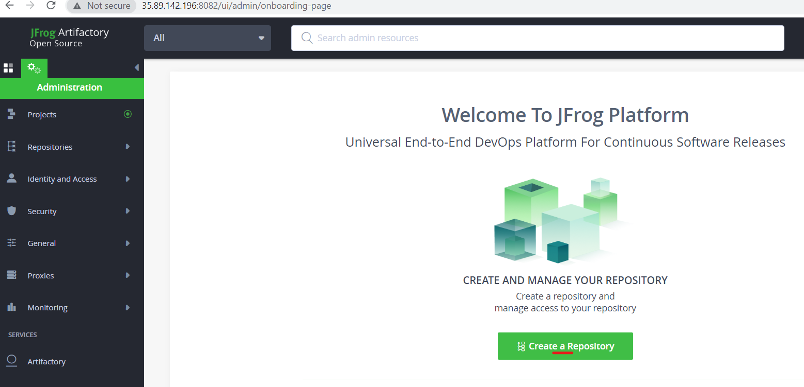


### Integrate Jfrog with the jenkins :
* Install Jfrog plugon from __manage plugin__


* After plugin installated, Navigate to Manage jenkins >> Configure System , do the changes as below and save them


## Create a Maven-job to store our artifacts to the jfog artifactory:
1. Create a new maven job 


2. SCM - provide code repository


3. Build -- Provide maven goal 


4. Post-build-Actions -- Deploy Artifacts to Artifactory


5. Build the maven-job to check the artifactory working as per expexted.


* Upload the artifacts to jfrog in groovy :

```
pipeline {
   agent any
   stages{
       stage('git clone'){
           steps{
               git branch: 'master', url: 'https://github.com/devops-surya/game-of-life.git'
           }        
       }
       stage('build the code'){
           steps{
              sh 'mvn package'
           }
       }
       stage('archive the artifacts'){
           steps{
              archiveArtifacts artifacts: 'gameoflife-web/target/*.war', followSymlinks: false
           }          
       }
       stage('publish the junit reports'){
           steps{
              junit 'gameoflife-web/target/surefire-reports/*.xml'
           }
           
       }
       stage('rt server'){
           steps{
               rtServer (
                   id: 'JFROG-OSS',
                   url: 'http://35.89.142.196:8082/artifactory',
                   username: 'admin',
                   password: 'Jfrog@123',
                   bypassProxy: true,
                   timeout: 300
               )

           }
       }
       stage('rt upload'){
           steps{
               rtUpload (
                   serverId: 'JFROG-OSS',
                   spec: '''{
                         "files": [
                             {
                                 "pattern": "gameoflife-web/target/*.war",
                                 "target": "my-second-repo/"

                             }
                                  ]
                   }''',
                        
               )

           }

       }

      }


    }


```