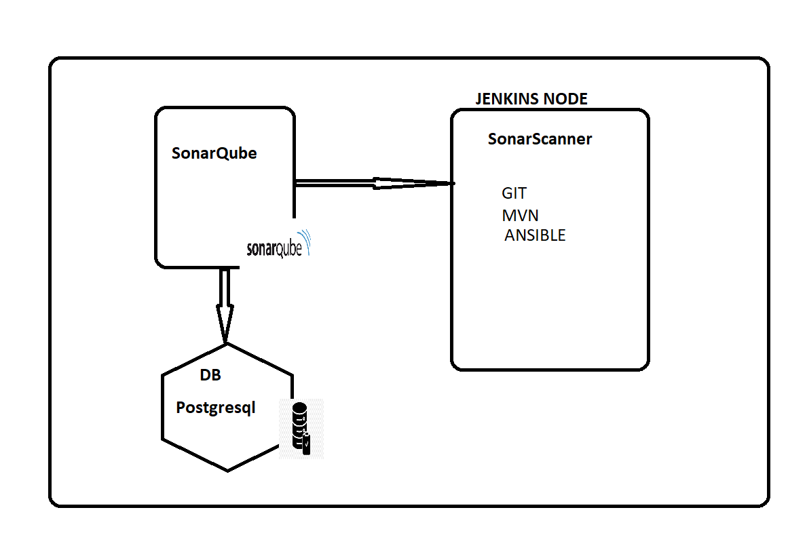
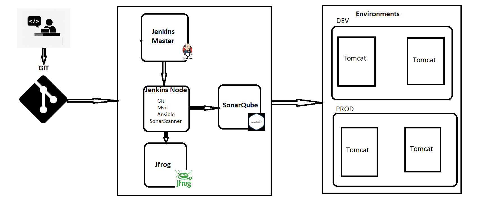
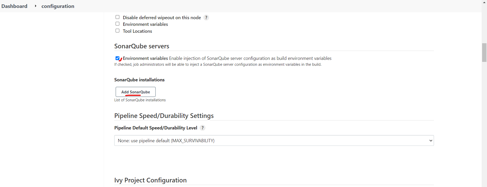
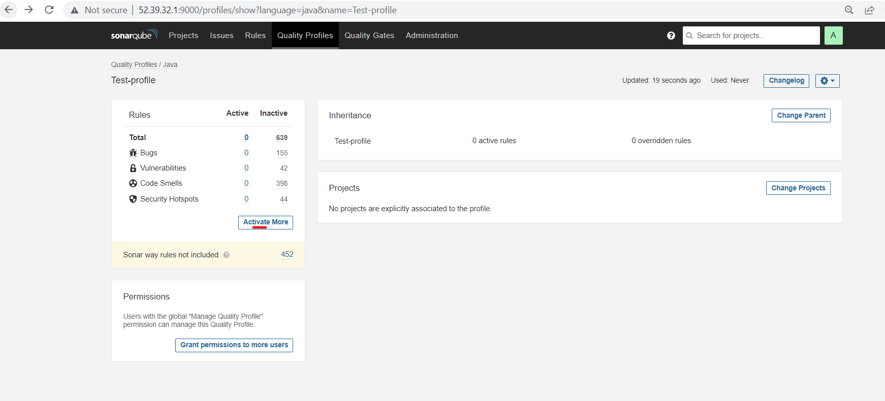

# Sonarqube 
* SonarQube is an open-source static testing analysis software, it is used by developers to manage source code quality and consistency.
* __sonarscanner-for-maven__ Official docs [REFERHERE](https://docs.sonarqube.org/latest/analysis/scan/sonarscanner-for-maven/)

## SonarQube working flow:



### Pipeline integrated with Jfrog & SonarQube :


### Prerequisites
1. Need an EC2 instance (min t2.small)
2. Install Java-11
  ```sh 
   sudo su 
   cd
   apt-get update   
   apt  list | grep openjdk-11  
   apt-get install openjdk-11-jdk -y   
   ```

### Install & Setup Postgres Database for SonarQube
`Source: https://www.postgresql.org/download/linux/ubuntu/`  
1. Install Postgres database   
  ```sh 
  sudo sh -c 'echo "deb http://apt.postgresql.org/pub/repos/apt $(lsb_release -cs)-pgdg main" > /etc/apt/sources.list.d/pgdg.list'  
  wget --quiet -O - https://www.postgresql.org/media/keys/ACCC4CF8.asc | sudo apt-key add -
  sudo apt-get update
  sudo apt-get -y install postgresql
  ```

2. Set a password and connect to database (setting password as "admin" password)
  
  ```sh
  sudo passwd postgres
  su - postgres
  ```

3. Create a database user and database for sonarque 
  ```sh 
  createuser sonar
  psql
  ALTER USER sonar WITH ENCRYPTED PASSWORD 'admin';
  CREATE DATABASE sonarqube OWNER sonar;
  GRANT ALL PRIVILEGES ON DATABASE sonarqube to sonar;
  \q
  exit
  ``` 

4. Restart postgres database to take latest changes effect 
  ```sh 
  systemctl restart postgresql 
  systemctl status postgresql
  ```
`check point`: You should see postgres is running on 5432
```sh
apt install net-tools
netstat -plnt
```

`Source: https://docs.sonarqube.org/latest/requirements/requirements/`

5. Added below entries in `/etc/sysctl.conf`
  ```sh 
  vm.max_map_count=524288
  fs.file-max=131072
  ulimit -n 131072
  ulimit -u 8192
  ```
6. Add below entries in `/etc/security/limits.conf`
  ```sh 
  sonarqube   -   nofile   131072
  sonarqube   -   nproc    8192
  ```

7. reboot the server 
  ```sh 
  sudo reboot 
  init 6 
  ```
  ==========================================

 ### SonarQube Setup

1. Download [soarnqube](https://www.sonarqube.org/downloads/) and extract it.   
  ```sh 
  sudo su 
  cd /opt/
  wget https://binaries.sonarsource.com/Distribution/sonarqube/sonarqube-8.9.2.46101.zip
  apt-get install unzip
  unzip sonarqube-8.9.2.46101.zip
  ```

2. Update sonar.properties with below information 
  ```sh
  sonar.jdbc.username=<sonar_database_username>
  sonar.jdbc.password=<sonar_database_password>

  sonar.jdbc.username=sonar
  sonar.jdbc.password=admin
  sonar.jdbc.url=jdbc:postgresql://localhost/sonarqube
  sonar.search.javaOpts=-Xmx512m -Xms512m -XX:MaxDirectMemorySize=256m -XX:+HeapDumpOnOutOfMemoryError
  ```

__Note__:Before the step3 do below steps 
```sh
cd /opt/
mv sonarqube-8.9.2.46101 sonarqube
``` 

3. Add below data to `/etc/systemd/system/sonarqube.service` file start sonarqube service at the boot time 
  ```sh   
  [Unit]
  Description=SonarQube service
  After=syslog.target network.target

  [Service]
  Type=forking
  User=sonar
  Group=sonar
  PermissionsStartOnly=true
  ExecStart=/opt/sonarqube/bin/linux-x86-64/sonar.sh start 
  ExecStop=/opt/sonarqube/bin/linux-x86-64/sonar.sh stop
  StandardOutput=syslog
  LimitNOFILE=65536
  LimitNPROC=4096
  TimeoutStartSec=5
  Restart=always

  [Install]
  WantedBy=multi-user.target
  ```

4. Add sonar user and grant ownership to /opt/sonarqube directory 
  ```sh 
  useradd -d /opt/sonarqube sonar
  chown -R sonar:sonar /opt/sonarqube
  ```

5. Reload the demon and start sonarqube service 
  ```sh 
  systemctl daemon-reload 
  systemctl start sonarqube.service 
  ```


* Open SOnarqube on browser:

```sh

http://<publicip>:9000

Default:
=======
username: admin
password: admin
```
 ### Unable to access Sonarqube from browser? 

 1. Make sure port 9000 is opened at security group leave
 2. start sonar service as a sonar user 
 3. user correct database credentials in the sonar.properties
 4. use instance which has atleast 2 GB of RAM


## Integrate the Sonarqube with jenkins:
### On Sonarqube server 
* Generate a sonarqube token to authenticate from Jenkins as followed below:


* Use the below stuff when you want to use the sonar in your build 
```sh
mvn sonar:sonar \
  -Dsonar.projectKey=GOL-Project \
  -Dsonar.host.url=http://52.39.32.1:9000 \
  -Dsonar.login=b6b603faf2879eb994hagskaadhlal a24e93acbdf37bbd81
```


### On Jenkins server 
1. Install Sonarqube plugin --  Manage Jenkins >> Manage Plugins >> SonarQube Scanner  


2. Configure Sonarqube credentials  -- Manage Jenkins >> Manage Credentials 


3. Add Sonarqube to jenkins "configure system"  -- Manage jenkins >> configure system



4. Install SonarScanner -- Manage Jenkins >> Global Tool Configuration


5. Create a  Pipeline job with sonar integrated script and run it :

```
pipeline{
    agent any
    environment {
        PATH = "$PATH:/opt/apache-maven-3.8.2/bin"
    }
    stages{
       stage('GetCode'){
            steps{
                git 'https://github.com/devops-surya/game-of-life.git'
            }
         }        
       stage('Build'){
            steps{
                sh 'mvn clean package'
            }
         }
        stage('SonarQube analysis') {
//    def scannerHome = tool 'SonarScanner 4.0';
        steps{
        withSonarQubeEnv('sonarqube-8.9.2') { 
        // If you have configured more than one global server connection, you can specify its name
//      sh "${scannerHome}/bin/sonar-scanner"
        sh "mvn sonar:sonar"
    }
        }
        }
       
    }
}
```


6. Default Quality Profile VS customized quality profile :
* Quality profile default 


* Customized Quality Profile





* Now run the jenkinsjob , it will the new quality Profile and produces output as below :

* Verify jenkins job is using new customized quality profile :


