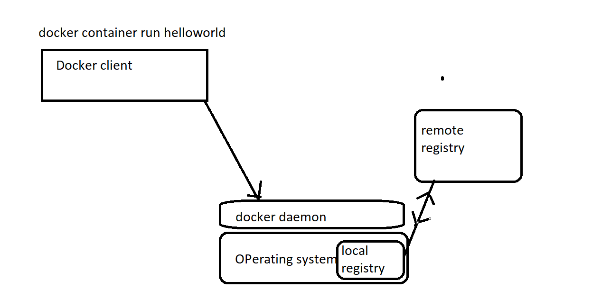
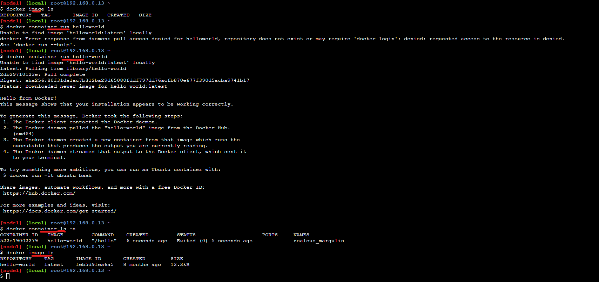

# Docker :
 * The evolution of applications ( VM vs Containers):
 

* For the docker documentaion [REFER HERE](https://docs.docker.com/) and also for the differences between vm and containers [REFER HERE](https://docs.docker.com/get-started/)

## How docker works:
* Every app running in container will be using the base os.
* EVery container running in docker wil be having process id.
* Application running inside the container will have storage, CPU, RAM , network.
* Each container running in the docker is going to have ip address.

## Installing docker :
* Scripted way of installing docker [REFER HERE](https://get.docker.com/)
* Installing docker [REFER HERE](https://docs.docker.com/engine/install/ubuntu/)

# Exercise:
* Signup in dockerhub [REFER HERE](https://hub.docker.com/signup)
* Docker playground     
 

 # Docker :
* Docker provides the ability to package and run the application in a loosely isolated environment called a  container. 

* Containerazation:  The procces of making your application run on the docker conatiners.
* Image : Docker image is a procees of packaging your application.

# How Docker works:
  * There are two two components will get installed , when we install docker.
   1. Docker daemon
   2. Docker client

 

```
docker image ls 
docker conatainer run helloworld
```
 


* Docker cheat sheet [REFER HERE](https://www.docker.com/sites/default/files/d8/2019-09/docker-cheat-sheet.pdf)

# Docker HUB:
* Docker hub is the default remote registry to the docker
* There are many private registries:
  * ECR - (Elastic container registry provided by AWS)
  * ACR - (Azure container regitry provided by Azure)


 # Lets create a Image with java installed.
* For creating Docker Image we need to write Dockerfile
 * Steps to do it manually:
   1. Need an machine with OS (Need an image with OS)
   2. sudo apt-get update 
   3. sudo apt-get install openjdk-8-jdk -y 

* To run the image and make a container follow below cmmands:
```
docker container run hello-world
docker image ls 
```


## Basic Dockerfile syntax :
```
INSTRUCTIONS <ARGUMENTS>
```
* Some of the INSTRUCTIONS are FROM , RUN , CMD , ENTRYPOINT , ARG 

## Dockerfile for the java :
* Make folder of sample and create a Dockerfile in that samplefolder
```
mkdir sample 
cd sample
vi Dockerfile
```
* Search for the ubuntu image in the dockerhub . For latest image follow below
```
docker pull ubuntu:latest
```
* After adding Instructions and arguments , Dockerfile looks as below:
```
FROM ubuntu:latest
RUN  apt-get update
RUN  apt-get install openjdk-8-jdk -y
```

* To create a image from dockerfile follow below dteps:
```
docker image build -t <imagename> .
docker image build -t <imagename> <pathtothedockerfile>
docker image build -t myfirstimage .

```
* Dockerfile is convention , we can also change the filename


* To run the image we have created 
```
docker conatiner run <imagename>
docker conatiner run myfirstimage
docker conatiner ls 
docker container ls -a
```


# Installing docker :
 * Installing by script based :

```
curl -fsSL https://get.docker.com -o get-docker.sh
sh get-docker.sh

``` 


# RUN :
* This instructor executes your commands in the Dockerfile
* Every RUN instructor stores as a single layer .
* syntax :
```
RUN <command>
RUN ["executable, "param1", "param2" ]
```
* shell way of providing RUN command:
```
RUN echo sample
```
* exec way of providing RUN command
```
RUN ["echo", "sample"]
```


## ENTRYPOINT:
* This is the command thats executed when the container starting.
* syntax:
```
ENTRYPOINT [ "executable, "param1", "param2"  ]
ENTRYPOINT executable param1 param2 
```

## CMD :
* This will be excuted when the container starting , if the ENTRYPOINT is no there 
* syntax:
```
CMD [ "executable, "param1", "param2"  ]
CMD executable param1 param2 
```

* If both the CMD and ENTRYPOINT exists, then the ENTRYPOINT will be excuted 

## EXPOSE :
* This intsructor is used to expose your port on the container 
* syntax:
```
EXPOSE <port>
EXPOSE 8080
```

## LABEL :
* This instructor adds metadata to your image :
* syntax:
```
LABEL <key>=<value>
LABEL author="myself"
LABEL project="myproject"
LABEL version="1.0"
```

## ADD and COPY :
* The two instructors are used to copy the files to the docker image.
* ADD instructor is uded to copying files from url and local machine.
* COPY instructor supports copying the files on the local machine.

* synatx:
```
ADD <src> <dest>
ADD <url> <dest>
COPY <src> <dest>
```

## Creating a Dockefile for SAMPLEWAR :
 * Install JAVA 
 * Install tomcat
 * Downloading the war file and copying it to tomcat webapps
 * start the tomcat
# First approach :
  1. Taking baseimage of ubuntu  ---- FROM 
  2. Installing java     ----  RUN 
  3. Installing tomcat   ----  RUN 
  4. know the exact path of webapps 
  5. downloading the war file  and copy to the webapps -----  ADD/COPY
  6. Open port of tomcat on container   --- EXPOSE 
  7. starting the tomcat  ----  ENTRYPOINT/CMD
## Second approch:
  1. Taking the baseimage of tomcat directly --- FROM
  2. Downloading the war file and copying it to tomcat webapps --- ADD/COPY
  3. Open port of tomcat on container   --- EXPOSE 
  4. starting the tomcat  ----  ENTRYPOINT/CMD

# Dockerfile for the second approach:
```
FROM tomcat:8
LABEL author="surya"
ADD https://tomcat.apache.org/tomcat-7.0-doc/appdev/sample/sample.war /usr/local/tomcat/webapps/
EXPOSE 8080
CMD [ "catalina.sh", "run" ]
```
* Run the above Dockerfile wiht below commads
```
docker image build -t samplewar .
```


* To create a cotainer from the image of samplewar follow below steps:
```
docker container run samplewar
```

* To run the container on the detach mode follow below:
```
docker container  run -d samplewar
```
* To check the application ruuning on tomcat , we use -P to publish one of the port on the base OS to the container:
```
docker container -d  -P run samplewar
```


* To check the samplewar application accessible to the outside world:

```
ipaddress:<port>/sample
```

# Instructions:

## USER :
* This sets the username for any subsequent commands running by RUN , CMD , ENTRYPOINT
* syntax:
```
USER <username>
USER devops
```

## WORKDIR:
* This intruction sets the working directory for any subsequent commands running by RUN , CMD , ENTRYPOINT
* Syntax:
```
WORKDIR /home/devops/mypath
```

## ARG :
* This insruction allows variable to be passed while building image.
* syntax:
```
ARG <key>=<value>
```

## ENV:
* This insruction allows you to set the environmental variables for the docker image.
* syntax:
```
ENV <key>=<value>
```
* Environmental variable can also be replaced while container running.

## Example  Dockerfile with above Instructions

```
FROM tomcat:8
LABEL author="surya"
USER devops
ARG url=https://tomcat.apache.org/tomcat-7.0-doc/appdev/sample/sample.war
ADD $url /usr/local/tomcat/webapps/
EXPOSE 8080
WORKDIR /home/devops/
ENV tomcatversion=8
CMD [ "catalina.sh", "run" ]
```

##  CMD &  ENTRYPOINT
* These can be overwritten while creating a container:

```
docker container run -d samplewar echo hello
docker container run -d samplewar --entrypoint 
```

## stop/start pause/unpause

```
docker container stop <container-id>/<containername>
docker container start  <container-id>/<containername>
docker container pause  <container-id>/<containername>
docker container unpause  <container-id>/<containername>
```
## Commands:
```
docker container ls   ---- list of running container 
docker container ls -a    ---- list of all contaner running and exited
docker image ls         ----- list all the images

```

# Inspect an Image:
* Create a folder with java 

```
mkdir java 
cd java/
vi Dockerfile
```

```
FROM ubuntu:18.04
RUN apt-get update
RUN apt-get install openjdk-8-jdk -y
```

* Run the above Dockerfile :

```
docker image build -t java:1.0 .
docker image build -t java:2.0 .
```
* From one Dockerfile we can create multiple images.
* From one image we can also create multiple containers.


## To inspect an image 
```
docker image inspect <imagename>
```

## To publish our own specified port :
```
docker conatiner run -d -p 8005:8080 <imagename>
```


# Portforwarding:
* It is used to access our application running inside the container 

```
docker conatiner run -P <image>
docker conatiner run -p <hosport>:<conatinerport>
```

# Attached mode:
* The container runs on foreground
* Default mode of docker

```
docker conatiner run -P <dockerimage>
```

# Detached mode:

* Docker conainer runs in the background .

```
docker conatiner run -d -P <imagename>
```

# Interactive :
* In interactive mode we can interact with docker using terminal (/bin/bash, /bin/sh)
* We will be using -it in the docker command
```
docker conatainer exec -it -P <imagename> /bin/bash 
```

## Adding name to the container :

```
docker container  run --name <nameofconainer>  -d -P <image>
```


## Delete an image :

```
docker image rm <imagename>
docker image rm -f <imagename>
```
* To delete all images :

```
docker rmi $(docker images -a -q)
```

# To get inside the conatiner :

```
docker exec -it <conainername>/<containerid> /bin/bash
```


## To delete the docker container :

```
docker container rm <conatinername>/<conatinerid>
docker container rm -f  <conatinername>/<conatinerid>
```
* For more info [REFERHERE](https://docs.docker.com/engine/reference/commandline/container_rm/)

# Namespaces:


* As the containers are not reliable .That means the containers are going to stop/kill/died when there is no service running inside the container.
* When the containers are stopped the data inside the containers also lost.
* For the above isuue to be resolved , there is a concept of volumes, where we can attach the volumes. The volumes will be available even after the container is lost

## Volumes :
* volumes 
* Bind mount
* tmpfs

* For docker volumes [REFERHERE](https://docs.docker.com/storage/volumes/)

# DELETING/INSPECT/PRUNE volumes
* For Document [REFERHERE](https://docs.docker.com/engine/reference/commandline/volume_rm/)

```
docker volume rm <volumename>
docker volume rm  -f <volumename>
```
# CNM(Conatiner Networking Model)
* For Document [REFERHERE](https://docs.docker.com/network/)