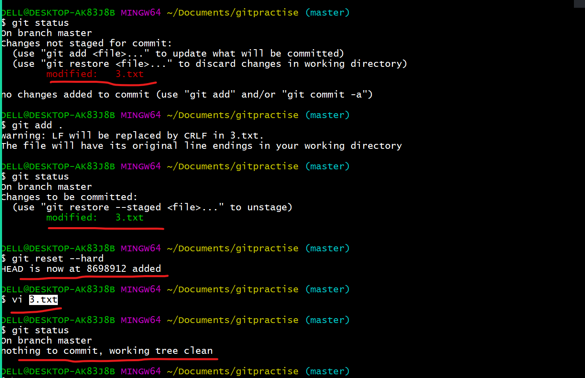

# Working on thhe git 


## RESET 
* Reset will revert the changes add to the stagging area to the working tree


```
git cchecout --<filename>
```
* git checkout --<filename>  -- it is used to remove the changes u made on the working tree , after we do reset..


#  YOu came across a scenario , where u want remove the changes from stagging area and the working tree at a single shot:

```
git reset --hard 
```


* removin the file is also a chnage in the working of git.


## Head 
* Head will be always at the latest commit .
## Detached head
* When we are going back to the history , the head will be detached and it will go back to the commit which you are using.


