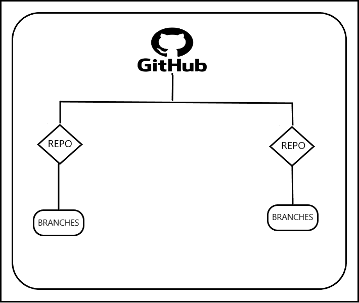

# GIT PUSH 
* git push will add changes changes from local repo to the remote repo


* Remote repository we must have a github account to create it .
* Repositry is the place where the code will be stored.
* The number of repositries will be depending up on the basis of the project.

## High level view of github 



## Create a repositry in the github:
* Got to the repositries and then refer the image below:

* Provided the repositry name and make it public , so that it will be available to everyone.


## Add remote repo to the local repo for push 


```
git remote add origin https://github.com/devops-surya/sample.git

git push origin master

```


## * scenario : A new developer added to a team and he want the to total code from the repositry:

```
git clone https://github.com/devops-surya/sample.git
```


## * Scenario : A developer already exists and he/she ha  the code in his local desktop.But he/she dont have the latest code.

```
git push https://github.com/devops-surya/sample.git
```
