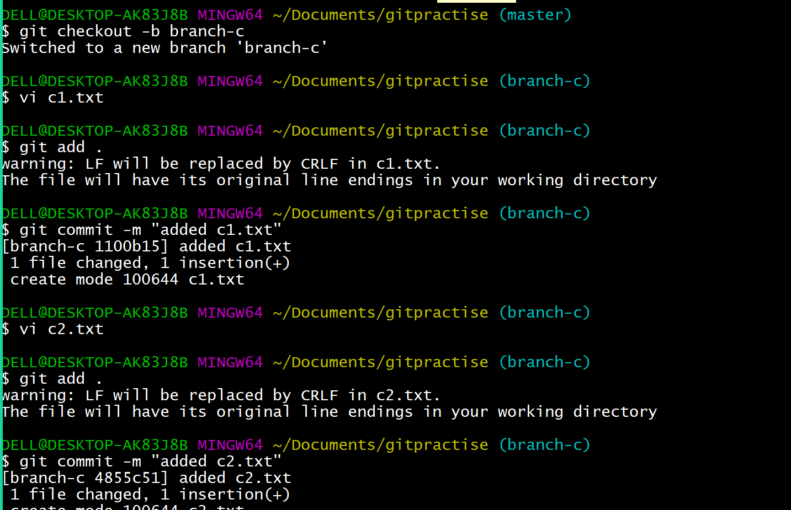

# Multiple branching :
* If a company want to serve the code to the mutliple companies , there will create multiple branches and go for the parallel development.


* To create a branch

```
git branch <branchname>
```
* To list the branches:
```
git branch
```

* To switch between the branches

```
git checkout <branchname>
```

* To create a branch and switch to it directly:

```
git checkout -b <branchname>
```


* To push the code from the company-x branch to the remote repo:

```
git push origin company-x
```


* To see the remote branches:
```
git branch -r
```


## MERGE :

* creating a file y1.txt and do add , commit .

* Switch to the company-x branch .creating a file x1.txt and do add , commit .


## Fastforward merge:

* Create branch a company-z. create afile z1.txt and do add , commit.

* if u dont want to go with the fastforward merge 

```
git checkout master 
git merge --no-ff company-z
```

## Rebase :

* Create  a branch-a and create a a1.txt file in it. do git add , git commit.
* switch to master branch and create file rebase.txt, do git add and git commit.

* For rebase to be done

```
git checkout branch-a
git rebase master
```


## cherry-pick :

* Created a branch-c , added to commits  by creatinf c1.xtx and c2.txt.

* Create a branch-d , add d1.txt . do add and commit.


## git pull :
* git pull = git fetch + git merge 