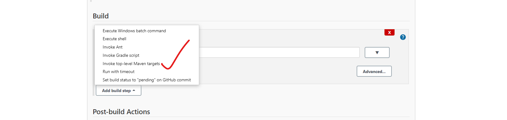
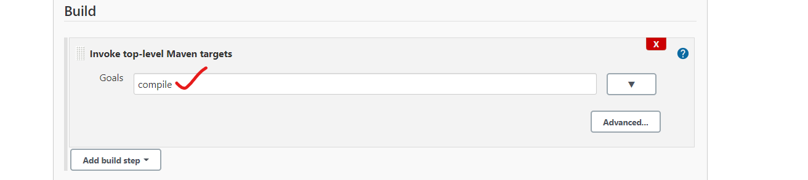
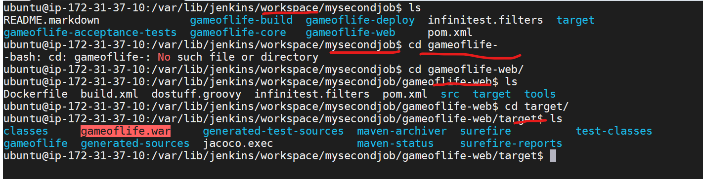

# Build tools
   * c => Make, GCC
   * Java => Ant, Maven, Gradle
   * .net => MSBuild, dotnet build

* For maven projects , we are going to have POM.XML , in which developer defines the dependencies to build the project and also he will define the output of the build.

  
 

## MAVEN GOALS:
  * compile
  * Test
  * package
  * Install
  * clean
# compile: 
* when we are firing the command __mvn compile__.This creates the  classfile.

# Test:  __mvn test__
* This executes the junit tests.

# package :  __mvn package__
* This will create the package (.war/.jar/.ear)

# clean :  __mvn clean__
* when you do clean , it will delete the old war and create the war.
* Basically the output will be stored in the target folder.

```
mvn test = mvn compile + mvn test
mvn package = mvn compile + mvn test + mvn package

```

* Jenkins is having a maven plugin called __invoke top-levl maven plugin__
 
 

  
 

* Delete workspace before every buils , if it is checked it is going to rmove the whole workspca for every build.
