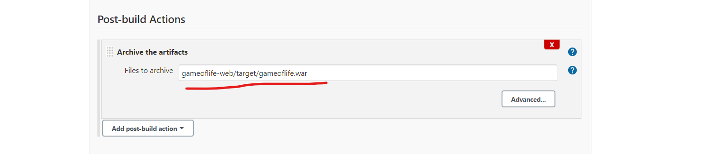

# Create a job for GOL build.
1. create a freestyle job with name __gol__
2. SCM -- provide the github url 
3. POLLSCM --- * * * * *
4. DELETE the workspace for every build
5. BUILD -- provide the goal in the invoke top-level maen plugin.


5. BUild the job.


6. GO to configure and add post build actions as below:



7. Build the job again and ouput will be as below:


* Artifacts are nothing but the war/jar/ear files.

8. Go to configure and add the publish junit test resulta as below:


9. BUild the job and output will be as shown below:


## Restarting the jenkins :
* Multiple ways to restart 
  1. In cli 
    ``` 
    sudo service jenkins restart 
    ```
  2. FROM GUI 
    
  3. In manage jenkins
     

## configurations in the __ Manage jenkins__
* IN manage jenkins => configure system 


* IN manage jenkins => configure global security 


* IN manage jenkins => manage plugins


