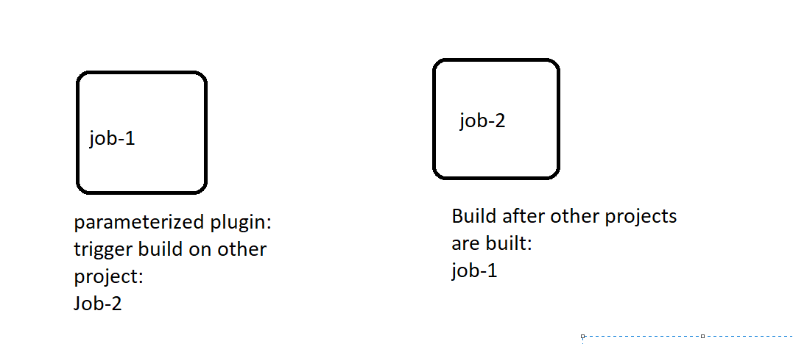

# SNAPSHOT vs RELEASE 
* If you find the a artifacta with the Snapshot , that means it is still in development.
* If you find your artifact with the release , that means it is ready for the deploymnet and sent it to production.

EX: Game-of-life.war-sanapshot-1.0 
EX: Game-of-life.war-Release-1.0

# Upstream and Downstream projects:



### Jenkins declarative pipeline syntax:
* For the pipeline syntax refer the link [REFER HER](https://www.jenkins.io/doc/book/pipeline/syntax/)

## For git pipeline syatax [REFER HERE](https://www.jenkins.io/doc/pipeline/steps/git/)

```
pipeline {
   agent any
   stages{
       stage('git clone'){
           steps{
               git branch: 'master', url: 'https://github.com/devops-surya/game-of-life.git'
           }        
       }
       stage('build the code'){
           steps{
              sh 'mvn package'
           }
       }
       stage('archive the artifacts'){
           steps{
              archiveArtifacts artifacts: 'gameoflife-web/target/*.war', followSymlinks: false
           }          
       }
       stage('publish the junit reports'){
           steps{
              junit 'gameoflife-web/target/surefire-reports/*.xml'
           }
           
       }

   }
}
```

## Triigers for build peridically and pollSCM in the pipeline job [REFER HERE](https://www.jenkins.io/doc/book/pipeline/syntax/#triggers)

```
pipeline {
   agent any
   triggers{
      cron('* * * * *')
   }
   triggers{
      pollSCM('* 8 * * *')
   }
   stages{
       stage('git clone'){
           steps{
               git branch: 'master', url: 'https://github.com/devops-surya/game-of-life.git'
           }        
       }
       stage('build the code'){
           steps{
              sh 'mvn package'
           }
       }
       stage('archive the artifacts'){
           steps{
              archiveArtifacts artifacts: 'gameoflife-web/target/*.war', followSymlinks: false
           }          
       }
       stage('publish the junit reports'){
           steps{
              junit 'gameoflife-web/target/surefire-reports/*.xml'
           }
           
       }

   }
}
```

## UPSTREAM job triggering:

```
pipeline {
   agent any
   triggers{
     upstream(upstreamProjects: 'pipeline-1', threshold: hudson.model.Result.SUCCESS)
   }
   stages{
       stage('git clone'){
           steps{
               git branch: 'master', url: 'https://github.com/devops-surya/game-of-life.git'
           }        
       }
       stage('build the code'){
           steps{
              sh 'mvn package'
           }
       }
       stage('archive the artifacts'){
           steps{
              archiveArtifacts artifacts: 'gameoflife-web/target/*.war', followSymlinks: false
           }          
       }
       stage('publish the junit reports'){
           steps{
              junit 'gameoflife-web/target/surefire-reports/*.xml'
           }
           
       }

   }
}
```

## Parameters using in jenkins pipeline [REFER HERE](https://www.jenkins.io/doc/book/pipeline/syntax/#parameters)
```
pipeline {
   agent any
   triggers{
     upstream(upstreamProjects: 'pipeline-1', threshold: hudson.model.Result.SUCCESS)
   }
   parameters{
     string(name: 'BUILD_BRANCH', defaultValue: 'master', description: 'parameterized the branch' )
   }
   stages{
       stage('git clone'){
           steps{
               git branch: "$BUILD_BRANCH", url: 'https://github.com/devops-surya/game-of-life.git'
           }        
       }
       stage('build the code'){
           steps{
              sh 'mvn package'
           }
       }
       stage('archive the artifacts'){
           steps{
              archiveArtifacts artifacts: 'gameoflife-web/target/*.war', followSymlinks: false
           }          
       }
       stage('publish the junit reports'){
           steps{
              junit 'gameoflife-web/target/surefire-reports/*.xml'
           }
           
       }

   }
}
```

### Building the another job from this present job [REFER HERE](https://www.jenkins.io/doc/pipeline/steps/pipeline-build-step/)
```
pipeline {
   agent any
   triggers{
     upstream(upstreamProjects: 'pipeline-1', threshold: hudson.model.Result.SUCCESS)
   }
   parameters{
     string(name: 'BUILD_BRANCH', defaultValue: 'master', description: 'parameterized the branch' )
   }
   stages{
       stage('git clone'){
           steps{
               git branch: "$BUILD_BRANCH", url: 'https://github.com/devops-surya/game-of-life.git'
           }        
       }
       stage('build the code'){
           steps{
              sh 'mvn package'
           }
       }
       stage('archive the artifacts'){
           steps{
              archiveArtifacts artifacts: 'gameoflife-web/target/*.war', followSymlinks: false
           }          
       }
       stage('publish the junit reports'){
           steps{
              junit 'gameoflife-web/target/surefire-reports/*.xml'
           }
	   stage('triggering the another job named gol'){
	       steps{
		      build job: 'gol'
		   }
	   }
           
       }

   }
}
```