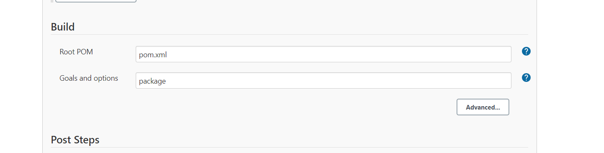

### Jfrog artifactory :
* To install the jfrog [REFER HERE](https://jfrog.com/open-source/#artifactory)


* After downloading that you  need copy that to the machine where you  want to install artifactory:
 1. In your local machine , copy the jfrog-artifactory-oss-7.10.6.deb to the path documents => mobaxterm => home 
 2. copy to the artifactory machine
    ```
     scp -i <pemfilepath> jfrog-artifactory-oss-7.10.6.deb   ubuntu@<publicip>:/home/ubuntu/
     ```
 3. After copying to the artifactory machine follow below commads:
    ```
    sudo dpkg -i jfrog-artifactory-oss-7.10.6.deb
    systemctl enable artifactory
    sudo systemctl start  artifactory
    ```
  4. OPen artifactory in UI
    ```
    http://publicip:8081/artifactory
    ```
    
  5. Give the username and password.
  ```
  Username: admin
  Password: password
  ```
  
  * It will ask for change password:
  

  * To create repositry see below steps:
  

  

  

  

  6. Make sure that artifactory plugin is installed before doing the jforgintegartion with jenkins
   

  7. To integrate JFROG with the jenkins , follow below steps:
      Managejenkins => configure system => artifactory
    
  8. Cretae a maven project by following below steps:
     
     
     
  9. Build the job and check the jfor artifactory repo :
     

* For the  jforg ansible module  [REFER HERE](https://docs.ansible.com/ansible/latest/collections/community/general/maven_artifact_module.html)

* For the Jfrog to be added in the Jenkinsfile declarative pipeline [REFER HERE](https://www.jfrog.com/confluence/display/RTF6X/Declarative+Pipeline+Syntax)

## Branching strategy 