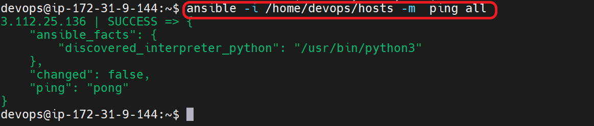
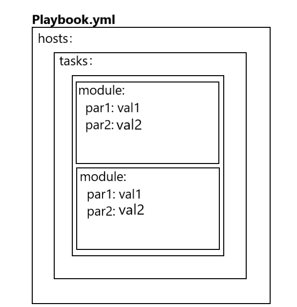
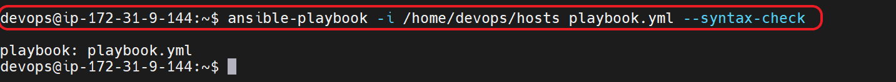
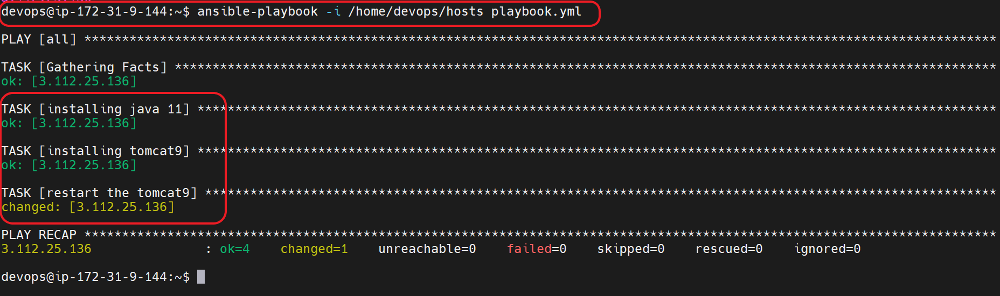
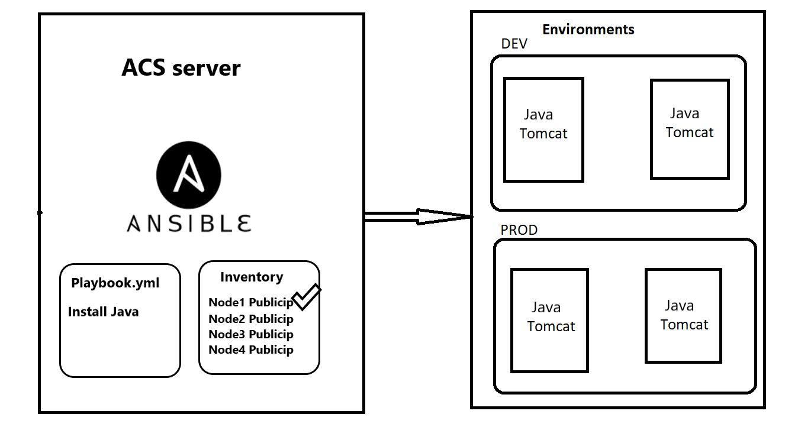

## BASIC PIPELINE OF DEVOPS :


## Ansible
* Ansible is one of the configuration management tool.
* Ansible is used for IT tasks such as application deployment, configuration management, and infrastructure orchestration. It uses a simple and easy-to-learn YAML-based language to define tasks and playbooks, making it accessible to a wide range of users.

<br/>

* * * 

<br/>

## Configuration management :
* For any application to be work,  we need some softwares to be installed. The process of configure & installing softwares is called Configuration Management.

<br/>

* * * 

<br/>


## Configuration Management:
* We write the desired state ..i,e(i want a file to be created)
* It uses declarative syntax.
* The main usecase of CM tool are idempotency .

<br/>

* * * 

<br/>

## Push / Pull type CM :

### Push type CM : 
* Ansible is the push type model of CM.


### Pull type CM:
* Chef is the  pull type model of CM 


<br/>

* * * 

<br/>

## Architecture  of ansible :


### Playbook:
* In playbook we will define the desired state .
* Playbooks are written in YAML format and consist of a set of tasks that define what actions Ansible should take on the managed hosts.

### Inventory : 
* In Ansible, an inventory file is a simple text file that contains a list of hosts or IP addresses that Ansible can connect to and manage. It is essentially a collection of the hosts or nodes that you want to configure or manage with Ansible.


<br/>

* * * 

<br/>


## SCENARIO-1 :-  LAB SETUP of ANSIBLE  :


* For ansible to be worked we need to install python on all the servers where you  want to install softwares.
* We also have to make sure that python is installed on the ACS , however it will be installed while installing ansible.

1. Enabling the password based authentication both  on ACS and NODE-1 :
```
sudo su - 
vi /etc/ssh/sshd_config
sudo service ssh restart 
sudo service ssh status
ctrl+c or Q -- to exit 
```


2. Create a user and give sudo acess on both ACS and NODE1 servers : 

```
sudo su - 
adduser devops
visudo  
*  To exit : ctrl+X , Y/N , Enter
su devops   
```


3. ssh-keygen on ACS Server to create keys for Key-based Authentication

```
sudo su - devops
ssh-keygen  
ssh-copy-id devops@<nodeipadress>
``` 


4. Ansible installation  on ACS SERVER: 
* Ansible installation [REFER HERE](https://docs.ansible.com/ansible/latest/installation_guide/intro_installation.html#installing-ansible-on-ubuntu)

```
sudo apt update
sudo apt install software-properties-common
sudo apt-add-repository --yes --update ppa:ansible/ansible
sudo apt install ansible
```

5. Installing  python on the NODE1: 

```
sudo apt update
sudo apt install software-properties-common
sudo apt-add-repository --yes --update ppa:ansible/ansible
sudo apt install python
```
<br/>

* * * 

<br/>


## Inventory :
* An inventory file is a simple text file that contains information about your hosts or devices, such as their IP addresses, hostnames, and connection details.
* The default path of inventory is 

```
/etc/ansible/hosts
```

<br/>

* * * 

<br/>


## Check the communication b/w ACS and NODE-1:

* Add your NODE-1 public ip to the /etc/ansible/hosts file

```
ansible -m ping all
```


<br/>

* * * 

<br/>


## Use customized file for inventory: 
* Add your NODE1 public ip to the /home/devops/hosts file


* Use below command to check communication between ACS & NODE1

```
ansible -i <path to the file> -m ping all
```
* EX : ansible -i /home/devops/hosts -m ping all




<br/>

* * * 

<br/>


## How to write ansible playbooks :
* list down all the manaul commands for the desired state.
* Make sure that the commands are working , when doing manaully .
* Each desired state / each step you are going to do in ansible is considered as task.
* In Ansible the tasks are executed by using MODULES.
* Modules are atomic units of ansible which performs execution

## Playbook syntax:
* Yaml Syntax [REFERHERE(]https://docs.ansible.com/ansible/latest/reference_appendices/YAMLSyntax.html)
* Ansible modules Offical Document [REFER HERE](https://docs.ansible.com/ansible/2.8/modules/list_of_all_modules.html)




```
---
- hosts: all
  become: yes
  tasks:
    - name: name of your task1
      module:
        par1: val1
        par2: val2
    - name: name of your task2
      module:
        par1: val1
        par2: val2
  ...
  ..
  ..

```

<br/>

* * * 

<br/>

## SCENARIO-2: Write a playbook to install Tomcat & Java to configure servers:

```
Java is a development software and it is prequisite for Tomcat.
Tomcat is one of the appliaction server.
```


## List down the steps to install tomcat:

```
sudo apt-get update 
sudo apt-get install openjdk-11-jdk
java -version

sudo apt-get update
sudo apt-get install tomcat9

sudo service tomcat9 restart
sudo service tomcat9 status
```


## Playbook to install java11 and tomcat9

```
---
- hosts: all
  become: yes
  tasks:
    - name: installing java 11
      apt:
        name: openjdk-11-jdk
        state: present
        update_cache: yes
    - name: installing tomcat9
      apt: 
        name: tomcat9
        state: present
        update_cache: yes
    - name: restart the tomcat9
      service:
         name: tomcat9
         state: restarted
    
```
* ***NOTE***: Make sure you addd your NODE1 public ip to the /home/devops/hosts file


* To check the playbook syntax is correct : 

```
 ansible-playbook -i /home/devops/hosts playbook.yml --syntax-check
```



* To run the playbook use below command : 

```
 ansible-playbook -i /home/devops/hosts playbook.yml
```



* To run the playbook for the  dryrun 

```
 ansible-playbook -i inventory playbook.yml --check
```


<br/>

* * * 

<br/>

## Playbook vs Adhoc commands :
* Playbooks and Ad-hoc commands are different ways of using Ansible to achieve the same result
* In Playbook , We can define all the tasks and modules in a file.
* In adhoc commands , we can use  only one module at at time.

*  Adhoc commands syntax:

```
ansible -i <host file path> -m <module> "para1=value1 ....paran=valuen" [-b]  <all>
```

* For the adhoc commands [REFER HERE](https://docs.ansible.com/ansible/latest/user_guide/intro_adhoc.html)

<br/>

* * * 

<br/>


## SCENARIO -3 : Run the playbook on the specific server in the inventory file.



* The  /home/devops/hosts file changes as below :


* Create a java.yml with below playbook  content : 

```
sudo su - devops 
cd /home/devops
vi java.yml 

Paste the below Playbook content 

```

```
---
- hosts: Node1
  become: yes
  tasks:
    - name: installing java 11
      apt:
        name: openjdk-11-jdk
        state: present
        update_cache: yes
```


* To run the playbook use below command : 

```
 ansible-playbook -i /home/devops/hosts java.yml
```


<br/>

* * * 

<br/>


## Variables in Ansible  :
* In ansible we had a multiple ways to define variable:
1. host level
2. group level 
3. playbook level 
4. commandline level

* Create variable name **package_name** as below in playbook :
```
---
- hosts: webserver
  become: yes
  tasks:
    - name: using variables in ansible
      apt:
        name: "{{package_name}}"
        state: present
        update_cache: yes

```

1. **Host level variable**  :


2. **Group level variable** : 


3. **Playbook level variable** :

```
- hosts: webserver
  become: yes
  vars:
    package_name:
      - tomcat9
  tasks:
    - name: using variables in ansible
      apt:
        name: "{{package_name}}"
        state: present
        update_cache: yes

```

4 **commandline level variable** :

```
 ansible-playbook -i <hostspath> -e " package_name=tomcat9" playbook.yml
```

<br/>

* * * 

<br/>