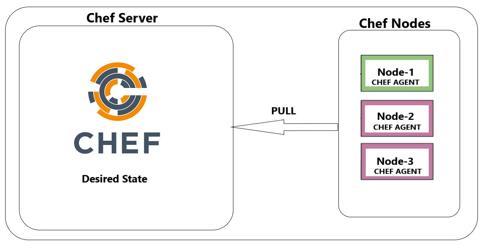

## BASIC PIPELINE OF DEVOPS :


## Ansible
* Ansible is one of the configuration management tool.
* Ansible is used for IT tasks such as application deployment, configuration management, and infrastructure orchestration. It uses a simple and easy-to-learn YAML-based language to define tasks and playbooks, making it accessible to a wide range of users.

<br/>

* * * 

<br/>

## Configuration management :
* For any application to be work,  we need some softwares to be installed. The process of configure & installing softwares is called Configuration Management.

<br/>

* * * 

<br/>


## Configuration Management:
* We write the desired state ..i,e(i want a file to be created)
* It uses declarative syntax.
* The main usecase of CM tool are idempotency .

<br/>

* * * 

<br/>

## Push / Pull type CM :

### Push type CM : 
* Ansible is the push type model of CM.


### Pull type CM:
* Chef is the  pull type model of CM 


<br/>

* * * 

<br/>

## Architecture  of ansible :


### Playbook:
* In playbook we will define the desired state .
* Playbooks are written in YAML format and consist of a set of tasks that define what actions Ansible should take on the managed hosts.

### Inventory : 
* In Ansible, an inventory file is a simple text file that contains a list of hosts or IP addresses that Ansible can connect to and manage. It is essentially a collection of the hosts or nodes that you want to configure or manage with Ansible.


<br/>

* * * 

<br/>


## SCENARIO-1 :-  LAB SETUP of ANSIBLE  :


* For ansible to be worked we need to install python on all the servers where you  want to install softwares.
* We also have to make sure that python is installed on the ACS , however it will be installed while installing ansible.

1. Enabling the password based authentication both  on ACS and NODE-1 :
```
sudo su - 
vi /etc/ssh/sshd_config
sudo service ssh restart 
sudo service ssh status
ctrl+c or Q -- to exit 
```


2. Create a user and give sudo acess on both ACS and NODE1 servers : 

```
sudo su - 
adduser devops
visudo  
*  To exit : ctrl+X , Y/N , Enter
su devops   
```


3. ssh-keygen on ACS Server to create keys for Key-based Authentication

```
sudo su - devops
ssh-keygen  
ssh-copy-id devops@<nodeipadress>
``` 


4. Ansible installation  on ACS SERVER: 
* Ansible installation [REFER HERE](https://docs.ansible.com/ansible/latest/installation_guide/intro_installation.html#installing-ansible-on-ubuntu)

```
sudo apt update
sudo apt install software-properties-common
sudo apt-add-repository --yes --update ppa:ansible/ansible
sudo apt install ansible
```

5. Installing  python on the NODE1: 

```
sudo apt update
sudo apt install software-properties-common
sudo apt-add-repository --yes --update ppa:ansible/ansible
sudo apt install python
```
<br/>

* * * 

<br/>


