## To create a EKS cluster follow below steps :

1. Create a role with AmazonEKSClusterPolicy attached and call it as eksclusterrole


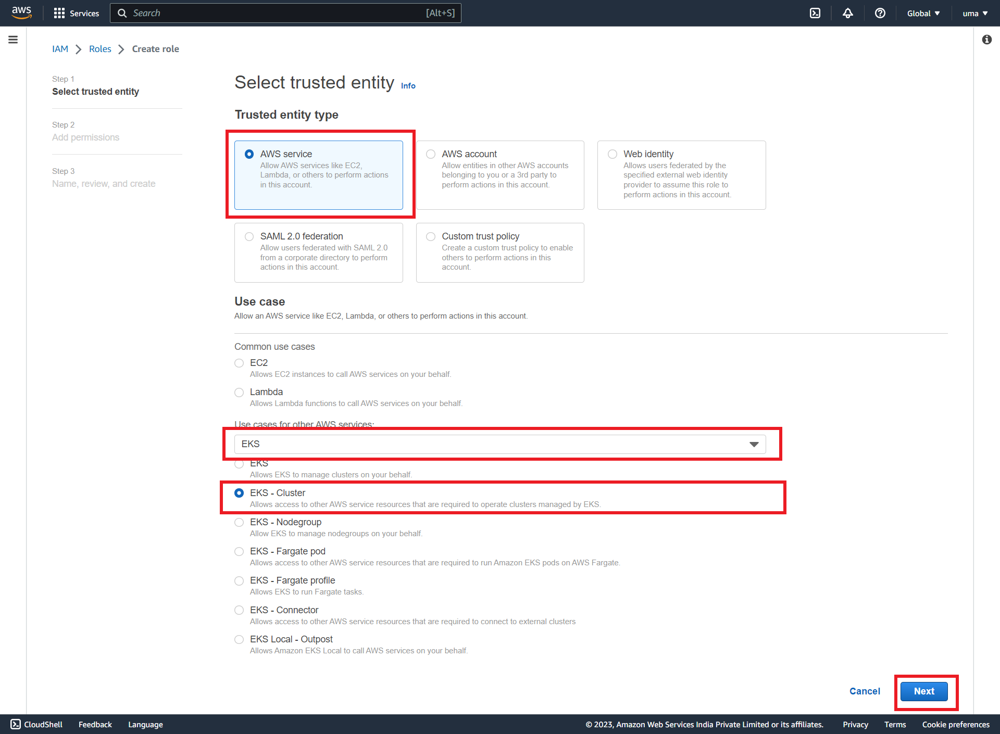
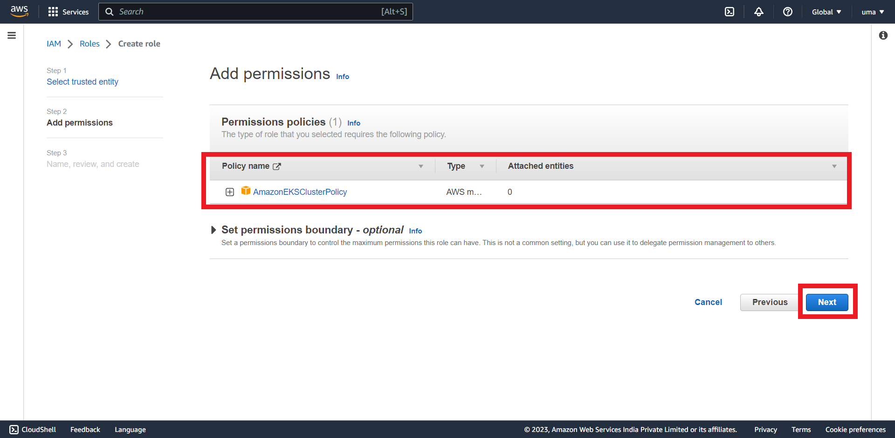


2. Create a EKS cluster from the AWS console.

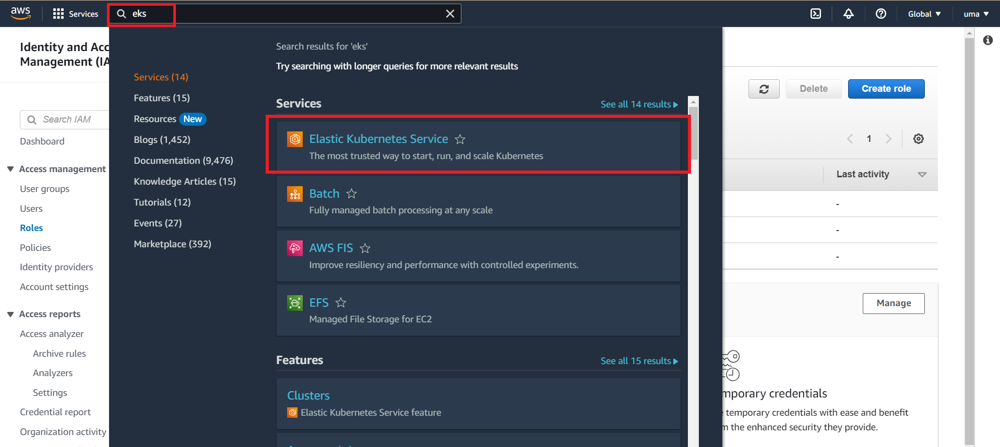
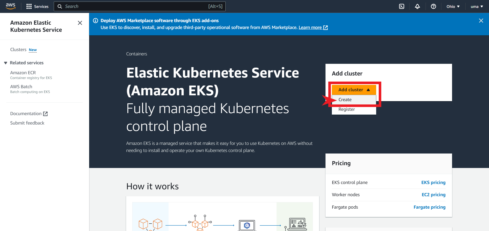

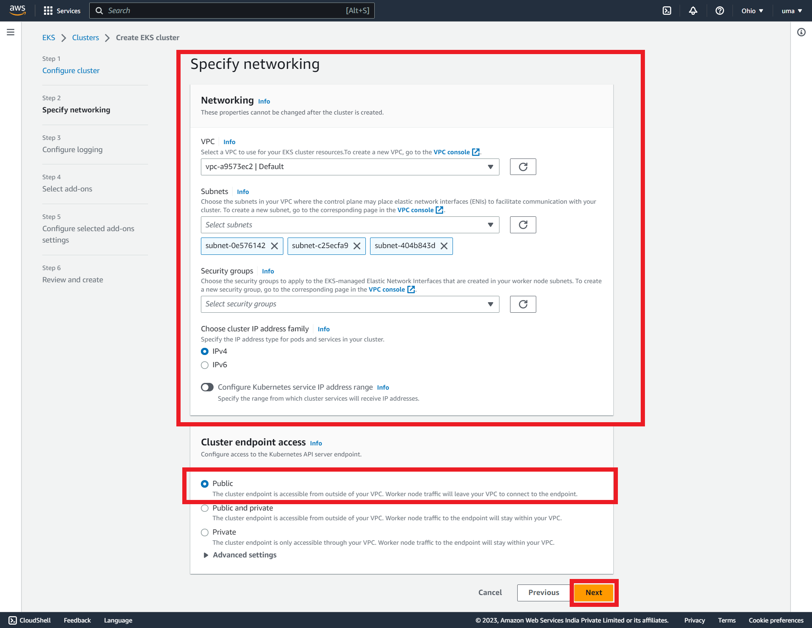
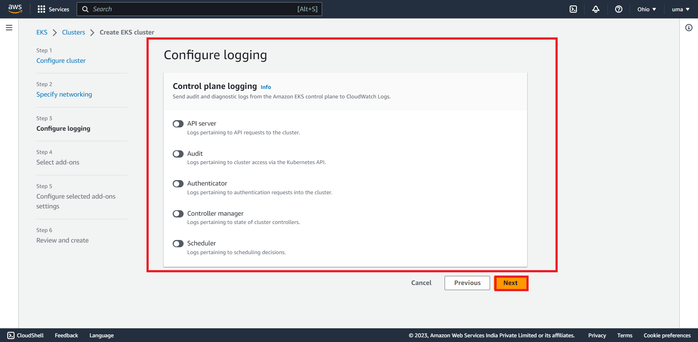
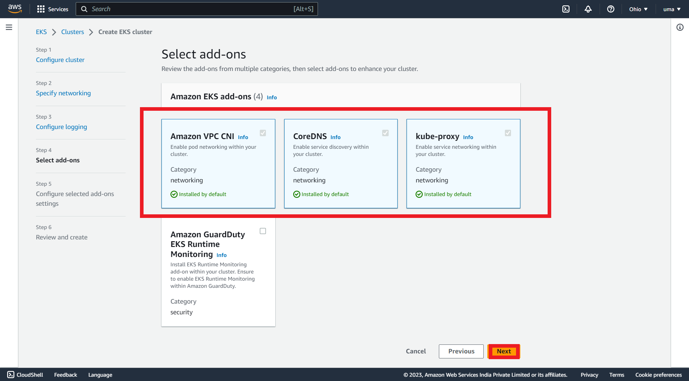


3. Create a Ubuntu EC2 instance and install the Kubectl , IAM authenticator , aws cli 
    * Create a Ec2 ubuntu server :
      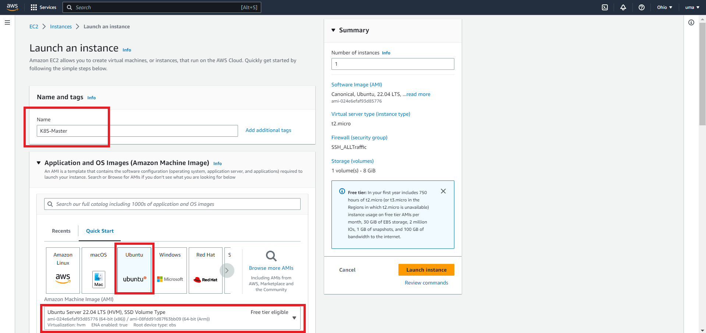
      
      
      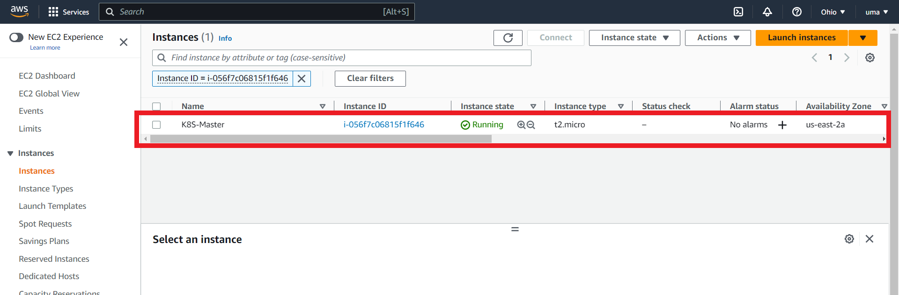

    * Install kubectl -- [REFERHERE](https://docs.aws.amazon.com/eks/latest/userguide/install-kubectl.html)

      

    * Install IAM Authenticator -- [REFERHERE](https://docs.aws.amazon.com/eks/latest/userguide/install-aws-iam-authenticator.html)

      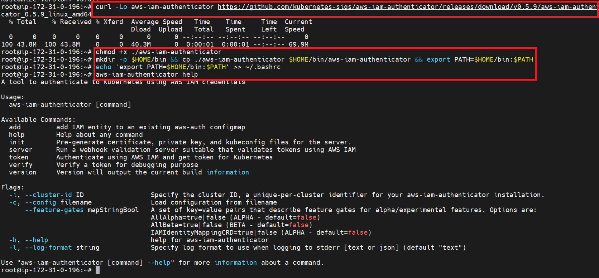

    * Install AWS CLI -- [REFERHERE](https://docs.aws.amazon.com/cli/latest/userguide/install-cliv2-linux.html)

      
      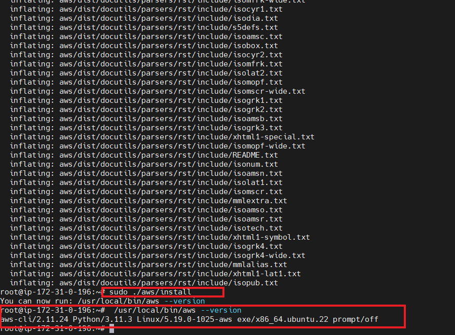
    


4. Create a IAM user with admin access in AWS  and configure the IAM user on  your K8S-Master instance by using aws-cli.
    * Create IAM user with Admin access :
      
      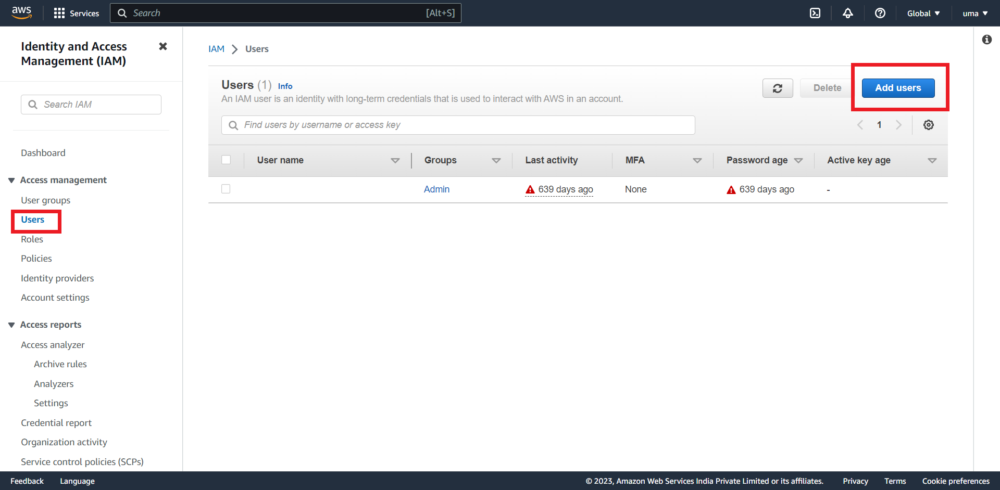
      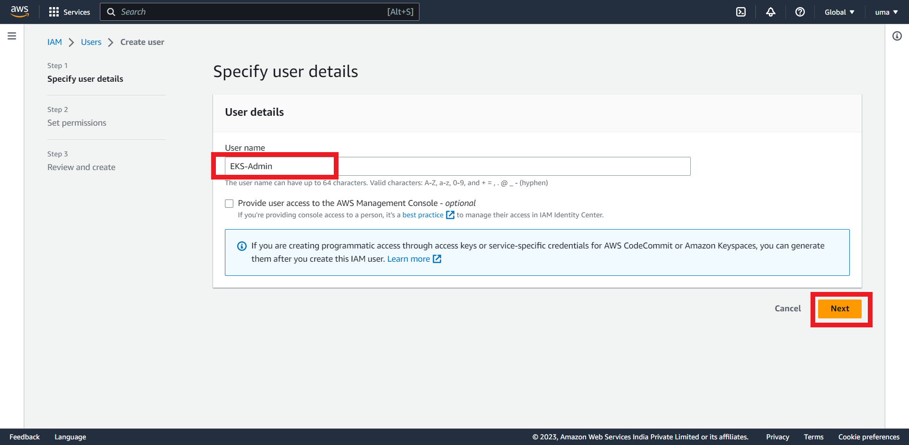
      
      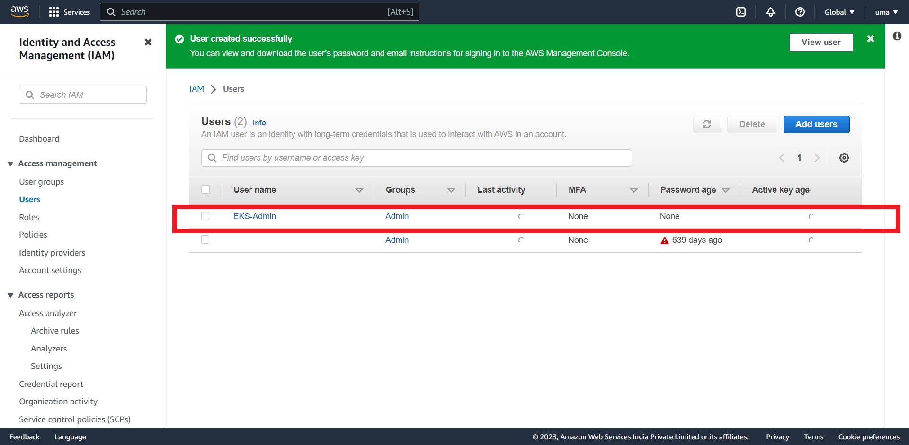
      
      
    * Configure IAM user to the K8s-Master to authenticate AWS: 

        ```
        aws configure 

        ```
      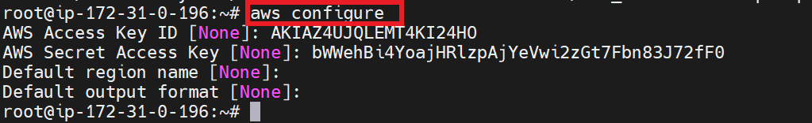

    * Run below command to get the config file downloaded to local , it helps us to connect to eks cluster.

      ```
      aws eks --region <region> update-kubeconfig --name <clustername>

      aws eks --region us-east-2 update-kubeconfig --name ekscluster

      ```
      


* To check the kubectl configured correctly try the below command

```
kubectl get svc 
kubectl get nodes
```


5. Create a IAM role for EKS worker nodes with AmazonEKS_CNI_Policy , AmazonEKSWorkerNodePolicy, AmazonEc2ContainerRegistryReadOnly


6. Create/add a nodegroup to the cluster  from AWS console.


* For the sample twotire code deployment [REFERHERE](https://github.com/learnitguide/kubernetes-knote)

<br/>
<br/>
<br/>
<br/>

* * * 

<br/>
<br/>
<br/>
<br/>