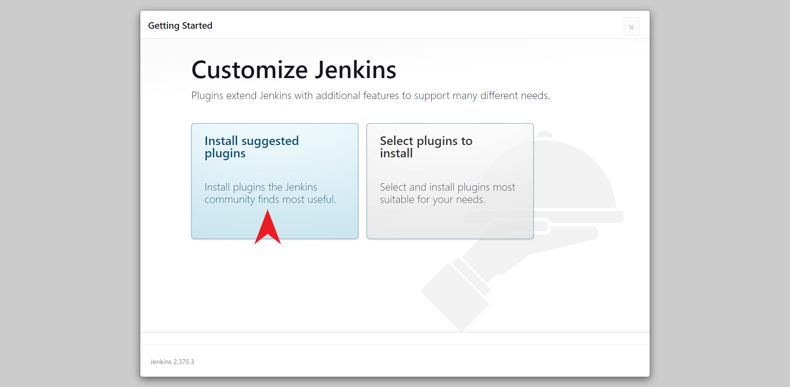

# Jenkins:
* Jenkins is an open source __continuous integration/continuous delivery and deployment__ (CI/CD) automation software DevOps tool written in the Java programming language. It is used to implement CI/CD workflows, called pipelines.
* Jenkins is a CI/CD tool
    * ***CI (Continous integration)*** : Continuous Integration is the practice of merging code changes into a shared repository frequently and automatically verifying that the resulting code builds, tests, and integrates successfully.
    * ***CD -- Continous Delivery / Continous Deployment*** :
        * **Continous Delivery** : Continuous Delivery is a software development practice that aims to make the release process more efficient and reliable by automating the entire software delivery pipeline. The idea is to ensure that code changes are always in a releasable state and can be deployed to production at any time. Continuous Delivery typically involves a continuous integration process that compiles and tests the code, followed by an automated deployment process that deploys the built artifacts to a staging environment. Once the code has been successfully tested in the staging environment, it can be promoted to the production environment.
        * **Continous Deployment** : Continuous Deployment, on the other hand, is a practice where every code change that passes the automated tests is automatically deployed to production. This means that any changes made to the code are automatically released to the users without any human intervention. Continuous Deployment is a more advanced version of Continuous Delivery and is generally suitable for organizations with high release frequency and the ability to handle fast feedback loops.
<br/>

* * * 

<br/>

## Pipeline flow of devops :


<br/>

* * * 

<br/>

## Installing Jenkins 
* prerequisites:
1. Ubuntu
2. Java 
3. Jenkins

## For installing Jenkins we have two ways.
1. Quick setup (it is not the enterprize setup)
2. Jenkins master 

### Quick setup [REFER HERE](https://www.jenkins.io/download/)
```
 java-jar <path to the download>
```

### Jenkins master setup :
* Jenkins installation official document [REFER HERE](https://www.jenkins.io/doc/book/installing/linux/#debianubuntu) 
* Create a EC2 in AWS and follow below steps to install Jenkins :
```
sudo apt-get update
sudo apt-get install openjdk-11-jdk

java -version

curl -fsSL https://pkg.jenkins.io/debian-stable/jenkins.io.key | sudo tee \
  /usr/share/keyrings/jenkins-keyring.asc > /dev/null
echo deb [signed-by=/usr/share/keyrings/jenkins-keyring.asc] \
  https://pkg.jenkins.io/debian-stable binary/ | sudo tee \
  /etc/apt/sources.list.d/jenkins.list > /dev/null

sudo apt-get update
sudo apt-get install jenkins
```

* To open jenkins on brower 
* ***NOTE*** : jenkins runs on port of 8080 . So port 8080 must be opened in EC2 server (or) set inbound rule to All Traffic .
```
http://publicipaddress:8080
```
* ***http://publicipaddress:8080*** will open below screen on browser:

* Copy the password from server and paste it on the browser:


* Select ***Install suggested plugins*** and wait all plugins installed:


* ***Create First Admin User*** by provide the username, password , email then  Save and continue:

* ***Instance Configuration*** -- No changes


* Dashboard of jenkins


<br/>

* * * 

<br/>
