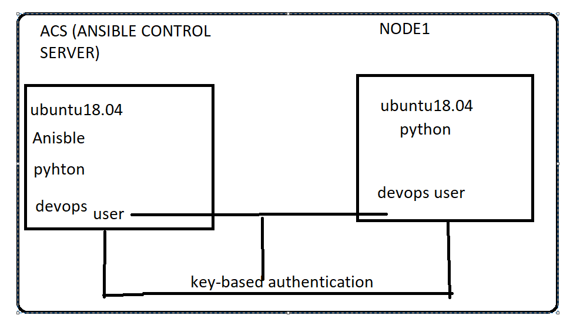

## Ansible Installation with node setup:

* Ways of connecting to a ubuntu machine .Refer below image
* 1. password based
* 2. Key based


## LAB SETUP of ANSIBLE :



* 1. Enabling the password based authentication :


* 2. Create a user  and give sudo acess

```
adduser devops
visudo
su devops   
```


* 3. ssh-keygen 

```
ssh-keygen  
ssh-copy-id devops@<nodeipadress>
``` 

