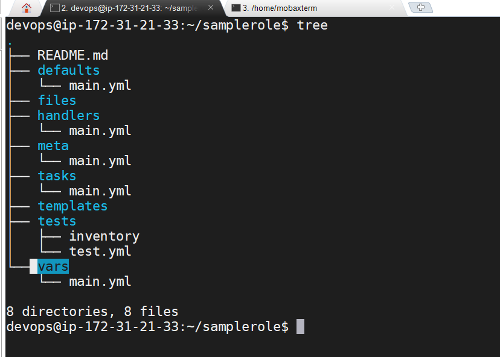

## Jinja template
* These are used to create the dynamic files. Dynamic files means the content in the file will not be the static
* Example:
* Create a file with extension .j2 
```
vi   Testjinja.txt.j2

This is for the os {{ ansible_os_family }}
This is of distribution {{ ansible_distribution }}
```

* playbook goe using jinja template

```
---
- hosts: all
  become: yes
  tasks:
    - name: copying jinja file to the node
      template:
        src: /home/devops/Readme.txt.j2
        dest: /home/devops/
        
```

* Run above playbook by using below command:

```
ansible-playbook -i hosts jinja.yml
```

* After running the above playbook the content in the file changes as below:

```
This is for the os "Debian"
This is of distribution "Ubuntu"

```

## Ansible roles 
* Ansible galaxy link [REFER HERE](https://galaxy.ansible.com/)

## How to use the role from ansible galaxy:
```
 ansible-galaxy install geerlingguy.java
```


## How to use the ansible role downloaded from the ansible-galaxy:

```
---
- hosts: all
  become: yes 
  roles: 
    - role: geerlingguy.java
```

## hot to create a ansible role:

```
ansible-galaxy role init <name of role>
```



### How to deal with ansible:
1. List down the commands/steps to installed the software
2. My goal is to install tree
```
sudo apt-get update 
sudo apt-get install tree
```

```
yum update
yum install tree
```

### Write a playbook for installing tree : 

```
---
- hosts: all
  become: yes
  tasks:
    - name: installing tree
      apt:
        name: tree
        state: present
        update_cache: yes
```

## Terms we learnt in ansible :
*  Some of them Modules , parameters , jinja template , hosts , become , taks .