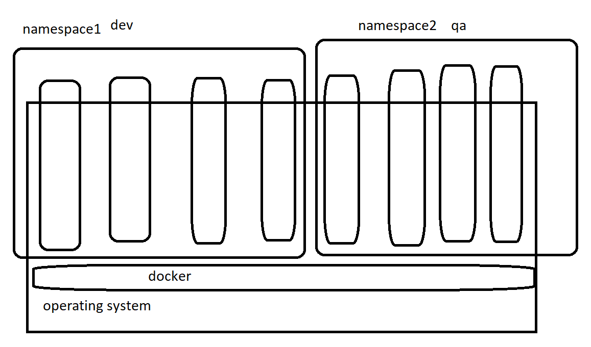

# Namespaces:


* As the containers are not reliable .That means the containers are going to stop/kill/died when there is no service running inside the container.
* When the containers are stopped the data inside the containers also lost.
* For the above isuue to be resolved , there is a concept of volumes, where we can attach the volumes. The volumes will be available even after the container is lost

## Volumes :
* volumes 
* Bind mount
* tmpfs

* For docker volumes [REFERHERE](https://docs.docker.com/storage/volumes/)

# DELETING/INSPECT/PRUNE volumes
* For Document [REFERHERE](https://docs.docker.com/engine/reference/commandline/volume_rm/)

```
docker volume rm <volumename>
docker volume rm  -f <volumename>
```
# CNM(Conatiner Networking Model)
* For Document [REFERHERE](https://docs.docker.com/network/)