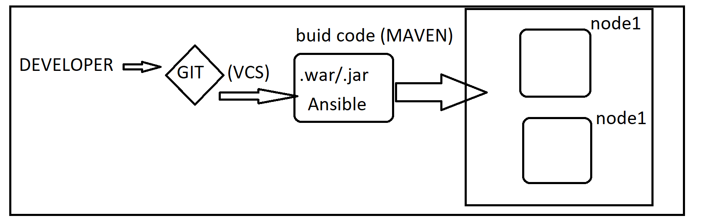
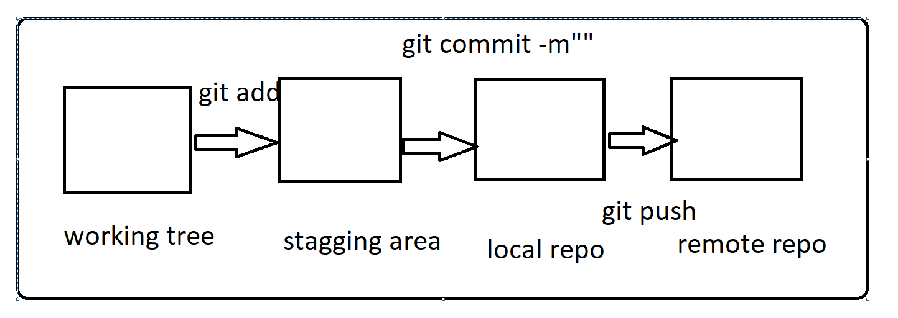

# GIT

* Git is the version control system (VCS)

* BASIC PIPELINE OF DEVOPS:

## Scenario with VCS is not exists:
* If there are 10 developers working in a company.
1. DATA loss of code  developed by the developers.
2. AS 10 developers working on the same code and developing for long period of time , there will be more conflicts when 10 developers merge the code at the same time.
3. It is very difficult to track the changes(version wise).

* To resolve those above issues we are going see the git functionality.

## THREE phases in git:
1. working tree
2. stagging area
3. local repo
4. remote repo .

#### prerequisites:
* Install choco :
  [REFER HERE](https://chocolatey.org/docs/installation)

* GIt install
  [REFER HERE](https://chocolatey.org/packages/git.install)

* VSC install
  [REFER HERE](https://chocolatey.org/packages/vscode)

* MOBAXTERM Install 
  [REFER HERE](https://chocolatey.org/packages/MobaXTerm)
  

### Next sessions:
* we are going to intialize a git and try to push one file to the remote repo , to get understanding about the three phases in the git .