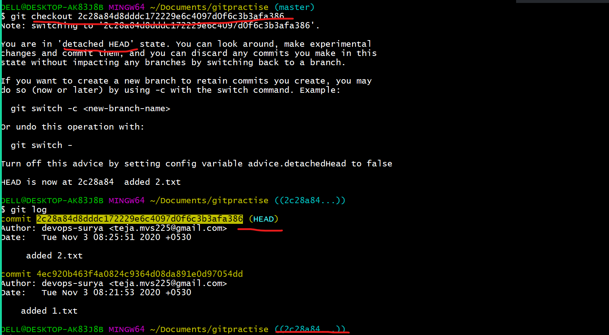
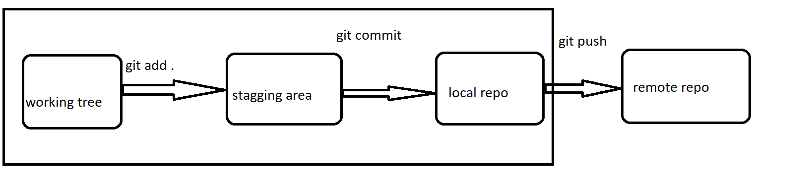
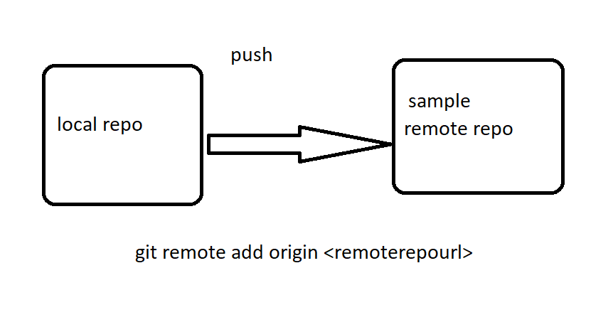

```
git checkout  --<filename>
```
* git checkout --<filename>  -- it is used to remove the changes u made on the working tree , after we do reset..


### * Scenario.. If you came across a scenario , where you  want to  remove the changes from stagging area and the working tree at a single shot:

```
git reset --hard 
```


* removin the file is also a chnage in the working of git.


## Head 
* Head will be always at the latest commit .
## Detached head
* When we are going back to the history , the head will be detached and it will go back to the commit which you are using.


## Reporting the issues 
* Refer to the link [REFER HERE](https://github.com/devops-surya/devops-training/issues
)

# GIT PUSH 
* git push will add changes  from local repo to the remote repo



* For Remote repository we must have a github account to create it .
* Repositry is the place where the code will be stored.
* The number of repositries will be depending up on the basis of the project.

## High level view of github 


## Create a repositry in the github:
* Got to the repositries and then refer the image below:

* Provided the repositry name and make it public , so that it will be available to everyone.


## Add remote repo to the local repo for push 



```
git remote add origin https://github.com/devops-surya/sample.git

git push origin master

```


## * scenario : A new developer added to a team and he/she want the  total code from the repositry:

```
git clone https://github.com/devops-surya/sample.git
```


## * Scenario : A developer already exists and he/she has  the code in his local desktop.But he/she dont have the latest code.

```
git pull https://github.com/devops-surya/sample.git
```
