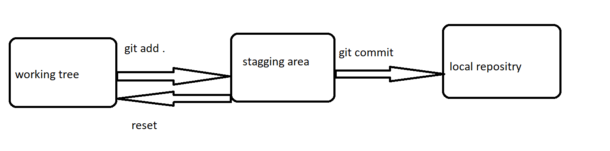

# Working on git 
```
 mkdir gitpractise

 cd gitpractise

 git init  --- it to intilalize the git in the present folder.

```


* TO see the changes made are added to the stagging area
```
git status
```

* To add all the changes to the staging area 
```
git add .
```

* To commit all the changes to the local repo 

```
git commit -m "< added some changes>"
```


* To configure the git  :

```
git config --global user.name <username>
git config --global user.email <emailaddress>
git config --list
```
## Untracked and modified changes:
* Untracked is the new file added and it is not there initially.
* Modified is  the file that already present and there are some changes in the content of the file


* To add only the modified changes to the stagging area:

```
git add -U 
```

```
git add --all   --- it add all changes 
git add -A      --- it add all chnages
git log --oneline   ---it will show u all the commit u have made till now
git checkout <commitid>   --- u can track the changes on the history 
git checkout master 
```


* Git tracks only the files not the folders .


# Working on the git 



## RESET 
* Reset will revert the changes from  the stagging area to the working tree


