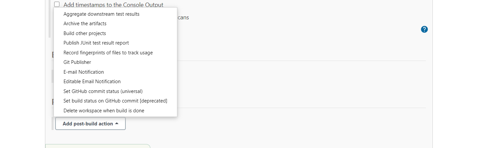
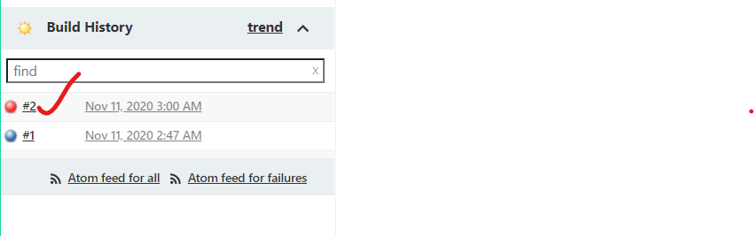

# Create a freestyle job:


## Options in the jenkins job:
1. source code management  ---- provide git related things.
2. Build Triggers          ---  we can trigger the job.
3. Build environment      --- we will have multiple options like deleting workspace.
4. Build 
5. Post-build actions








* JENKINS HOME DIRECTORY ---- __/var/lib/jenkins/__
* whenever we are installing jenkins , a jenkins user is created.


* In jenkins home directory:
1. All the jobs we created on GUI will be stored at the path /var/lib/jekins/jobs

2. All info about  build and build number will be stored in path /var/lib/jenkins/jobs/< jobname >/builds . In config.xml we will have all the settings realted to the jenkins job.

3. Workspace is the place where your whole work related to the jenkins job is stored.


* if the color of the ball is red , it is indicating that the job is failed.

* Running the jenkins job is nothing but building the jenkins.i,e build.
* A build number will be generated for every build triggered.

## Weather condition of the job:
1. sunny --- job is healthy and good.
2. Clouds with sunny   --- The health is good , but there are failures in the job builds.   
3. Total cloudy  --- the helath is bad.

# Failure cases in jenkins:
*  In failure cases we need to look up for mainly two things:
   1. Permissions to the jenkins user (sudo/root).
   2. Command not found . It is issue with the software . We need to check the software is installed or not.

* Create a job in freestyle . provide the git urls and  give _mvn package_ in the execute shell .


## Install maven :

```
sudo apt-get update 
sudo apt-get install maven -y 
mvn --version
```

## cron tab syntax:
* We use crontab syntax in two fields in jenkins:
  1. Build periodically 
  2. Poll SCM 


## If i want my job to be build at 9.0 AM everyday:

```
* 9 * * * 
```
## If i want my job to be build at 9.0 AM everyday sunday:

```
* 9 * * 7 
```

## Difference between build periodically and Poll SCM:
* Build periodically will build  the job at the specific time we defined.
* Poll scm also will build  the job at the specific time we defined, But it will build only when thereare changes in the repositry.


## Nightly builds  and Day builds:

