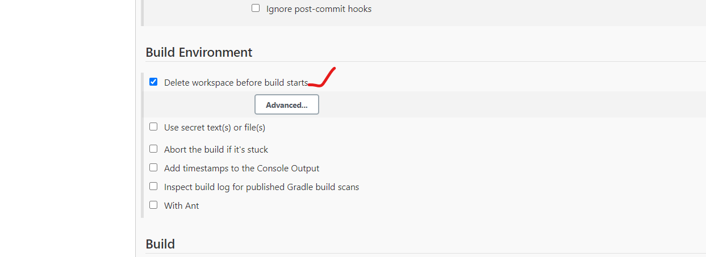
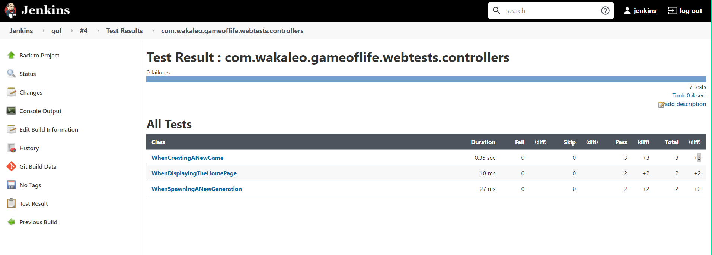
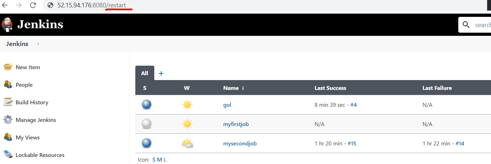
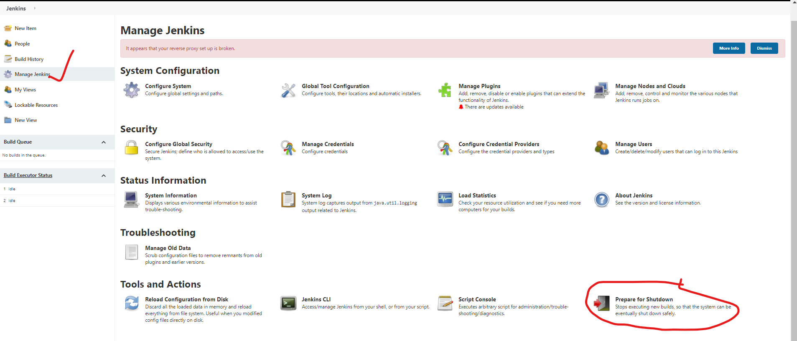

# Build tools
   * c => Make, GCC
   * Java => Ant, Maven, Gradle
   * .net => MSBuild, dotnet build

* For maven projects , we are going to have POM.XML , in which developer defines the dependencies to build the project and also he will define the output of the build.

  
 

## MAVEN GOALS:
  * compile
  * Test
  * package
  * Install
  * clean
# compile: 
* when we are firing the command __mvn compile__.This creates the  classfile.

# Test:  __mvn test__
* This executes the junit tests.

# package :  __mvn package__
* This will create the package (.war/.jar/.ear)

# clean :  __mvn clean__
* when you do clean , it will delete the old war and create the war.
* Basically the output will be stored in the target folder.

```
mvn test = mvn compile + mvn test
mvn package = mvn compile + mvn test + mvn package

```

* Jenkins is having a maven plugin called __invoke top-levl maven plugin__
 
 

  
 

* Delete workspace before every buils , if it is checked it is going to rmove the whole workspca for every build.



# Create a job for GOL build.
1. create a freestyle job with name __gol__
2. SCM -- provide the github url 
3. POLLSCM --- * * * * *
4. DELETE the workspace for every build
5. BUILD -- provide the goal in the invoke top-level maen plugin.


5. BUild the job.


6. GO to configure and add post build actions as below:


7. Build the job again and ouput will be as below:


* Artifacts are nothing but the war/jar/ear files.

8. Go to configure and add the publish junit test resulta as below:


9. BUild the job and output will be as shown below:




## Restarting the jenkins :
* Multiple ways to restart 
  1. In cli 
    ``` 
    sudo service jenkins restart 
    ```
  2. FROM GUI 
    
  3. In manage jenkins
     

## Configurations in the __ Manage jenkins__
* IN manage jenkins => configure system 


* IN manage jenkins => configure global security 


* IN manage jenkins => manage plugins


