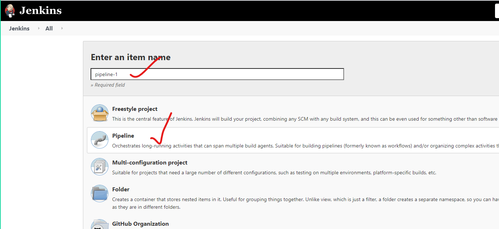
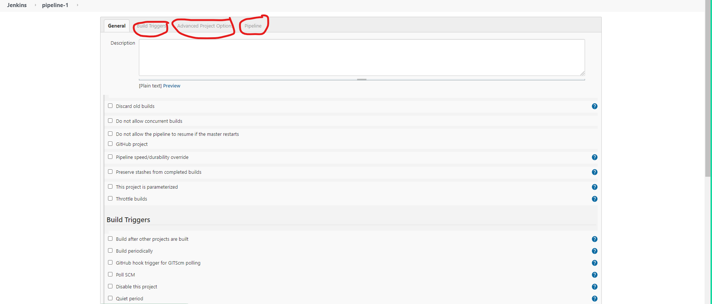

# Adding node to the jenkins:


## Below are the high level steps discussed on the freestyle:
1. Git 
2. Invoke top level maven plugin
3. archive the artifacts
4. publish the junit reports
5. Running the ansible playbook.

## Creating a jenkins job in pipeline format:





* Basic syntax on the groovy:

```
node('<LABEL>'){
    stage('git clone'){
      
    }
    stage('build the code){

    }
    stage('archive the artifacts'){

    }
    stage('publish the junit reports'){

    }
    stage('Running the ansible playbook'){
        
    }
}
  
```

# Jenkins pipeline :
* In jenkins pipeline there are two ways:
  1. pipeline  script     
  2. pipeline  script from SCM

* The approcah we follow for the jenkins pipeline and writing the groovy for is called as pipeline-as-code.

## Basic script :
```
node('ubuntu'){
    stage('git clone'){
      git 'https://github.com/devops-surya/game-of-life.git' 
    }
    stage('build the code'){
      sh 'mvn package'
    }
    stage('archive the artifacts'){
      archiveArtifacts artifacts: 'gameoflife-web/target/*.war', followSymlinks: false
    }
    stage('publish the junit reports'){
      junit 'gameoflife-web/target/surefire-reports/*.xml'
    }
}
```
## Snippet generator:


## To generate the pipeline script for git:


## To generate pipeline for the publish junkts tests:


* The output of the jenkins pipeline job will be as below:


## Job Configuration History :
* This plugin is used to tarck the changes made previously  .


## Jenkinsfile 
* Using jenkins will be helpful in tracking the changes .

## scripted pipeline vs declarative pipeline :
*  scripted pipeline:
```
node('ubuntu'){
    stage('git clone'){
      git 'https://github.com/devops-surya/game-of-life.git' 
    }
    stage('build the code'){
      sh 'mvn package'
    }
    stage('archive the artifacts'){
      archiveArtifacts artifacts: 'gameoflife-web/target/*.war', followSymlinks: false
    }
    stage('publish the junit reports'){
      junit 'gameoflife-web/target/surefire-reports/*.xml'
    }
}
```

* Declarative pipeline:
```
pipeline {
   agent { label 'ubuntu' }
   stages{
       stage('git clone'){
           steps{
               git 'https://github.com/devops-surya/game-of-life.git'  
           }        
       }
       stage('build the code'){
           steps{
              sh 'mvn package'
           }
       }
       stage('archive the artifacts'){
           steps{
              archiveArtifacts artifacts: 'gameoflife-web/target/*.war', followSymlinks: false
           }          
       }
       stage('publish the junit reports'){
           steps{
              junit 'gameoflife-web/target/surefire-reports/*.xml'
           }
           
       }

   }
}
```

## Create a new pipeline job with pipeline script from scm as below:


## Blue ocean plugin :
* In manage jenkins => manage plugins => available => Blue ocean
* After installing u r going to see below changes:


