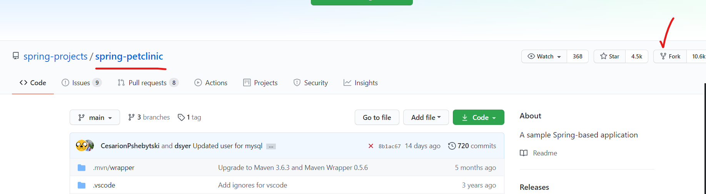

* Declarative pipeline:
```
pipeline {
   agent { label 'ubuntu' }
   stages{
       stage('git clone'){
           steps{
               git 'https://github.com/devops-surya/game-of-life.git'  
           }        
       }
       stage('build the code'){
           steps{
              sh 'mvn package'
           }
       }
       stage('archive the artifacts'){
           steps{
              archiveArtifacts artifacts: 'gameoflife-web/target/*.war', followSymlinks: false
           }          
       }
       stage('publish the junit reports'){
           steps{
              junit 'gameoflife-web/target/surefire-reports/*.xml'
           }
           
       }

   }
}
```

## Create a new pipeline job with pipeline script from scm as below:


## Blue ocean plugin :
* In manage jenkins => manage plugins => available => Blue ocean
* After installing u r going to see below changes:


# FORK:


* Go to the repo from which you want to fork:

 


## Build with parameters:


* Install the plugin shown in below image:


* Ater install we see can the option in parameteres:


* To trigger the jenkins jobs from aone-to-another:
  * Install the plugin shown in the below image:


* For installing we can see the below options on the jenkins UI:
    
    