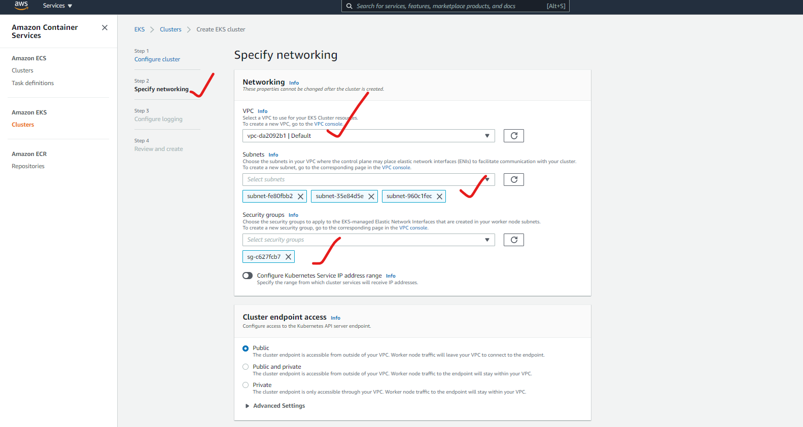
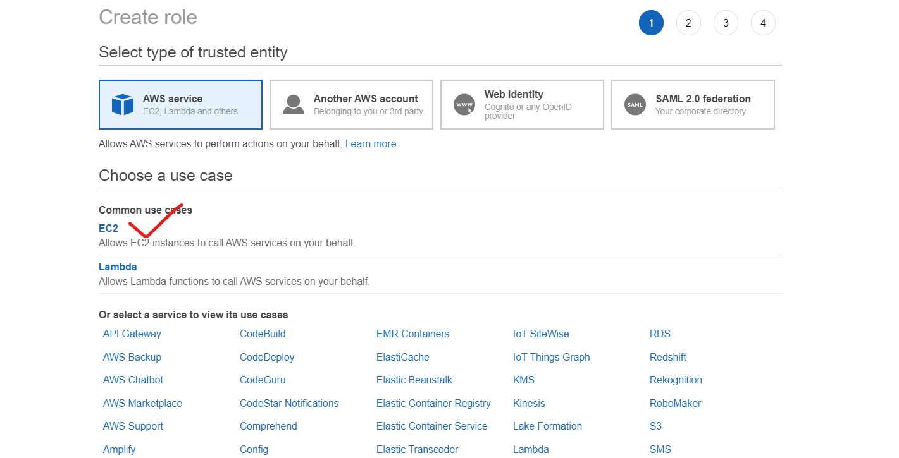

## AKS (AZURE KUBERNETES SERVICE):
* In AKS the master is free of cost and it is managed by the AZURE.
## EKS (ELASTIC KUBERNETES SERVICE):
* In EKS the master is not free of cost and it is managed by AWS.


## To create a EKS cluster follow below steps :
1. Create a role with AmazonEKSClusterPolicy attached and call it as eksclusterrole


2. Create a EKS cluster from the AWS console.




3. Create a ubuntu instance and install the Kubectl , IAM authenticator , aws cli 
    * Install kubectl -- [REFERHERE](https://docs.aws.amazon.com/eks/latest/userguide/install-kubectl.html)
    * Install IAM Authenticator -- [REFERHERE](https://docs.aws.amazon.com/eks/latest/userguide/install-aws-iam-authenticator.html)
    * Install AWS CLI -- [REFERHERE](https://docs.aws.amazon.com/cli/latest/userguide/install-linux.html)

4. Must have a user with admin access and configure the user with your instance by using aws-cli.

```
aws eks --region <region> update-kubeconfig --name <clustername>

aws eks --region us-east-2 update-kubeconfig --name sample1
```


5. Create a IAM role for EKS worker nodes with AmazonEKS_CNI_Policy , AmazonEKSWorkerNodePolicy, AmazonEc2ContainerRegistryReadOnly



6. Create/add a nodegroup to the cluster  from AWS console.


* For the sample twotire code deployment [REFERHERE](https://github.com/learnitguide/kubernetes-knote)

