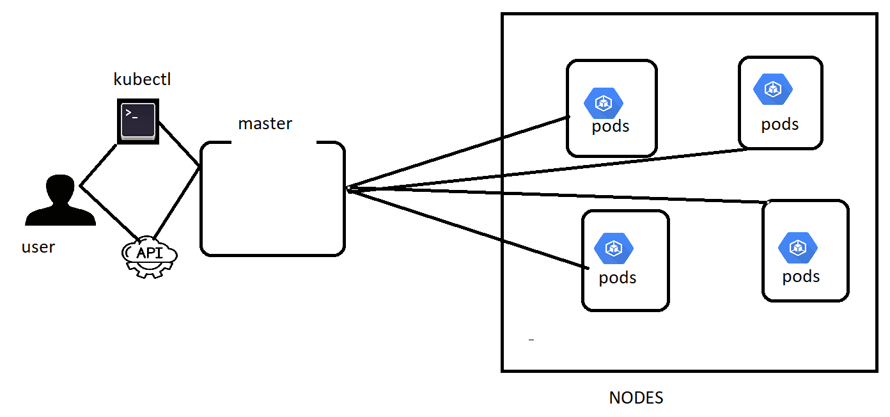

# Kubernetes or K8s :
* Kubernetes is a portable, extensible, open-source platform for managing containerized workloads and services, that facilitates both declarative configuration and automation. 

* For the document [REFER HERE ](https://kubernetes.io/docs/concepts/overview/what-is-kubernetes/   )

## Why you need Kubernetes and what it can do :
* Automatic scaling .
* Microservices .
* Handle persistent volume .(stateful vs stateless)
* Zero downtime deployments .
* Effecient loadbalancers integrations.
* Monitoring interface

## Basic architecture of k8s:

