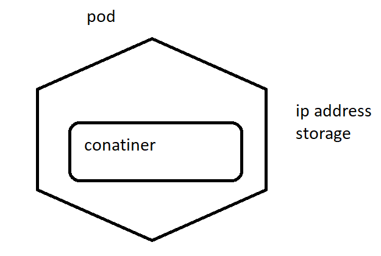
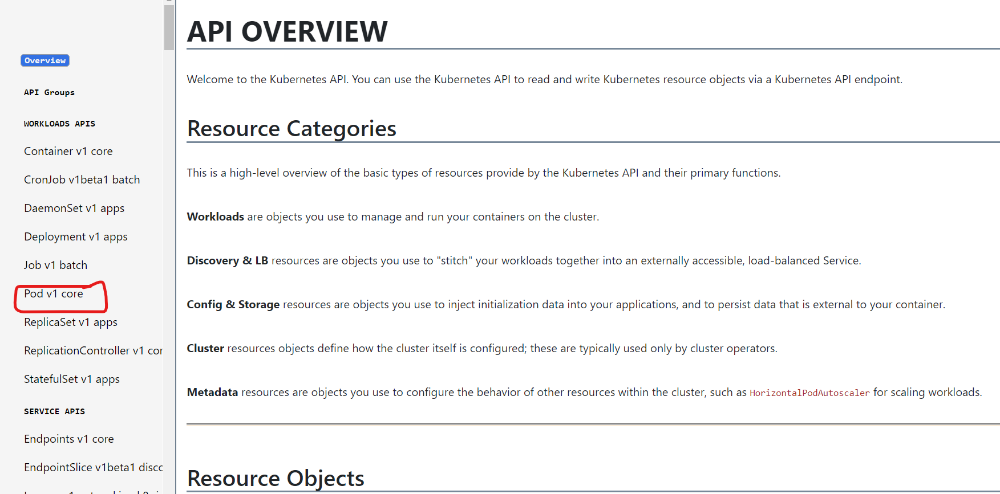
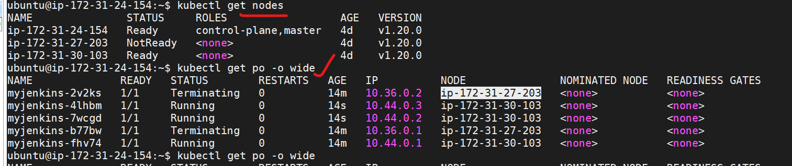

# POD :
* Pod can be defined as the basic unit of execution in k8s.
* Pod is going have application container , storage and network.



* pod is having docker conainer 
* Pod can run single/multiple containers running inside it.
* Running one-container per pod is best usecase.

## Workloads:
* K8s workloads will be having two things 
   1. pod .
   2. Controller .

# Create a pod using the API reference:


```
---
apiVersion: v1
kind: Pod
metadata: 
  name: myfirstpod
spec:
  containers: 
    - name: myjenkins
      image: jenkins:2.60.3  
```

* Connect to the k8s master and try to use above manifest to create a pod.
```
vi pod.yml
kubectl apply -f pod.yml
kubecl get nodes
kubectl get pods 
kubectl get pods -o wide
kubectl get po
kubectl delete -f pod.yml
```


* Pod are not the durable entities 
* To make sure the pods are running we will be using controllers.
* Pods will be having states of pending , Running , failed , sucess.
* Kubernetes will be having some probes inside the running container:
 * liveness probe
 * readiness probe
 * startup probe

## Init containers:
* These containers run before your main conatiner is going to start.

# CONTROLLERS :
* Controllers wil be taking care of the desired state .
* In a k8s cluster it is not a suggestable way of creaing pod.Instead of creating a pod, we will be creating a pod with controllers.
* Controllers in K8s:
 1. ReplicaSet
 2. ReplicationController
 3. Deployments
 4. SatefulSets
 5. DaemonSets
 6. Jobs
 7. CronJOb

##  ReplicationController:
* It make sures that the specified pods to be running all the time.
* create a yaml/manifest file for the ReplicationController
* For the ReplicationController reference  [REFER HERE](https://kubernetes.io/docs/reference/generated/kubernetes-api/v1.20/#replicationcontroller-v1-core)


```
---
apiVersion: v1
kind: ReplicationController
metadata:
  name: myjenkins
spec: 
  replicas: 3
  template:
    metadata: 
      labels: 
        app: myjenkins
    spec: 
      containers: 
        - name: myjenkins
          image: jenkins:2.60.3
```

* RUn below commands to apply Replicationcontroller
```
kubectl apply -f rc.yml
kubectl get rc
```


* If the node on which the pods are running are deleted , RC will create the pod on existing node.



# Replicaset:
* It also acts same as a replication controller, but it is internal functionality of another controller(DEPLOYMENT)

# Deployment:
* It is a controller used to deploy the new version of your code, with th help of providing version numbers.

# Jobs and Cronjobs :
* Jobs are used to call the script/command in the containers.

# DaemonSet:
* These are the pods running on every node in k8s cluster and do our job.

## k8s cluster Neworking:
* For any k8s cluster , below are the things o be addresed:
 * container-conatiner communication
 * pod to pod communication
 * Pod to service communication
 * External to service communication


## Service:


* For document [REFER HERE](https://kubernetes.io/docs/reference/generated/kubernetes-api/v1.20/#service-v1-core)

```
---
apiVersion: V1
kind: Service
metadata:
  name: nginx-svc
spec:
  selector:
    name: nginx-svc
  type: NodePort
  ports:
      - port: 80
        targetPort: 80
        nodePort: 32000
```

* To publish ports , we have following types:
* ClusterIP: Exposes service on clusteripinternal address. Default type
* NodePort: If you want to expose the service on the node on which pod is running.
* Loadbalancer: Exposes the service externaly using cloud loadbalancers.

* Take an example from replicationController:

```
---
apiVersion: v1
kind: ReplicationController
metadata:
  name: nginx-svc
spec:
  replicas: 3
  template:
    metadata:
      labels:
        app: nginx
    spec:
      containers:
      - name: nginx
        image: nginx:1.14
```

```
kubectl get svc 
kubectl describe service <servicename>
kubectl describe pod <podname>
```

