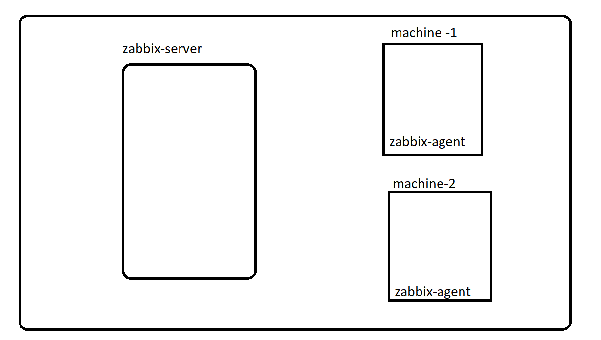

# ZABBIX :
* Zabbix is a mature and effortless enterprise-class open source monitoring solution for network monitoring and application monitoring of millions of metrics.

* Baisc monioring things in zabbix:


## Basic architecture of zabbix:




## ZABBIX-SERVER-INSTALLATION :

* For document [REFER HERE](https://www.digitalocean.com/community/tutorials/how-to-install-and-configure-zabbix-to-securely-monitor-remote-servers-on-ubuntu-18-04)

## Step 1 – Install Apache, MySQL and PHP
* Installing necessary modules 

```
sudo apt-get update
sudo apt-get install apache2 libapache2-mod-php
sudo apt-get install mysql-server
sudo apt-get install php php-mbstring php-gd php-xml php-bcmath php-ldap php-mysql
```

## Update timezone in php configuration file /etc/php/PHP_VERSION/apache2/php.ini. Like below:

```
[Date]
; http://php.net/date.timezone
date.timezone = 'Asia/Kolkata'
```
## Step 2 – Enable Required Apt Repository

```
## Ubuntu 18.04 LTS (Bionic):

wget https://repo.zabbix.com/zabbix/4.0/ubuntu/pool/main/z/zabbix-release/zabbix-release_4.0-3+bionic_all.deb
sudo dpkg -i zabbix-release_4.0-3+bionic_all.deb


## Ubuntu 16.04 LTS (Xenial):

wget https://repo.zabbix.com/zabbix/4.0/ubuntu/pool/main/z/zabbix-release/zabbix-release_4.0-3+xenial_all.deb
sudo dpkg -i zabbix-release_4.0-3+xenial_all.deb
```

## Step 3 – Install Zabbix Server

```
sudo apt-get update
sudo apt-get install zabbix-server-mysql zabbix-frontend-php zabbix-agent zabbix-java-gateway
```

## Step 4 – Create Database Schema

```
mysql -u root -p

mysql> CREATE DATABASE zabbixdb character set utf8 collate utf8_bin;
mysql> CREATE USER 'zabbix'@'localhost' IDENTIFIED BY 'password';
mysql> GRANT ALL PRIVILEGES ON zabbixdb.* TO 'zabbix'@'localhost' WITH GRANT OPTION;
mysql> FLUSH PRIVILEGES;
```

```
cd /usr/share/doc/zabbix-server-mysql
zcat create.sql.gz | mysql -u zabbix -p zabbixdb
```

## Step 5 – Edit Zabbix Configuration File

* /etc/zabbix/zabbix_server.conf
```
  DBHost=localhost
  DBName=zabbixdb
  DBUser=zabbix
  DBPassword=password
  JavaGateway=127.0.0.1
  JavaGatewayPort=10052
  StartJavaPollers=5
```

## Step 6 – Restart Apache and Zabbix

```
sudo service apache2 restart
sudo service zabbix-server restart

```

* TO open in browser:
```
publicip/zabbix
```

*  Follow the below images after installation is completed:


* Provide username as Admin and password as password:


