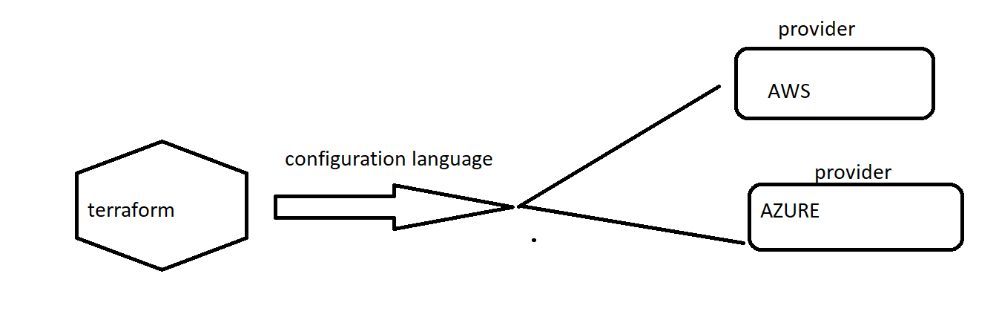

# Terraform
* Terraform is a infraprovisoning tool.
* Infraprovisoning --- What ever you want to create for your project in the cloud is called as infraprovisoning.

* Terraform work on the multiple clouds.
* For all the clouds [REFER HERE](https://www.terraform.io/docs/providers/index.html)

* Any cloud  we are using in terraform is called  as provider.
* Whatever you want to create in the terrafrom is called as resource.
* Terraform uses the configuration language to write the terraform script.


## Prerequisites:
* Need to create a AWS free tier account.


## How to install terraform:
* On windows : 
```
choco install terraform
```
* On ubuntu:
```
sudo apt-get update 
sudo apt-get install terraform -y 
```
* To check terraform version

```
terraform --version
```

# How to  create a ec2 instance in AWS.