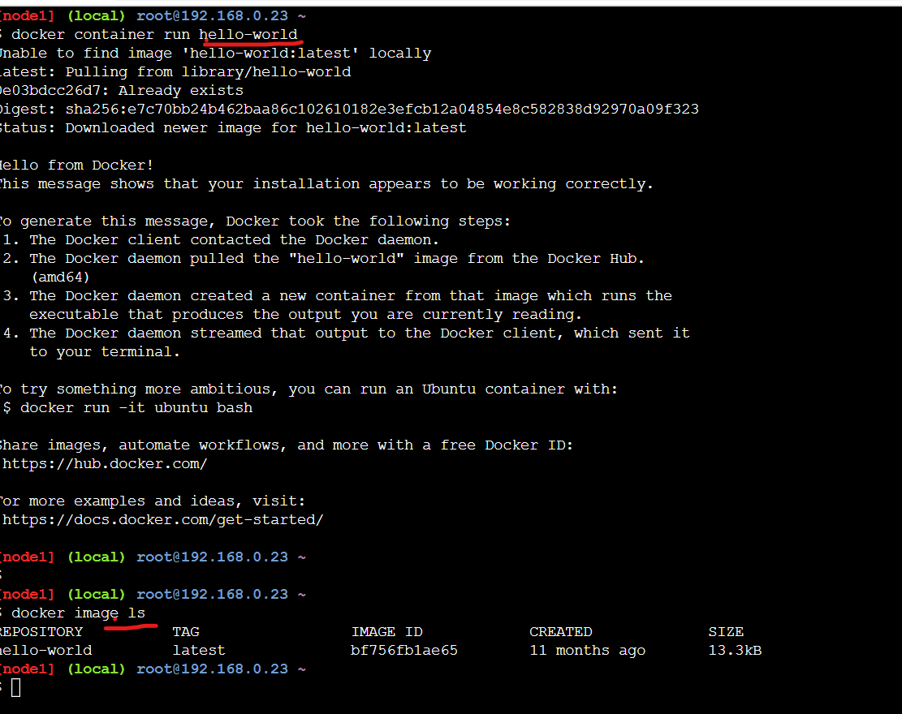

# Lets create a Image with java installed.
* For creating Docker Image we need to write Dockerfile
 * Steps to do it manually:
   1. Need an machine with OS (Need an image with OS)
   2. sudo apt-get update 
   3. sudo apt-get install openjdk-8-jdk -y 

* To run the image and make a container follow below cmmands:
```
docker container run hello-world
docker image ls 
```


## Basic Dockerfile syntax :
```
INSTRUCTIONS <ARGUMENTS>
```
* Some of the INSTRUCTIONS are FROM , RUN , CMD , ENTRYPOINT , ARG 

## Dockerfile for the java :
* Make folder of sample and create a Dockerfile in that samplefolder
```
mkdir sample 
cd sample
vi Dockerfile
```
* Search for the ubuntu image in the dockerhub . For latest image follow below
```
docker pull ubuntu:latest
```
* After adding Instructions and arguments , Dockerfile looks as below:
```
FROM ubuntu:latest
RUN  apt-get update
RUN  apt-get install openjdk-8-jdk -y
```

* To create a image from dockerfile follow below dteps:
```
docker image build -t <imagename> .
docker image build -t <imagename> <pathtothedockerfile>
docker image build -t myfirstimage .

```
* Dockerfile is convention , we can also change the filename


* To run the image we have created 
```
docker conatiner run <imagename>
docker conatiner run myfirstimage
docker conatiner ls 
docker container ls -a
```

