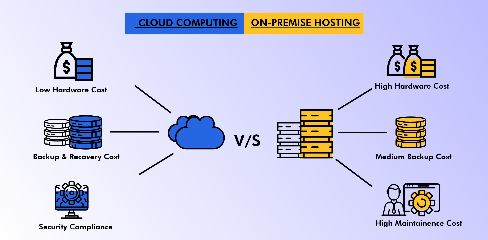

## Understand the ways of login/connect to VM(Virtual Machine/server):
### Check the below image to understand connecting to ***Physical Machine/Laptop*** **vs**  ***VM*** 


<br/>

* * * 

<br/>

### Connect to VM using ***keybased(Passwordless)*** authentication without password : 
* Key-based authentication, also known as public-key authentication, is a more secure and convenient way to authenticate to a Linux system over SSH, compared to traditional password-based authentication. It allows users to log in without typing a password, instead, they use a private/public key pair to authenticate themselves.


#### Here are the steps to set up key-based authentication in Linux:

* Generate a public/private key pair on the client machine using the ssh-keygen command. This will create a pair of keys: a private key (usually stored in ~/.ssh/id_rsa) and a public key (usually stored in ~/.ssh/id_rsa.pub).

* Copy the public key to the server that you want to log in to. You can do this manually by copying the contents of the public key file (id_rsa.pub) to the server's authorized_keys file, located in the .ssh directory of the user's home directory. You can also use the ssh-copy-id command to automatically copy the public key to the server.

* Set the correct permissions for the authorized_keys file on the server. It should have permissions of 600 (read and write only for the owner) and the .ssh directory should have permissions of 700 (read, write, and execute only for the owner).

* Configure the ssh client on the client machine to use key-based authentication. This can be done in the ssh config file (usually located in /etc/ssh/ssh_config or ~/.ssh/config) by adding the following line:
```
PubkeyAuthentication yes
```

* With key-based authentication, the private key should be kept secure and not shared with anyone, while the public key can be freely distributed to servers or services that require it for authentication. When a user attempts to log in using key-based authentication, the client machine will use the private key to sign a message that the server can verify with the user's public key. If the server can verify the message, it will allow the user to log in without requiring a password.

<br/>

* * * 

<br/>

### Understand  Onpremise VS Cloud :
* On-premise refers to the deployment of software or infrastructure on a physical server or data center located on the organization's premises. In contrast, cloud computing refers to the delivery of computing services (such as servers, storage, databases, and applications) over the internet from a remote data center managed by a third-party provider.



