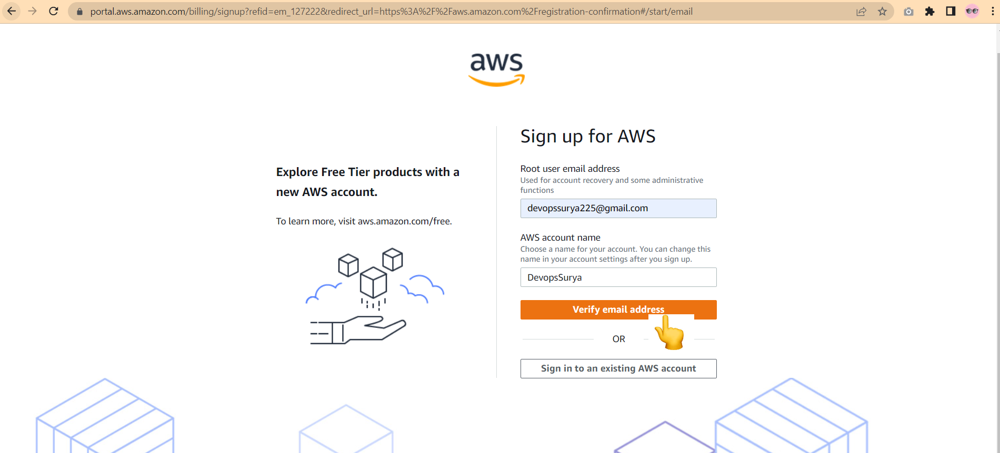
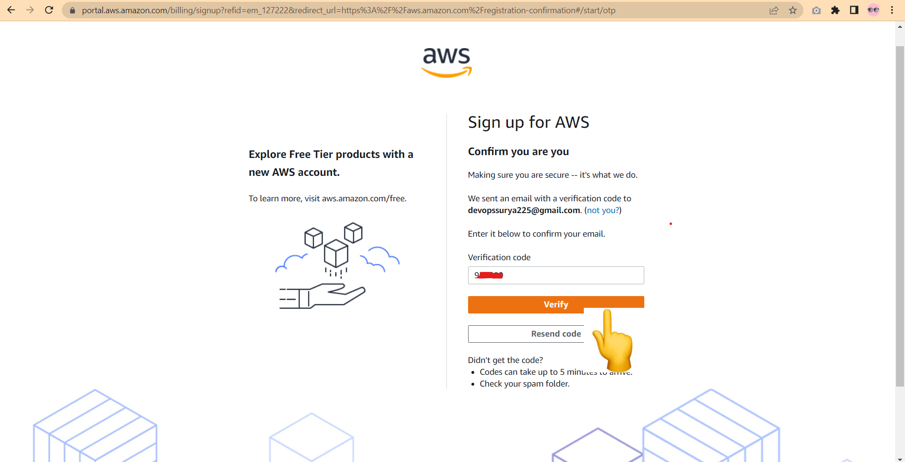
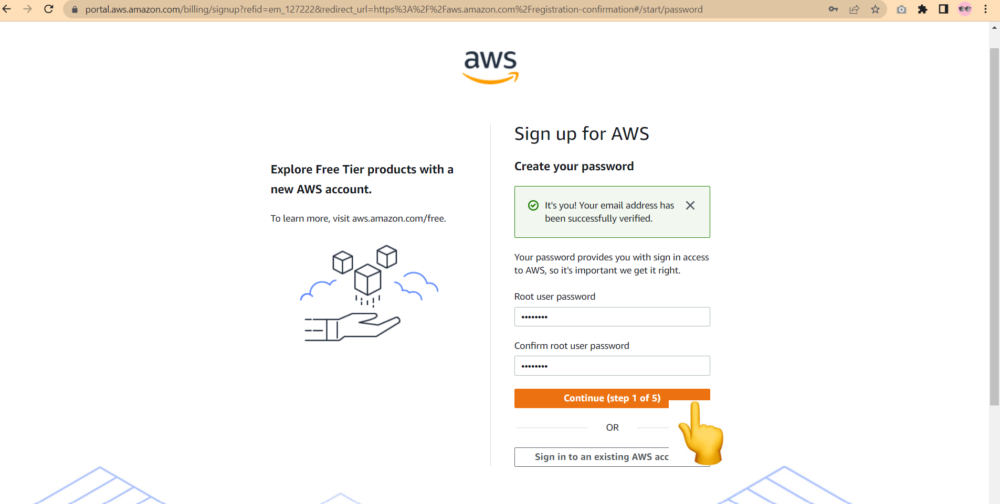
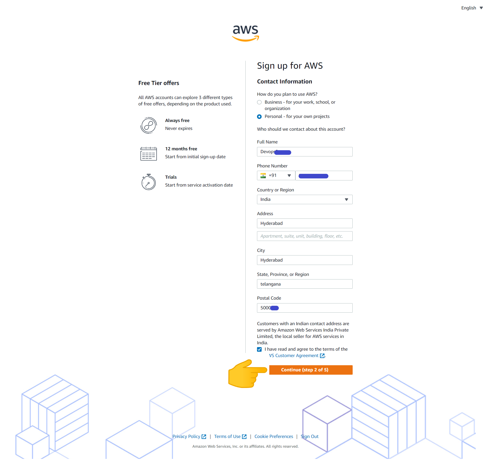
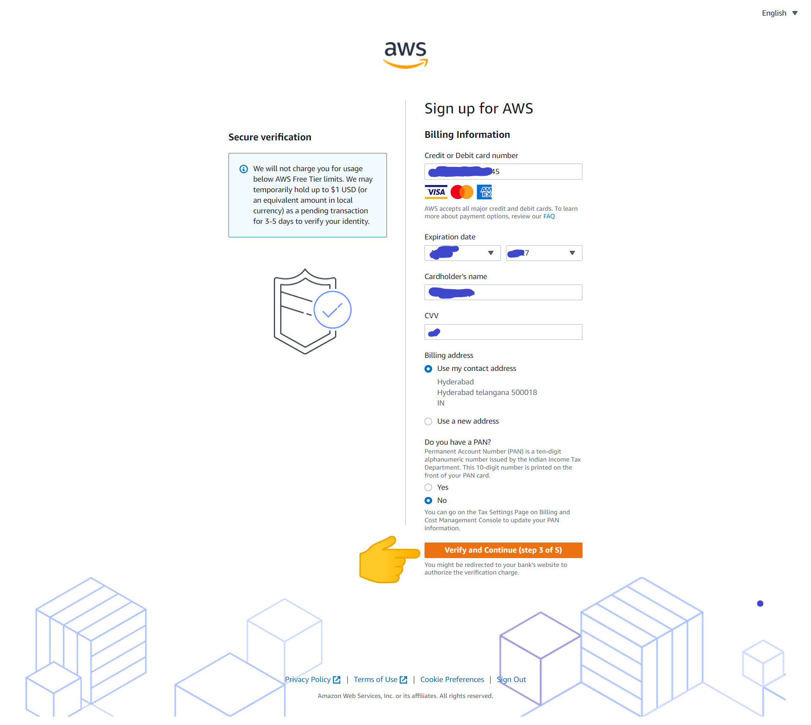

# Prerequisites:

## Install choco : [REFER HERE](https://chocolatey.org/docs/installation)
* The Package Manager for Windows

### Install with cmd.exe
* Run the following command:

```
@"%SystemRoot%\System32\WindowsPowerShell\v1.0\powershell.exe" -NoProfile -InputFormat None -ExecutionPolicy Bypass -Command "[System.Net.ServicePointManager]::SecurityProtocol = 3072; iex ((New-Object System.Net.WebClient).DownloadString('https://community.chocolatey.org/install.ps1'))" && SET "PATH=%PATH%;%ALLUSERSPROFILE%\chocolatey\bin"
```

### Install with PowerShell.exe
* With PowerShell, there is an additional step. You must ensure Get-ExecutionPolicy is not Restricted. We suggest using Bypass to bypass the policy to get things installed or AllSigned for quite a bit more security.

* Run Get-ExecutionPolicy. If it returns Restricted, then run Set-ExecutionPolicy AllSigned or Set-ExecutionPolicy Bypass -Scope Process.
* Now run the following command:

```
Set-ExecutionPolicy Bypass -Scope Process -Force; [System.Net.ServicePointManager]::SecurityProtocol = [System.Net.ServicePointManager]::SecurityProtocol -bor 3072; iex ((New-Object System.Net.WebClient).DownloadString('https://community.chocolatey.org/install.ps1'))
```

### Install Mobaxterm : [REFER HERE](https://community.chocolatey.org/packages/MobaXTerm)
* MobaXterm is a toolbox for remote computing. In a single Windows application, it provides loads of functions that are tailored for programmers, webmasters, IT administrators and pretty much all users who need to handle their remote jobs in a more simple fashion
```
choco install mobaxterm
```

### Install Git : [REFER HERE](https://chocolatey.org/packages/git.install)
* Git is a free and open source distributed version control system designed to handle everything from small to very large projects with speed and efficiency.
```
choco install git.install
```

### Install visualStudioCode : [REFER HERE](https://chocolatey.org/packages/vscode)
* Visual Studio Code combines the simplicity of a source code editor with powerful developer tooling, like IntelliSense code completion and debugging.
```
choco install vscode
```

### AWS (Amazon Web Services) 
* Amazon Web Services (AWS) is the world’s most comprehensive and broadly adopted cloud platform, offering over 200 fully featured services from data centers globally. Millions of customers—including the fastest-growing startups, largest enterprises, and leading government agencies—are using AWS to lower costs, become more agile, and innovate faster.

#### AWS free tier account:  [REFER HERE](https://aws.amazon.com/free/?all-free-tier.sort-by=item.additionalFields.SortRank&all-free-tier.sort-order=asc)









